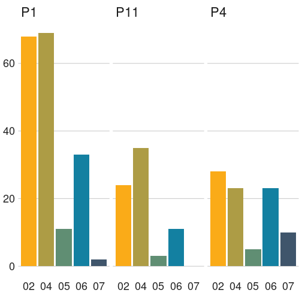
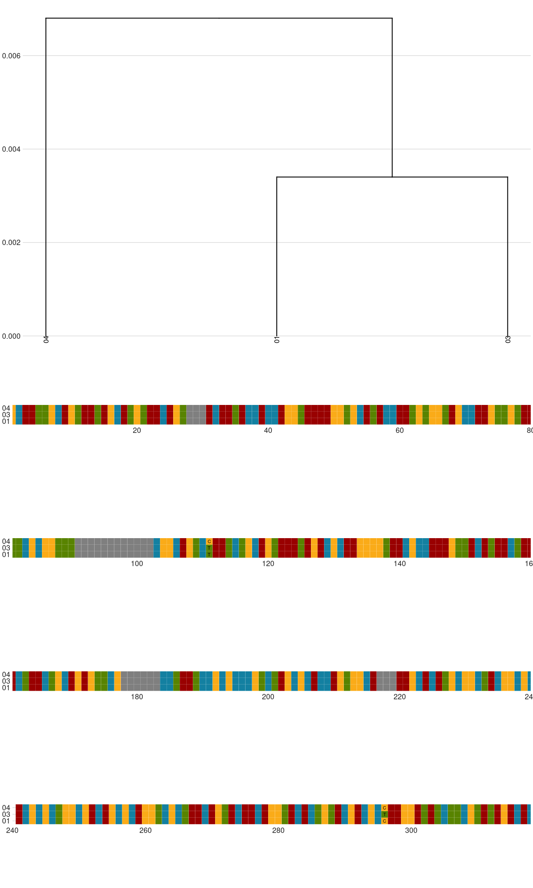
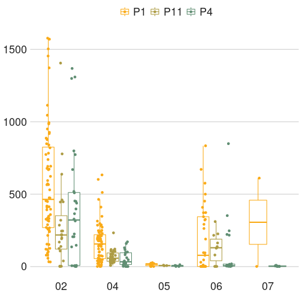
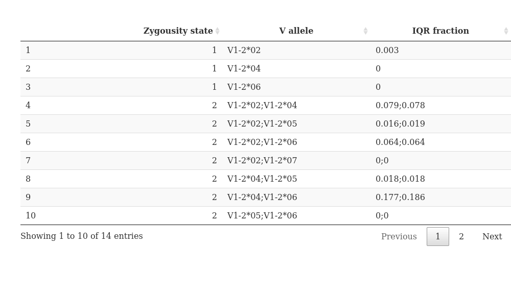

## Allele appearnce 

The group of IGHV1-2 includes 7 alleles, 7 out of the alleles are functional.

For each allele we counted the number of appearances across the population, any appearance was considered valid. 



## Group alignment

Based on the viewd alleles, we calculated the distance between the germline sequences.



## Sequence depth

To examine the potential cutoff we observed the sequence depth for each allele



## 0.5% cutoff 

We set an initial cutoff of $0.5\%$ to determine the potential genotype priors. For this cutoff we examined the zygousity state, such as homozygousity, heterozygousity and so on.


With the selected cutoff we saw that there are 4 zygousity states.

<!--html_preserve--><div id="htmlwidget-d01d39dc7e637ded3244" style="width:100%;height:400px;" class="plotly html-widget"></div>
<script type="application/json" data-for="htmlwidget-d01d39dc7e637ded3244">{"x":{"visdat":{"2f59c2e3ef25f":["function () ","plotlyVisDat"]},"cur_data":"2f59c2e3ef25f","attrs":{"2f59c2e3ef25f":{"alpha_stroke":1,"sizes":[10,100],"spans":[1,20],"type":"scatter","x":{},"y":{},"text":{},"symbol":{},"mode":"markers","marker":{"color":"grey","size":12},"showlegend":true,"opacity":0.9,"hoverinfo":"none","legendgroup":{},"inherit":true},"2f59c2e3ef25f.1":{"alpha_stroke":1,"sizes":[10,100],"spans":[1,20],"type":"scatter","x":{},"y":{},"text":{},"color":{},"mode":"markers","showlegend":false,"opacity":0.8,"hoverinfo":"text","legendgroup":{},"inherit":true},"2f59c2e3ef25f.2":{"alpha_stroke":1,"sizes":[10,100],"spans":[1,20],"x":{},"y":{},"color":{},"type":"box","hoverinfo":"none","fillcolor":"transparent","name":{},"legendgroup":{},"inherit":true}},"layout":{"margin":{"b":40,"l":60,"t":25,"r":10},"hovermode":"closest","shapes":[{"type":"line","x0":0,"x1":1,"xref":"paper","y0":0.005,"y1":0.005,"line":{"color":"red","dash":"dot"}}],"legend":{"tracegroupgap":20,"title":{"text":"<b>  <\/b>"},"orientation":"V"},"xaxis":{"domain":[0,1],"automargin":true,"title":"IGHV1-2 Alleles","autotick":false,"tickmode":"array","tickvals":[null,null],"ticktext":["V1-2*02","V1-2*04"]},"yaxis":{"domain":[0,1],"automargin":true,"title":"Relative allele frequency","range":[0,1.05]},"showlegend":true,"title":"state 1"},"source":"A","config":{"modeBarButtonsToAdd":["hoverclosest","hovercompare"],"showSendToCloud":false,"edits":{"shapePosition":true},"scrollZoom":false},"highlight":{"on":"plotly_click","off":"plotly_doubleclick","persistent":true,"dynamic":false,"color":null,"selectize":false,"defaultValues":null,"opacityDim":0.3,"selected":{"showlegend":false,"opacity":1},"debounce":0,"ctGroups":["SharedDatae62b98a3"]},"data":[{"type":"scatter","mode":"markers","marker":{"color":"grey","size":12,"line":{"color":"rgba(31,119,180,1)"}},"showlegend":true,"opacity":0.9,"set":"SharedDatae62b98a3","error_y":{"color":"rgba(31,119,180,1)"},"error_x":{"color":"rgba(31,119,180,1)"},"line":{"color":"rgba(31,119,180,1)"},"xaxis":"x","yaxis":"y","frame":null},{"type":"scatter","mode":"markers","showlegend":false,"opacity":0.8,"set":"SharedDatae62b98a3","marker":{"color":"rgba(255,127,14,1)","line":{"color":"rgba(255,127,14,1)"}},"error_y":{"color":"rgba(255,127,14,1)"},"error_x":{"color":"rgba(255,127,14,1)"},"line":{"color":"rgba(255,127,14,1)"},"xaxis":"x","yaxis":"y","frame":null},{"fillcolor":"rgba(44,160,44,0.5)","type":"box","set":"SharedDatae62b98a3","marker":{"color":"rgba(44,160,44,1)","line":{"color":"rgba(44,160,44,1)"}},"line":{"color":"rgba(44,160,44,1)"},"xaxis":"x","yaxis":"y","frame":null}],"shinyEvents":["plotly_hover","plotly_click","plotly_selected","plotly_relayout","plotly_brushed","plotly_brushing","plotly_clickannotation","plotly_doubleclick","plotly_deselect","plotly_afterplot","plotly_sunburstclick"],"base_url":"https://plot.ly"},"evals":[],"jsHooks":[]}</script>
<div id="htmlwidget-962718e5c9029bd2c13f" style="width:100%;height:400px;" class="plotly html-widget"></div>
<script type="application/json" data-for="htmlwidget-962718e5c9029bd2c13f">{"x":{"visdat":{"2f59c7fbe9074":["function () ","plotlyVisDat"]},"cur_data":"2f59c7fbe9074","attrs":{"2f59c7fbe9074":{"alpha_stroke":1,"sizes":[10,100],"spans":[1,20],"type":"scatter","x":{},"y":{},"text":{},"symbol":{},"mode":"markers","marker":{"color":"grey","size":12},"showlegend":true,"opacity":0.9,"hoverinfo":"none","legendgroup":{},"inherit":true},"2f59c7fbe9074.1":{"alpha_stroke":1,"sizes":[10,100],"spans":[1,20],"type":"scatter","x":{},"y":{},"text":{},"color":{},"mode":"markers","showlegend":false,"opacity":0.8,"hoverinfo":"text","legendgroup":{},"inherit":true},"2f59c7fbe9074.2":{"alpha_stroke":1,"sizes":[10,100],"spans":[1,20],"x":{},"y":{},"color":{},"type":"box","hoverinfo":"none","fillcolor":"transparent","name":{},"legendgroup":{},"inherit":true}},"layout":{"margin":{"b":40,"l":60,"t":25,"r":10},"hovermode":"closest","shapes":[{"type":"line","x0":0,"x1":1,"xref":"paper","y0":0.005,"y1":0.005,"line":{"color":"red","dash":"dot"}}],"legend":{"tracegroupgap":20,"title":{"text":"<b>  <\/b>"},"orientation":"V"},"xaxis":{"domain":[0,1],"automargin":true,"title":"IGHV1-2 Alleles","autotick":false,"tickmode":"array","tickvals":[1.25,2.25,3.25,4.25,5],"ticktext":["V1-2*02","V1-2*04","V1-2*05","V1-2*06","V1-2*07"]},"yaxis":{"domain":[0,1],"automargin":true,"title":"Relative allele frequency","range":[0,1.05]},"dragmode":"zoom","showlegend":true,"title":"state 2"},"source":"A","config":{"modeBarButtonsToAdd":["hoverclosest","hovercompare"],"showSendToCloud":false,"edits":{"shapePosition":true},"scrollZoom":false},"highlight":{"on":"plotly_click","off":"plotly_doubleclick","persistent":true,"dynamic":false,"color":null,"selectize":false,"defaultValues":null,"opacityDim":0.3,"selected":{"showlegend":false,"opacity":1},"debounce":0,"ctGroups":["SharedDatacd93c98e"]},"data":[{"type":"scatter","x":[1,1,1,1,1,1,1,1,1,1,1,1,1,1,1,1,1,1,1,1,1,1,1,1,1,1,1,1,1,1,1,1,1,1,1,1,1,1.16666666666667,1.16666666666667,1.16666666666667,1.16666666666667,1.33333333333333,1.33333333333333,1.33333333333333,1.33333333333333,1.33333333333333,1.33333333333333,1.33333333333333,1.33333333333333,1.5,2,2,2,2,2,2,2,2,2,2,2,2,2,2,2,2,2,2,2,2,2,2,2,2,2,2,2,2,2,2,2,2,2,2,2,2,2,2.25,2.25,2.25,2.5,2.5,2.5,2.5,2.5,2.5,2.5,2.5,2.5,2.5,2.5,3,3,3,3,3.25,3.25,3.25,3.5,4,4,4,4,4,4,4,4,4.25,4.25,4.25,4.25,4.25,4.25,4.25,4.25,4.25,4.25,4.25,4.5,5],"y":[0.8436,0.8288,0.8216,0.7358,0.7407,0.849,0.7623,0.7896,0.7588,0.8176,0.6929,0.7949,0.7596,0.7726,0.7026,0.746,0.7217,0.7917,0.9017,0.8791,0.8082,0.7986,0.827,0.7284,0.874,0.7623,0.7579,0.7288,0.8394,0.855,0.7117,0.7691,0.8139,0.8215,0.8218,0.8421,0.8286,0.9474,0.9747,0.9683,0.947,0.5368,0.5691,0.5565,0.5887,0.4493,0.5701,0.5238,0.4577,0.5307,0.1564,0.1712,0.1784,0.2642,0.2593,0.151,0.2377,0.2104,0.2412,0.1824,0.3071,0.203,0.2404,0.2274,0.2974,0.254,0.276,0.2083,0.0983,0.1209,0.1918,0.2014,0.1721,0.2716,0.126,0.2377,0.241,0.2699,0.1606,0.145,0.2883,0.2309,0.1861,0.1785,0.1782,0.1579,0.1714,0.9301,0.8929,0.8889,0.3255,0.3134,0.264,0.3997,0.0833,0.2782,0.3065,0.2938,0.357,0.2682,0.1083,0.0502,0.0239,0.0317,0.053,0.0699,0.1071,0.1111,0.0512,0.4632,0.4309,0.4435,0.4113,0.5507,0.4299,0.4762,0.5423,0.6745,0.6866,0.7347,0.6003,0.9167,0.7218,0.6925,0.7062,0.643,0.7318,0.8898,0.9488,0.4686],"text":["<\/br>Project:  P1 <\/br>Subject:  P1_I100_S1 <\/br>Alleles:  1 - V1-2*02;2 - V1-2*04 <\/br># assignments:  259 <\/br>Relative freq.:  0.8436 <\/br>Relative Rep. freq.:  0.0241","<\/br>Project:  P1 <\/br>Subject:  P1_I12_S1 <\/br>Alleles:  1 - V1-2*02;2 - V1-2*04 <\/br># assignments:  673 <\/br>Relative freq.:  0.8288 <\/br>Relative Rep. freq.:  0.0282","<\/br>Project:  P1 <\/br>Subject:  P1_I13_S1 <\/br>Alleles:  1 - V1-2*02;2 - V1-2*04 <\/br># assignments:  820 <\/br>Relative freq.:  0.8216 <\/br>Relative Rep. freq.:  0.0334","<\/br>Project:  P1 <\/br>Subject:  P1_I14_S1 <\/br>Alleles:  1 - V1-2*02;2 - V1-2*04 <\/br># assignments:  117 <\/br>Relative freq.:  0.7358 <\/br>Relative Rep. freq.:  0.0194","<\/br>Project:  P1 <\/br>Subject:  P1_I15_S1 <\/br>Alleles:  1 - V1-2*02;2 - V1-2*04 <\/br># assignments:  120 <\/br>Relative freq.:  0.7407 <\/br>Relative Rep. freq.:  0.0193","<\/br>Project:  P1 <\/br>Subject:  P1_I16_S1 <\/br>Alleles:  1 - V1-2*02;2 - V1-2*04 <\/br># assignments:  416 <\/br>Relative freq.:  0.849 <\/br>Relative Rep. freq.:  0.0292","<\/br>Project:  P1 <\/br>Subject:  P1_I17_S1 <\/br>Alleles:  1 - V1-2*02;2 - V1-2*04 <\/br># assignments:  93 <\/br>Relative freq.:  0.7623 <\/br>Relative Rep. freq.:  0.0165","<\/br>Project:  P1 <\/br>Subject:  P1_I2_S1 <\/br>Alleles:  1 - V1-2*02;2 - V1-2*04 <\/br># assignments:  289 <\/br>Relative freq.:  0.7896 <\/br>Relative Rep. freq.:  0.0175","<\/br>Project:  P1 <\/br>Subject:  P1_I20_S1 <\/br>Alleles:  1 - V1-2*02;2 - V1-2*04 <\/br># assignments:  475 <\/br>Relative freq.:  0.7588 <\/br>Relative Rep. freq.:  0.0346","<\/br>Project:  P1 <\/br>Subject:  P1_I22_S1 <\/br>Alleles:  1 - V1-2*02;2 - V1-2*04 <\/br># assignments:  950 <\/br>Relative freq.:  0.8176 <\/br>Relative Rep. freq.:  0.0352","<\/br>Project:  P1 <\/br>Subject:  P1_I23_S1 <\/br>Alleles:  1 - V1-2*02;2 - V1-2*04 <\/br># assignments:  449 <\/br>Relative freq.:  0.6929 <\/br>Relative Rep. freq.:  0.0256","<\/br>Project:  P1 <\/br>Subject:  P1_I25_S1 <\/br>Alleles:  1 - V1-2*02;2 - V1-2*04 <\/br># assignments:  783 <\/br>Relative freq.:  0.7949 <\/br>Relative Rep. freq.:  0.0335","<\/br>Project:  P1 <\/br>Subject:  P1_I28_S1 <\/br>Alleles:  1 - V1-2*02;2 - V1-2*04 <\/br># assignments:  79 <\/br>Relative freq.:  0.7596 <\/br>Relative Rep. freq.:  0.02","<\/br>Project:  P1 <\/br>Subject:  P1_I31_S1 <\/br>Alleles:  1 - V1-2*02;2 - V1-2*04 <\/br># assignments:  530 <\/br>Relative freq.:  0.7726 <\/br>Relative Rep. freq.:  0.0212","<\/br>Project:  P1 <\/br>Subject:  P1_I38_S1 <\/br>Alleles:  1 - V1-2*02;2 - V1-2*04 <\/br># assignments:  241 <\/br>Relative freq.:  0.7026 <\/br>Relative Rep. freq.:  0.0212","<\/br>Project:  P1 <\/br>Subject:  P1_I41_S1 <\/br>Alleles:  1 - V1-2*02;2 - V1-2*04 <\/br># assignments:  840 <\/br>Relative freq.:  0.746 <\/br>Relative Rep. freq.:  0.0345","<\/br>Project:  P1 <\/br>Subject:  P1_I44_S1 <\/br>Alleles:  1 - V1-2*02;2 - V1-2*04 <\/br># assignments:  319 <\/br>Relative freq.:  0.7217 <\/br>Relative Rep. freq.:  0.0274","<\/br>Project:  P1 <\/br>Subject:  P1_I45_S1 <\/br>Alleles:  1 - V1-2*02;2 - V1-2*04 <\/br># assignments:  152 <\/br>Relative freq.:  0.7917 <\/br>Relative Rep. freq.:  0.0247","<\/br>Project:  P1 <\/br>Subject:  P1_I46_S1 <\/br>Alleles:  1 - V1-2*02;2 - V1-2*04 <\/br># assignments:  413 <\/br>Relative freq.:  0.9017 <\/br>Relative Rep. freq.:  0.0278","<\/br>Project:  P1 <\/br>Subject:  P1_I47_S1 <\/br>Alleles:  1 - V1-2*02;2 - V1-2*04 <\/br># assignments:  80 <\/br>Relative freq.:  0.8791 <\/br>Relative Rep. freq.:  0.0241","<\/br>Project:  P1 <\/br>Subject:  P1_I5_S1 <\/br>Alleles:  1 - V1-2*02;2 - V1-2*04 <\/br># assignments:  1045 <\/br>Relative freq.:  0.8082 <\/br>Relative Rep. freq.:  0.0283","<\/br>Project:  P1 <\/br>Subject:  P1_I53_S1 <\/br>Alleles:  1 - V1-2*02;2 - V1-2*04 <\/br># assignments:  678 <\/br>Relative freq.:  0.7986 <\/br>Relative Rep. freq.:  0.0303","<\/br>Project:  P1 <\/br>Subject:  P1_I60_S1 <\/br>Alleles:  1 - V1-2*02;2 - V1-2*04 <\/br># assignments:  918 <\/br>Relative freq.:  0.827 <\/br>Relative Rep. freq.:  0.0269","<\/br>Project:  P1 <\/br>Subject:  P1_I64_S1 <\/br>Alleles:  1 - V1-2*02;2 - V1-2*04 <\/br># assignments:  566 <\/br>Relative freq.:  0.7284 <\/br>Relative Rep. freq.:  0.0294","<\/br>Project:  P1 <\/br>Subject:  P1_I69_S1 <\/br>Alleles:  1 - V1-2*02;2 - V1-2*04 <\/br># assignments:  215 <\/br>Relative freq.:  0.874 <\/br>Relative Rep. freq.:  0.0282","<\/br>Project:  P1 <\/br>Subject:  P1_I7_S1 <\/br>Alleles:  1 - V1-2*02;2 - V1-2*04 <\/br># assignments:  571 <\/br>Relative freq.:  0.7623 <\/br>Relative Rep. freq.:  0.0242","<\/br>Project:  P1 <\/br>Subject:  P1_I72_S1 <\/br>Alleles:  1 - V1-2*02;2 - V1-2*04 <\/br># assignments:  739 <\/br>Relative freq.:  0.7579 <\/br>Relative Rep. freq.:  0.023","<\/br>Project:  P1 <\/br>Subject:  P1_I74_S1 <\/br>Alleles:  1 - V1-2*02;2 - V1-2*04 <\/br># assignments:  594 <\/br>Relative freq.:  0.7288 <\/br>Relative Rep. freq.:  0.0238","<\/br>Project:  P1 <\/br>Subject:  P1_I77_S1 <\/br>Alleles:  1 - V1-2*02;2 - V1-2*04 <\/br># assignments:  392 <\/br>Relative freq.:  0.8394 <\/br>Relative Rep. freq.:  0.0211","<\/br>Project:  P1 <\/br>Subject:  P1_I79_S1 <\/br>Alleles:  1 - V1-2*02;2 - V1-2*04 <\/br># assignments:  454 <\/br>Relative freq.:  0.855 <\/br>Relative Rep. freq.:  0.0245","<\/br>Project:  P1 <\/br>Subject:  P1_I83_S1 <\/br>Alleles:  1 - V1-2*02;2 - V1-2*04 <\/br># assignments:  348 <\/br>Relative freq.:  0.7117 <\/br>Relative Rep. freq.:  0.024","<\/br>Project:  P1 <\/br>Subject:  P1_I84_S1 <\/br>Alleles:  1 - V1-2*02;2 - V1-2*04 <\/br># assignments:  623 <\/br>Relative freq.:  0.7691 <\/br>Relative Rep. freq.:  0.0261","<\/br>Project:  P1 <\/br>Subject:  P1_I91_S1 <\/br>Alleles:  1 - V1-2*02;2 - V1-2*04 <\/br># assignments:  774 <\/br>Relative freq.:  0.8139 <\/br>Relative Rep. freq.:  0.0328","<\/br>Project:  P1 <\/br>Subject:  P1_I92_S1 <\/br>Alleles:  1 - V1-2*02;2 - V1-2*04 <\/br># assignments:  267 <\/br>Relative freq.:  0.8215 <\/br>Relative Rep. freq.:  0.0272","<\/br>Project:  P1 <\/br>Subject:  P1_I94_S1 <\/br>Alleles:  1 - V1-2*02;2 - V1-2*04 <\/br># assignments:  332 <\/br>Relative freq.:  0.8218 <\/br>Relative Rep. freq.:  0.0264","<\/br>Project:  P1 <\/br>Subject:  P1_I96_S1 <\/br>Alleles:  1 - V1-2*02;2 - V1-2*04 <\/br># assignments:  32 <\/br>Relative freq.:  0.8421 <\/br>Relative Rep. freq.:  0.0245","<\/br>Project:  P1 <\/br>Subject:  P1_I99_S1 <\/br>Alleles:  1 - V1-2*02;2 - V1-2*04 <\/br># assignments:  58 <\/br>Relative freq.:  0.8286 <\/br>Relative Rep. freq.:  0.0298","<\/br>Project:  P1 <\/br>Subject:  P1_I3_S1 <\/br>Alleles:  1 - V1-2*02;2 - V1-2*05 <\/br># assignments:  396 <\/br>Relative freq.:  0.9474 <\/br>Relative Rep. freq.:  0.0316","<\/br>Project:  P1 <\/br>Subject:  P1_I57_S1 <\/br>Alleles:  1 - V1-2*02;2 - V1-2*05 <\/br># assignments:  693 <\/br>Relative freq.:  0.9747 <\/br>Relative Rep. freq.:  0.0286","<\/br>Project:  P1 <\/br>Subject:  P1_I86_S1 <\/br>Alleles:  1 - V1-2*02;2 - V1-2*05 <\/br># assignments:  336 <\/br>Relative freq.:  0.9683 <\/br>Relative Rep. freq.:  0.0179","<\/br>Project:  P1 <\/br>Subject:  P1_I95_S1 <\/br>Alleles:  1 - V1-2*02;2 - V1-2*05 <\/br># assignments:  250 <\/br>Relative freq.:  0.947 <\/br>Relative Rep. freq.:  0.0197","<\/br>Project:  P1 <\/br>Subject:  P1_I34_S1 <\/br>Alleles:  1 - V1-2*02;2 - V1-2*06 <\/br># assignments:  474 <\/br>Relative freq.:  0.5368 <\/br>Relative Rep. freq.:  0.0227","<\/br>Project:  P1 <\/br>Subject:  P1_I35_S1 <\/br>Alleles:  1 - V1-2*02;2 - V1-2*06 <\/br># assignments:  103 <\/br>Relative freq.:  0.5691 <\/br>Relative Rep. freq.:  0.0187","<\/br>Project:  P1 <\/br>Subject:  P1_I42_S1 <\/br>Alleles:  1 - V1-2*02;2 - V1-2*06 <\/br># assignments:  409 <\/br>Relative freq.:  0.5565 <\/br>Relative Rep. freq.:  0.0234","<\/br>Project:  P1 <\/br>Subject:  P1_I48_S1 <\/br>Alleles:  1 - V1-2*02;2 - V1-2*06 <\/br># assignments:  418 <\/br>Relative freq.:  0.5887 <\/br>Relative Rep. freq.:  0.019","<\/br>Project:  P1 <\/br>Subject:  P1_I49_S1 <\/br>Alleles:  1 - V1-2*06;2 - V1-2*02 <\/br># assignments:  155 <\/br>Relative freq.:  0.4493 <\/br>Relative Rep. freq.:  0.0153","<\/br>Project:  P1 <\/br>Subject:  P1_I58_S1 <\/br>Alleles:  1 - V1-2*02;2 - V1-2*06 <\/br># assignments:  126 <\/br>Relative freq.:  0.5701 <\/br>Relative Rep. freq.:  0.0166","<\/br>Project:  P1 <\/br>Subject:  P1_I61_S1 <\/br>Alleles:  1 - V1-2*02;2 - V1-2*06 <\/br># assignments:  33 <\/br>Relative freq.:  0.5238 <\/br>Relative Rep. freq.:  0.0245","<\/br>Project:  P1 <\/br>Subject:  P1_I82_S1 <\/br>Alleles:  1 - V1-2*06;2 - V1-2*02 <\/br># assignments:  314 <\/br>Relative freq.:  0.4577 <\/br>Relative Rep. freq.:  0.0227","<\/br>Project:  P1 <\/br>Subject:  P1_I24_S1 <\/br>Alleles:  1 - V1-2*02;2 - V1-2*07 <\/br># assignments:  692 <\/br>Relative freq.:  0.5307 <\/br>Relative Rep. freq.:  0.0308","<\/br>Project:  P1 <\/br>Subject:  P1_I100_S1 <\/br>Alleles:  1 - V1-2*02;2 - V1-2*04 <\/br># assignments:  48 <\/br>Relative freq.:  0.1564 <\/br>Relative Rep. freq.:  0.0045","<\/br>Project:  P1 <\/br>Subject:  P1_I12_S1 <\/br>Alleles:  1 - V1-2*02;2 - V1-2*04 <\/br># assignments:  139 <\/br>Relative freq.:  0.1712 <\/br>Relative Rep. freq.:  0.0058","<\/br>Project:  P1 <\/br>Subject:  P1_I13_S1 <\/br>Alleles:  1 - V1-2*02;2 - V1-2*04 <\/br># assignments:  178 <\/br>Relative freq.:  0.1784 <\/br>Relative Rep. freq.:  0.0072","<\/br>Project:  P1 <\/br>Subject:  P1_I14_S1 <\/br>Alleles:  1 - V1-2*02;2 - V1-2*04 <\/br># assignments:  42 <\/br>Relative freq.:  0.2642 <\/br>Relative Rep. freq.:  0.007","<\/br>Project:  P1 <\/br>Subject:  P1_I15_S1 <\/br>Alleles:  1 - V1-2*02;2 - V1-2*04 <\/br># assignments:  42 <\/br>Relative freq.:  0.2593 <\/br>Relative Rep. freq.:  0.0068","<\/br>Project:  P1 <\/br>Subject:  P1_I16_S1 <\/br>Alleles:  1 - V1-2*02;2 - V1-2*04 <\/br># assignments:  74 <\/br>Relative freq.:  0.151 <\/br>Relative Rep. freq.:  0.0052","<\/br>Project:  P1 <\/br>Subject:  P1_I17_S1 <\/br>Alleles:  1 - V1-2*02;2 - V1-2*04 <\/br># assignments:  29 <\/br>Relative freq.:  0.2377 <\/br>Relative Rep. freq.:  0.0051","<\/br>Project:  P1 <\/br>Subject:  P1_I2_S1 <\/br>Alleles:  1 - V1-2*02;2 - V1-2*04 <\/br># assignments:  77 <\/br>Relative freq.:  0.2104 <\/br>Relative Rep. freq.:  0.0047","<\/br>Project:  P1 <\/br>Subject:  P1_I20_S1 <\/br>Alleles:  1 - V1-2*02;2 - V1-2*04 <\/br># assignments:  151 <\/br>Relative freq.:  0.2412 <\/br>Relative Rep. freq.:  0.011","<\/br>Project:  P1 <\/br>Subject:  P1_I22_S1 <\/br>Alleles:  1 - V1-2*02;2 - V1-2*04 <\/br># assignments:  212 <\/br>Relative freq.:  0.1824 <\/br>Relative Rep. freq.:  0.0079","<\/br>Project:  P1 <\/br>Subject:  P1_I23_S1 <\/br>Alleles:  1 - V1-2*02;2 - V1-2*04 <\/br># assignments:  199 <\/br>Relative freq.:  0.3071 <\/br>Relative Rep. freq.:  0.0114","<\/br>Project:  P1 <\/br>Subject:  P1_I25_S1 <\/br>Alleles:  1 - V1-2*02;2 - V1-2*04 <\/br># assignments:  200 <\/br>Relative freq.:  0.203 <\/br>Relative Rep. freq.:  0.0086","<\/br>Project:  P1 <\/br>Subject:  P1_I28_S1 <\/br>Alleles:  1 - V1-2*02;2 - V1-2*04 <\/br># assignments:  25 <\/br>Relative freq.:  0.2404 <\/br>Relative Rep. freq.:  0.0063","<\/br>Project:  P1 <\/br>Subject:  P1_I31_S1 <\/br>Alleles:  1 - V1-2*02;2 - V1-2*04 <\/br># assignments:  156 <\/br>Relative freq.:  0.2274 <\/br>Relative Rep. freq.:  0.0062","<\/br>Project:  P1 <\/br>Subject:  P1_I38_S1 <\/br>Alleles:  1 - V1-2*02;2 - V1-2*04 <\/br># assignments:  102 <\/br>Relative freq.:  0.2974 <\/br>Relative Rep. freq.:  0.009","<\/br>Project:  P1 <\/br>Subject:  P1_I41_S1 <\/br>Alleles:  1 - V1-2*02;2 - V1-2*04 <\/br># assignments:  286 <\/br>Relative freq.:  0.254 <\/br>Relative Rep. freq.:  0.0117","<\/br>Project:  P1 <\/br>Subject:  P1_I44_S1 <\/br>Alleles:  1 - V1-2*02;2 - V1-2*04 <\/br># assignments:  122 <\/br>Relative freq.:  0.276 <\/br>Relative Rep. freq.:  0.0105","<\/br>Project:  P1 <\/br>Subject:  P1_I45_S1 <\/br>Alleles:  1 - V1-2*02;2 - V1-2*04 <\/br># assignments:  40 <\/br>Relative freq.:  0.2083 <\/br>Relative Rep. freq.:  0.0065","<\/br>Project:  P1 <\/br>Subject:  P1_I46_S1 <\/br>Alleles:  1 - V1-2*02;2 - V1-2*04 <\/br># assignments:  45 <\/br>Relative freq.:  0.0983 <\/br>Relative Rep. freq.:  0.003","<\/br>Project:  P1 <\/br>Subject:  P1_I47_S1 <\/br>Alleles:  1 - V1-2*02;2 - V1-2*04 <\/br># assignments:  11 <\/br>Relative freq.:  0.1209 <\/br>Relative Rep. freq.:  0.0033","<\/br>Project:  P1 <\/br>Subject:  P1_I5_S1 <\/br>Alleles:  1 - V1-2*02;2 - V1-2*04 <\/br># assignments:  248 <\/br>Relative freq.:  0.1918 <\/br>Relative Rep. freq.:  0.0067","<\/br>Project:  P1 <\/br>Subject:  P1_I53_S1 <\/br>Alleles:  1 - V1-2*02;2 - V1-2*04 <\/br># assignments:  171 <\/br>Relative freq.:  0.2014 <\/br>Relative Rep. freq.:  0.0076","<\/br>Project:  P1 <\/br>Subject:  P1_I60_S1 <\/br>Alleles:  1 - V1-2*02;2 - V1-2*04 <\/br># assignments:  191 <\/br>Relative freq.:  0.1721 <\/br>Relative Rep. freq.:  0.0056","<\/br>Project:  P1 <\/br>Subject:  P1_I64_S1 <\/br>Alleles:  1 - V1-2*02;2 - V1-2*04 <\/br># assignments:  211 <\/br>Relative freq.:  0.2716 <\/br>Relative Rep. freq.:  0.011","<\/br>Project:  P1 <\/br>Subject:  P1_I69_S1 <\/br>Alleles:  1 - V1-2*02;2 - V1-2*04 <\/br># assignments:  31 <\/br>Relative freq.:  0.126 <\/br>Relative Rep. freq.:  0.0041","<\/br>Project:  P1 <\/br>Subject:  P1_I7_S1 <\/br>Alleles:  1 - V1-2*02;2 - V1-2*04 <\/br># assignments:  178 <\/br>Relative freq.:  0.2377 <\/br>Relative Rep. freq.:  0.0076","<\/br>Project:  P1 <\/br>Subject:  P1_I72_S1 <\/br>Alleles:  1 - V1-2*02;2 - V1-2*04 <\/br># assignments:  235 <\/br>Relative freq.:  0.241 <\/br>Relative Rep. freq.:  0.0073","<\/br>Project:  P1 <\/br>Subject:  P1_I74_S1 <\/br>Alleles:  1 - V1-2*02;2 - V1-2*04 <\/br># assignments:  220 <\/br>Relative freq.:  0.2699 <\/br>Relative Rep. freq.:  0.0088","<\/br>Project:  P1 <\/br>Subject:  P1_I77_S1 <\/br>Alleles:  1 - V1-2*02;2 - V1-2*04 <\/br># assignments:  75 <\/br>Relative freq.:  0.1606 <\/br>Relative Rep. freq.:  0.004","<\/br>Project:  P1 <\/br>Subject:  P1_I79_S1 <\/br>Alleles:  1 - V1-2*02;2 - V1-2*04 <\/br># assignments:  77 <\/br>Relative freq.:  0.145 <\/br>Relative Rep. freq.:  0.0042","<\/br>Project:  P1 <\/br>Subject:  P1_I83_S1 <\/br>Alleles:  1 - V1-2*02;2 - V1-2*04 <\/br># assignments:  141 <\/br>Relative freq.:  0.2883 <\/br>Relative Rep. freq.:  0.0097","<\/br>Project:  P1 <\/br>Subject:  P1_I84_S1 <\/br>Alleles:  1 - V1-2*02;2 - V1-2*04 <\/br># assignments:  187 <\/br>Relative freq.:  0.2309 <\/br>Relative Rep. freq.:  0.0078","<\/br>Project:  P1 <\/br>Subject:  P1_I91_S1 <\/br>Alleles:  1 - V1-2*02;2 - V1-2*04 <\/br># assignments:  177 <\/br>Relative freq.:  0.1861 <\/br>Relative Rep. freq.:  0.0075","<\/br>Project:  P1 <\/br>Subject:  P1_I92_S1 <\/br>Alleles:  1 - V1-2*02;2 - V1-2*04 <\/br># assignments:  58 <\/br>Relative freq.:  0.1785 <\/br>Relative Rep. freq.:  0.0059","<\/br>Project:  P1 <\/br>Subject:  P1_I94_S1 <\/br>Alleles:  1 - V1-2*02;2 - V1-2*04 <\/br># assignments:  72 <\/br>Relative freq.:  0.1782 <\/br>Relative Rep. freq.:  0.0057","<\/br>Project:  P1 <\/br>Subject:  P1_I96_S1 <\/br>Alleles:  1 - V1-2*02;2 - V1-2*04 <\/br># assignments:  6 <\/br>Relative freq.:  0.1579 <\/br>Relative Rep. freq.:  0.0046","<\/br>Project:  P1 <\/br>Subject:  P1_I99_S1 <\/br>Alleles:  1 - V1-2*02;2 - V1-2*04 <\/br># assignments:  12 <\/br>Relative freq.:  0.1714 <\/br>Relative Rep. freq.:  0.0062","<\/br>Project:  P1 <\/br>Subject:  P1_I10_S1 <\/br>Alleles:  1 - V1-2*04;2 - V1-2*05 <\/br># assignments:  213 <\/br>Relative freq.:  0.9301 <\/br>Relative Rep. freq.:  0.009","<\/br>Project:  P1 <\/br>Subject:  P1_I70_S1 <\/br>Alleles:  1 - V1-2*04;2 - V1-2*05 <\/br># assignments:  175 <\/br>Relative freq.:  0.8929 <\/br>Relative Rep. freq.:  0.0065","<\/br>Project:  P1 <\/br>Subject:  P1_I76_S1 <\/br>Alleles:  1 - V1-2*04;2 - V1-2*05 <\/br># assignments:  192 <\/br>Relative freq.:  0.8889 <\/br>Relative Rep. freq.:  0.0081","<\/br>Project:  P1 <\/br>Subject:  P1_I19_S1 <\/br>Alleles:  1 - V1-2*06;2 - V1-2*04 <\/br># assignments:  180 <\/br>Relative freq.:  0.3255 <\/br>Relative Rep. freq.:  0.0081","<\/br>Project:  P1 <\/br>Subject:  P1_I21_S1 <\/br>Alleles:  1 - V1-2*06;2 - V1-2*04 <\/br># assignments:  21 <\/br>Relative freq.:  0.3134 <\/br>Relative Rep. freq.:  0.0088","<\/br>Project:  P1 <\/br>Subject:  P1_I27_S1 <\/br>Alleles:  1 - V1-2*06;2 - V1-2*04 <\/br># assignments:  207 <\/br>Relative freq.:  0.264 <\/br>Relative Rep. freq.:  0.008","<\/br>Project:  P1 <\/br>Subject:  P1_I30_S1 <\/br>Alleles:  1 - V1-2*06;2 - V1-2*04 <\/br># assignments:  229 <\/br>Relative freq.:  0.3997 <\/br>Relative Rep. freq.:  0.0112","<\/br>Project:  P1 <\/br>Subject:  P1_I32_S1 <\/br>Alleles:  1 - V1-2*06;2 - V1-2*04 <\/br># assignments:  1 <\/br>Relative freq.:  0.0833 <\/br>Relative Rep. freq.:  0.0028","<\/br>Project:  P1 <\/br>Subject:  P1_I50_S1 <\/br>Alleles:  1 - V1-2*06;2 - V1-2*04 <\/br># assignments:  37 <\/br>Relative freq.:  0.2782 <\/br>Relative Rep. freq.:  0.0058","<\/br>Project:  P1 <\/br>Subject:  P1_I68_S1 <\/br>Alleles:  1 - V1-2*06;2 - V1-2*04 <\/br># assignments:  297 <\/br>Relative freq.:  0.3065 <\/br>Relative Rep. freq.:  0.0088","<\/br>Project:  P1 <\/br>Subject:  P1_I71_S1 <\/br>Alleles:  1 - V1-2*06;2 - V1-2*04 <\/br># assignments:  347 <\/br>Relative freq.:  0.2938 <\/br>Relative Rep. freq.:  0.0106","<\/br>Project:  P1 <\/br>Subject:  P1_I75_S1 <\/br>Alleles:  1 - V1-2*06;2 - V1-2*04 <\/br># assignments:  146 <\/br>Relative freq.:  0.357 <\/br>Relative Rep. freq.:  0.0083","<\/br>Project:  P1 <\/br>Subject:  P1_I9_S1 <\/br>Alleles:  1 - V1-2*06;2 - V1-2*04 <\/br># assignments:  118 <\/br>Relative freq.:  0.2682 <\/br>Relative Rep. freq.:  0.0074","<\/br>Project:  P1 <\/br>Subject:  P1_I98_S1 <\/br>Alleles:  1 - V1-2*06;2 - V1-2*04 <\/br># assignments:  55 <\/br>Relative freq.:  0.1083 <\/br>Relative Rep. freq.:  0.0032","<\/br>Project:  P1 <\/br>Subject:  P1_I3_S1 <\/br>Alleles:  1 - V1-2*02;2 - V1-2*05 <\/br># assignments:  21 <\/br>Relative freq.:  0.0502 <\/br>Relative Rep. freq.:  0.0017","<\/br>Project:  P1 <\/br>Subject:  P1_I57_S1 <\/br>Alleles:  1 - V1-2*02;2 - V1-2*05 <\/br># assignments:  17 <\/br>Relative freq.:  0.0239 <\/br>Relative Rep. freq.:  7e-04","<\/br>Project:  P1 <\/br>Subject:  P1_I86_S1 <\/br>Alleles:  1 - V1-2*02;2 - V1-2*05 <\/br># assignments:  11 <\/br>Relative freq.:  0.0317 <\/br>Relative Rep. freq.:  6e-04","<\/br>Project:  P1 <\/br>Subject:  P1_I95_S1 <\/br>Alleles:  1 - V1-2*02;2 - V1-2*05 <\/br># assignments:  14 <\/br>Relative freq.:  0.053 <\/br>Relative Rep. freq.:  0.0011","<\/br>Project:  P1 <\/br>Subject:  P1_I10_S1 <\/br>Alleles:  1 - V1-2*04;2 - V1-2*05 <\/br># assignments:  16 <\/br>Relative freq.:  0.0699 <\/br>Relative Rep. freq.:  7e-04","<\/br>Project:  P1 <\/br>Subject:  P1_I70_S1 <\/br>Alleles:  1 - V1-2*04;2 - V1-2*05 <\/br># assignments:  21 <\/br>Relative freq.:  0.1071 <\/br>Relative Rep. freq.:  8e-04","<\/br>Project:  P1 <\/br>Subject:  P1_I76_S1 <\/br>Alleles:  1 - V1-2*04;2 - V1-2*05 <\/br># assignments:  24 <\/br>Relative freq.:  0.1111 <\/br>Relative Rep. freq.:  0.001","<\/br>Project:  P1 <\/br>Subject:  P1_I29_S1 <\/br>Alleles:  1 - V1-2*06;2 - V1-2*05 <\/br># assignments:  27 <\/br>Relative freq.:  0.0512 <\/br>Relative Rep. freq.:  0.0012","<\/br>Project:  P1 <\/br>Subject:  P1_I34_S1 <\/br>Alleles:  1 - V1-2*02;2 - V1-2*06 <\/br># assignments:  409 <\/br>Relative freq.:  0.4632 <\/br>Relative Rep. freq.:  0.0196","<\/br>Project:  P1 <\/br>Subject:  P1_I35_S1 <\/br>Alleles:  1 - V1-2*02;2 - V1-2*06 <\/br># assignments:  78 <\/br>Relative freq.:  0.4309 <\/br>Relative Rep. freq.:  0.0141","<\/br>Project:  P1 <\/br>Subject:  P1_I42_S1 <\/br>Alleles:  1 - V1-2*02;2 - V1-2*06 <\/br># assignments:  326 <\/br>Relative freq.:  0.4435 <\/br>Relative Rep. freq.:  0.0187","<\/br>Project:  P1 <\/br>Subject:  P1_I48_S1 <\/br>Alleles:  1 - V1-2*02;2 - V1-2*06 <\/br># assignments:  292 <\/br>Relative freq.:  0.4113 <\/br>Relative Rep. freq.:  0.0133","<\/br>Project:  P1 <\/br>Subject:  P1_I49_S1 <\/br>Alleles:  1 - V1-2*06;2 - V1-2*02 <\/br># assignments:  190 <\/br>Relative freq.:  0.5507 <\/br>Relative Rep. freq.:  0.0187","<\/br>Project:  P1 <\/br>Subject:  P1_I58_S1 <\/br>Alleles:  1 - V1-2*02;2 - V1-2*06 <\/br># assignments:  95 <\/br>Relative freq.:  0.4299 <\/br>Relative Rep. freq.:  0.0125","<\/br>Project:  P1 <\/br>Subject:  P1_I61_S1 <\/br>Alleles:  1 - V1-2*02;2 - V1-2*06 <\/br># assignments:  30 <\/br>Relative freq.:  0.4762 <\/br>Relative Rep. freq.:  0.0222","<\/br>Project:  P1 <\/br>Subject:  P1_I82_S1 <\/br>Alleles:  1 - V1-2*06;2 - V1-2*02 <\/br># assignments:  372 <\/br>Relative freq.:  0.5423 <\/br>Relative Rep. freq.:  0.0269","<\/br>Project:  P1 <\/br>Subject:  P1_I19_S1 <\/br>Alleles:  1 - V1-2*06;2 - V1-2*04 <\/br># assignments:  373 <\/br>Relative freq.:  0.6745 <\/br>Relative Rep. freq.:  0.0168","<\/br>Project:  P1 <\/br>Subject:  P1_I21_S1 <\/br>Alleles:  1 - V1-2*06;2 - V1-2*04 <\/br># assignments:  46 <\/br>Relative freq.:  0.6866 <\/br>Relative Rep. freq.:  0.0192","<\/br>Project:  P1 <\/br>Subject:  P1_I27_S1 <\/br>Alleles:  1 - V1-2*06;2 - V1-2*04 <\/br># assignments:  576 <\/br>Relative freq.:  0.7347 <\/br>Relative Rep. freq.:  0.0223","<\/br>Project:  P1 <\/br>Subject:  P1_I30_S1 <\/br>Alleles:  1 - V1-2*06;2 - V1-2*04 <\/br># assignments:  344 <\/br>Relative freq.:  0.6003 <\/br>Relative Rep. freq.:  0.0168","<\/br>Project:  P1 <\/br>Subject:  P1_I32_S1 <\/br>Alleles:  1 - V1-2*06;2 - V1-2*04 <\/br># assignments:  11 <\/br>Relative freq.:  0.9167 <\/br>Relative Rep. freq.:  0.0313","<\/br>Project:  P1 <\/br>Subject:  P1_I50_S1 <\/br>Alleles:  1 - V1-2*06;2 - V1-2*04 <\/br># assignments:  96 <\/br>Relative freq.:  0.7218 <\/br>Relative Rep. freq.:  0.0152","<\/br>Project:  P1 <\/br>Subject:  P1_I68_S1 <\/br>Alleles:  1 - V1-2*06;2 - V1-2*04 <\/br># assignments:  671 <\/br>Relative freq.:  0.6925 <\/br>Relative Rep. freq.:  0.0199","<\/br>Project:  P1 <\/br>Subject:  P1_I71_S1 <\/br>Alleles:  1 - V1-2*06;2 - V1-2*04 <\/br># assignments:  834 <\/br>Relative freq.:  0.7062 <\/br>Relative Rep. freq.:  0.0254","<\/br>Project:  P1 <\/br>Subject:  P1_I75_S1 <\/br>Alleles:  1 - V1-2*06;2 - V1-2*04 <\/br># assignments:  263 <\/br>Relative freq.:  0.643 <\/br>Relative Rep. freq.:  0.015","<\/br>Project:  P1 <\/br>Subject:  P1_I9_S1 <\/br>Alleles:  1 - V1-2*06;2 - V1-2*04 <\/br># assignments:  322 <\/br>Relative freq.:  0.7318 <\/br>Relative Rep. freq.:  0.0201","<\/br>Project:  P1 <\/br>Subject:  P1_I98_S1 <\/br>Alleles:  1 - V1-2*06;2 - V1-2*04 <\/br># assignments:  452 <\/br>Relative freq.:  0.8898 <\/br>Relative Rep. freq.:  0.0262","<\/br>Project:  P1 <\/br>Subject:  P1_I29_S1 <\/br>Alleles:  1 - V1-2*06;2 - V1-2*05 <\/br># assignments:  500 <\/br>Relative freq.:  0.9488 <\/br>Relative Rep. freq.:  0.0222","<\/br>Project:  P1 <\/br>Subject:  P1_I24_S1 <\/br>Alleles:  1 - V1-2*02;2 - V1-2*07 <\/br># assignments:  611 <\/br>Relative freq.:  0.4686 <\/br>Relative Rep. freq.:  0.0272"],"mode":"markers","marker":{"color":"grey","symbol":"circle","size":12,"line":{"color":"rgba(31,119,180,1)"}},"showlegend":true,"opacity":0.9,"hoverinfo":["none","none","none","none","none","none","none","none","none","none","none","none","none","none","none","none","none","none","none","none","none","none","none","none","none","none","none","none","none","none","none","none","none","none","none","none","none","none","none","none","none","none","none","none","none","none","none","none","none","none","none","none","none","none","none","none","none","none","none","none","none","none","none","none","none","none","none","none","none","none","none","none","none","none","none","none","none","none","none","none","none","none","none","none","none","none","none","none","none","none","none","none","none","none","none","none","none","none","none","none","none","none","none","none","none","none","none","none","none","none","none","none","none","none","none","none","none","none","none","none","none","none","none","none","none","none","none","none","none","none"],"legendgroup":"P1","key":["P1_I100_S1","P1_I12_S1","P1_I13_S1","P1_I14_S1","P1_I15_S1","P1_I16_S1","P1_I17_S1","P1_I2_S1","P1_I20_S1","P1_I22_S1","P1_I23_S1","P1_I25_S1","P1_I28_S1","P1_I31_S1","P1_I38_S1","P1_I41_S1","P1_I44_S1","P1_I45_S1","P1_I46_S1","P1_I47_S1","P1_I5_S1","P1_I53_S1","P1_I60_S1","P1_I64_S1","P1_I69_S1","P1_I7_S1","P1_I72_S1","P1_I74_S1","P1_I77_S1","P1_I79_S1","P1_I83_S1","P1_I84_S1","P1_I91_S1","P1_I92_S1","P1_I94_S1","P1_I96_S1","P1_I99_S1","P1_I3_S1","P1_I57_S1","P1_I86_S1","P1_I95_S1","P1_I34_S1","P1_I35_S1","P1_I42_S1","P1_I48_S1","P1_I49_S1","P1_I58_S1","P1_I61_S1","P1_I82_S1","P1_I24_S1","P1_I100_S1","P1_I12_S1","P1_I13_S1","P1_I14_S1","P1_I15_S1","P1_I16_S1","P1_I17_S1","P1_I2_S1","P1_I20_S1","P1_I22_S1","P1_I23_S1","P1_I25_S1","P1_I28_S1","P1_I31_S1","P1_I38_S1","P1_I41_S1","P1_I44_S1","P1_I45_S1","P1_I46_S1","P1_I47_S1","P1_I5_S1","P1_I53_S1","P1_I60_S1","P1_I64_S1","P1_I69_S1","P1_I7_S1","P1_I72_S1","P1_I74_S1","P1_I77_S1","P1_I79_S1","P1_I83_S1","P1_I84_S1","P1_I91_S1","P1_I92_S1","P1_I94_S1","P1_I96_S1","P1_I99_S1","P1_I10_S1","P1_I70_S1","P1_I76_S1","P1_I19_S1","P1_I21_S1","P1_I27_S1","P1_I30_S1","P1_I32_S1","P1_I50_S1","P1_I68_S1","P1_I71_S1","P1_I75_S1","P1_I9_S1","P1_I98_S1","P1_I3_S1","P1_I57_S1","P1_I86_S1","P1_I95_S1","P1_I10_S1","P1_I70_S1","P1_I76_S1","P1_I29_S1","P1_I34_S1","P1_I35_S1","P1_I42_S1","P1_I48_S1","P1_I49_S1","P1_I58_S1","P1_I61_S1","P1_I82_S1","P1_I19_S1","P1_I21_S1","P1_I27_S1","P1_I30_S1","P1_I32_S1","P1_I50_S1","P1_I68_S1","P1_I71_S1","P1_I75_S1","P1_I9_S1","P1_I98_S1","P1_I29_S1","P1_I24_S1"],"set":"SharedDatacd93c98e","name":"P1","error_y":{"color":"rgba(31,119,180,1)"},"error_x":{"color":"rgba(31,119,180,1)"},"line":{"color":"rgba(31,119,180,1)"},"xaxis":"x","yaxis":"y","_isNestedKey":false,"frame":null},{"type":"scatter","x":[1,1,1,1,1,1,1,1,1,1,1,1,1,1,1.16666666666667,1.33333333333333,1.33333333333333,2,2,2,2,2,2,2,2,2,2,2,2,2,2,2.25,2.5,2.5,2.5,2.5,3,3.25,4,4,4.25,4.25,4.25,4.25],"y":[0.8507,0.7972,0.8696,0.8065,0.8424,0.8113,0.8368,0.0128,0.7587,0.8016,0.8298,0.8314,0.023,0.8727,0.9563,0.5057,0.5745,0.1493,0.2028,0.1277,0.1935,0.1576,0.1887,0.1632,0.9872,0.2413,0.1984,0.1702,0.1686,0.977,0.1273,0.8704,0.1376,0.1375,0.1114,0.4038,0.0437,0.1296,0.4943,0.4255,0.8624,0.8625,0.8886,0.5962],"text":["<\/br>Project:  P11 <\/br>Subject:  P11_I1_S1 <\/br>Alleles:  1 - V1-2*02;2 - V1-2*04 <\/br># assignments:  245 <\/br>Relative freq.:  0.8507 <\/br>Relative Rep. freq.:  0.0418","<\/br>Project:  P11 <\/br>Subject:  P11_I22_S1 <\/br>Alleles:  1 - V1-2*02;2 - V1-2*04 <\/br># assignments:  169 <\/br>Relative freq.:  0.7972 <\/br>Relative Rep. freq.:  0.0389","<\/br>Project:  P11 <\/br>Subject:  P11_I23_S1 <\/br>Alleles:  1 - V1-2*02;2 - V1-2*04 <\/br># assignments:  320 <\/br>Relative freq.:  0.8696 <\/br>Relative Rep. freq.:  0.0406","<\/br>Project:  P11 <\/br>Subject:  P11_I25_S1 <\/br>Alleles:  1 - V1-2*02;2 - V1-2*04 <\/br># assignments:  125 <\/br>Relative freq.:  0.8065 <\/br>Relative Rep. freq.:  0.0552","<\/br>Project:  P11 <\/br>Subject:  P11_I27_S1 <\/br>Alleles:  1 - V1-2*02;2 - V1-2*04 <\/br># assignments:  139 <\/br>Relative freq.:  0.8424 <\/br>Relative Rep. freq.:  0.0387","<\/br>Project:  P11 <\/br>Subject:  P11_I31_S1 <\/br>Alleles:  1 - V1-2*02;2 - V1-2*04 <\/br># assignments:  447 <\/br>Relative freq.:  0.8113 <\/br>Relative Rep. freq.:  0.0501","<\/br>Project:  P11 <\/br>Subject:  P11_I32_S1 <\/br>Alleles:  1 - V1-2*02;2 - V1-2*04 <\/br># assignments:  446 <\/br>Relative freq.:  0.8368 <\/br>Relative Rep. freq.:  0.042","<\/br>Project:  P11 <\/br>Subject:  P11_I34_S1 <\/br>Alleles:  1 - V1-2*04;2 - V1-2*02 <\/br># assignments:  1 <\/br>Relative freq.:  0.0128 <\/br>Relative Rep. freq.:  2e-04","<\/br>Project:  P11 <\/br>Subject:  P11_I37_S1 <\/br>Alleles:  1 - V1-2*02;2 - V1-2*04 <\/br># assignments:  217 <\/br>Relative freq.:  0.7587 <\/br>Relative Rep. freq.:  0.0425","<\/br>Project:  P11 <\/br>Subject:  P11_I41_S1 <\/br>Alleles:  1 - V1-2*02;2 - V1-2*04 <\/br># assignments:  198 <\/br>Relative freq.:  0.8016 <\/br>Relative Rep. freq.:  0.0453","<\/br>Project:  P11 <\/br>Subject:  P11_I42_S1 <\/br>Alleles:  1 - V1-2*02;2 - V1-2*04 <\/br># assignments:  39 <\/br>Relative freq.:  0.8298 <\/br>Relative Rep. freq.:  0.0346","<\/br>Project:  P11 <\/br>Subject:  P11_I5_S1 <\/br>Alleles:  1 - V1-2*02;2 - V1-2*04 <\/br># assignments:  286 <\/br>Relative freq.:  0.8314 <\/br>Relative Rep. freq.:  0.0338","<\/br>Project:  P11 <\/br>Subject:  P11_I6_S1 <\/br>Alleles:  1 - V1-2*04;2 - V1-2*02 <\/br># assignments:  2 <\/br>Relative freq.:  0.023 <\/br>Relative Rep. freq.:  4e-04","<\/br>Project:  P11 <\/br>Subject:  P11_I8_S1 <\/br>Alleles:  1 - V1-2*02;2 - V1-2*04 <\/br># assignments:  192 <\/br>Relative freq.:  0.8727 <\/br>Relative Rep. freq.:  0.0358","<\/br>Project:  P11 <\/br>Subject:  P11_I33_S1 <\/br>Alleles:  1 - V1-2*02;2 - V1-2*05 <\/br># assignments:  219 <\/br>Relative freq.:  0.9563 <\/br>Relative Rep. freq.:  0.0393","<\/br>Project:  P11 <\/br>Subject:  P11_I28_S1 <\/br>Alleles:  1 - V1-2*02;2 - V1-2*06 <\/br># assignments:  221 <\/br>Relative freq.:  0.5057 <\/br>Relative Rep. freq.:  0.0317","<\/br>Project:  P11 <\/br>Subject:  P11_I43_S1 <\/br>Alleles:  1 - V1-2*02;2 - V1-2*06 <\/br># assignments:  108 <\/br>Relative freq.:  0.5745 <\/br>Relative Rep. freq.:  0.0349","<\/br>Project:  P11 <\/br>Subject:  P11_I1_S1 <\/br>Alleles:  1 - V1-2*02;2 - V1-2*04 <\/br># assignments:  43 <\/br>Relative freq.:  0.1493 <\/br>Relative Rep. freq.:  0.0073","<\/br>Project:  P11 <\/br>Subject:  P11_I22_S1 <\/br>Alleles:  1 - V1-2*02;2 - V1-2*04 <\/br># assignments:  43 <\/br>Relative freq.:  0.2028 <\/br>Relative Rep. freq.:  0.0099","<\/br>Project:  P11 <\/br>Subject:  P11_I23_S1 <\/br>Alleles:  1 - V1-2*02;2 - V1-2*04 <\/br># assignments:  47 <\/br>Relative freq.:  0.1277 <\/br>Relative Rep. freq.:  0.006","<\/br>Project:  P11 <\/br>Subject:  P11_I25_S1 <\/br>Alleles:  1 - V1-2*02;2 - V1-2*04 <\/br># assignments:  30 <\/br>Relative freq.:  0.1935 <\/br>Relative Rep. freq.:  0.0133","<\/br>Project:  P11 <\/br>Subject:  P11_I27_S1 <\/br>Alleles:  1 - V1-2*02;2 - V1-2*04 <\/br># assignments:  26 <\/br>Relative freq.:  0.1576 <\/br>Relative Rep. freq.:  0.0072","<\/br>Project:  P11 <\/br>Subject:  P11_I31_S1 <\/br>Alleles:  1 - V1-2*02;2 - V1-2*04 <\/br># assignments:  104 <\/br>Relative freq.:  0.1887 <\/br>Relative Rep. freq.:  0.0117","<\/br>Project:  P11 <\/br>Subject:  P11_I32_S1 <\/br>Alleles:  1 - V1-2*02;2 - V1-2*04 <\/br># assignments:  87 <\/br>Relative freq.:  0.1632 <\/br>Relative Rep. freq.:  0.0082","<\/br>Project:  P11 <\/br>Subject:  P11_I34_S1 <\/br>Alleles:  1 - V1-2*04;2 - V1-2*02 <\/br># assignments:  77 <\/br>Relative freq.:  0.9872 <\/br>Relative Rep. freq.:  0.0161","<\/br>Project:  P11 <\/br>Subject:  P11_I37_S1 <\/br>Alleles:  1 - V1-2*02;2 - V1-2*04 <\/br># assignments:  69 <\/br>Relative freq.:  0.2413 <\/br>Relative Rep. freq.:  0.0135","<\/br>Project:  P11 <\/br>Subject:  P11_I41_S1 <\/br>Alleles:  1 - V1-2*02;2 - V1-2*04 <\/br># assignments:  49 <\/br>Relative freq.:  0.1984 <\/br>Relative Rep. freq.:  0.0112","<\/br>Project:  P11 <\/br>Subject:  P11_I42_S1 <\/br>Alleles:  1 - V1-2*02;2 - V1-2*04 <\/br># assignments:  8 <\/br>Relative freq.:  0.1702 <\/br>Relative Rep. freq.:  0.0071","<\/br>Project:  P11 <\/br>Subject:  P11_I5_S1 <\/br>Alleles:  1 - V1-2*02;2 - V1-2*04 <\/br># assignments:  58 <\/br>Relative freq.:  0.1686 <\/br>Relative Rep. freq.:  0.0069","<\/br>Project:  P11 <\/br>Subject:  P11_I6_S1 <\/br>Alleles:  1 - V1-2*04;2 - V1-2*02 <\/br># assignments:  85 <\/br>Relative freq.:  0.977 <\/br>Relative Rep. freq.:  0.0151","<\/br>Project:  P11 <\/br>Subject:  P11_I8_S1 <\/br>Alleles:  1 - V1-2*02;2 - V1-2*04 <\/br># assignments:  28 <\/br>Relative freq.:  0.1273 <\/br>Relative Rep. freq.:  0.0052","<\/br>Project:  P11 <\/br>Subject:  P11_I19_S1 <\/br>Alleles:  1 - V1-2*04;2 - V1-2*05 <\/br># assignments:  47 <\/br>Relative freq.:  0.8704 <\/br>Relative Rep. freq.:  0.0055","<\/br>Project:  P11 <\/br>Subject:  P11_I2_S1 <\/br>Alleles:  1 - V1-2*06;2 - V1-2*04 <\/br># assignments:  26 <\/br>Relative freq.:  0.1376 <\/br>Relative Rep. freq.:  0.0051","<\/br>Project:  P11 <\/br>Subject:  P11_I29_S1 <\/br>Alleles:  1 - V1-2*06;2 - V1-2*04 <\/br># assignments:  22 <\/br>Relative freq.:  0.1375 <\/br>Relative Rep. freq.:  0.0048","<\/br>Project:  P11 <\/br>Subject:  P11_I3_S1 <\/br>Alleles:  1 - V1-2*06;2 - V1-2*04 <\/br># assignments:  39 <\/br>Relative freq.:  0.1114 <\/br>Relative Rep. freq.:  0.0051","<\/br>Project:  P11 <\/br>Subject:  P11_I36_S1 <\/br>Alleles:  1 - V1-2*06;2 - V1-2*04 <\/br># assignments:  86 <\/br>Relative freq.:  0.4038 <\/br>Relative Rep. freq.:  0.016","<\/br>Project:  P11 <\/br>Subject:  P11_I33_S1 <\/br>Alleles:  1 - V1-2*02;2 - V1-2*05 <\/br># assignments:  10 <\/br>Relative freq.:  0.0437 <\/br>Relative Rep. freq.:  0.0018","<\/br>Project:  P11 <\/br>Subject:  P11_I19_S1 <\/br>Alleles:  1 - V1-2*04;2 - V1-2*05 <\/br># assignments:  7 <\/br>Relative freq.:  0.1296 <\/br>Relative Rep. freq.:  8e-04","<\/br>Project:  P11 <\/br>Subject:  P11_I28_S1 <\/br>Alleles:  1 - V1-2*02;2 - V1-2*06 <\/br># assignments:  216 <\/br>Relative freq.:  0.4943 <\/br>Relative Rep. freq.:  0.031","<\/br>Project:  P11 <\/br>Subject:  P11_I43_S1 <\/br>Alleles:  1 - V1-2*02;2 - V1-2*06 <\/br># assignments:  80 <\/br>Relative freq.:  0.4255 <\/br>Relative Rep. freq.:  0.0258","<\/br>Project:  P11 <\/br>Subject:  P11_I2_S1 <\/br>Alleles:  1 - V1-2*06;2 - V1-2*04 <\/br># assignments:  163 <\/br>Relative freq.:  0.8624 <\/br>Relative Rep. freq.:  0.0319","<\/br>Project:  P11 <\/br>Subject:  P11_I29_S1 <\/br>Alleles:  1 - V1-2*06;2 - V1-2*04 <\/br># assignments:  138 <\/br>Relative freq.:  0.8625 <\/br>Relative Rep. freq.:  0.0303","<\/br>Project:  P11 <\/br>Subject:  P11_I3_S1 <\/br>Alleles:  1 - V1-2*06;2 - V1-2*04 <\/br># assignments:  311 <\/br>Relative freq.:  0.8886 <\/br>Relative Rep. freq.:  0.0403","<\/br>Project:  P11 <\/br>Subject:  P11_I36_S1 <\/br>Alleles:  1 - V1-2*06;2 - V1-2*04 <\/br># assignments:  127 <\/br>Relative freq.:  0.5962 <\/br>Relative Rep. freq.:  0.0237"],"mode":"markers","marker":{"color":"grey","symbol":"triangle-up","size":12,"line":{"color":"rgba(255,127,14,1)"}},"showlegend":true,"opacity":0.9,"hoverinfo":["none","none","none","none","none","none","none","none","none","none","none","none","none","none","none","none","none","none","none","none","none","none","none","none","none","none","none","none","none","none","none","none","none","none","none","none","none","none","none","none","none","none","none","none"],"legendgroup":"P11","key":["P11_I1_S1","P11_I22_S1","P11_I23_S1","P11_I25_S1","P11_I27_S1","P11_I31_S1","P11_I32_S1","P11_I34_S1","P11_I37_S1","P11_I41_S1","P11_I42_S1","P11_I5_S1","P11_I6_S1","P11_I8_S1","P11_I33_S1","P11_I28_S1","P11_I43_S1","P11_I1_S1","P11_I22_S1","P11_I23_S1","P11_I25_S1","P11_I27_S1","P11_I31_S1","P11_I32_S1","P11_I34_S1","P11_I37_S1","P11_I41_S1","P11_I42_S1","P11_I5_S1","P11_I6_S1","P11_I8_S1","P11_I19_S1","P11_I2_S1","P11_I29_S1","P11_I3_S1","P11_I36_S1","P11_I33_S1","P11_I19_S1","P11_I28_S1","P11_I43_S1","P11_I2_S1","P11_I29_S1","P11_I3_S1","P11_I36_S1"],"set":"SharedDatacd93c98e","name":"P11","error_y":{"color":"rgba(255,127,14,1)"},"error_x":{"color":"rgba(255,127,14,1)"},"line":{"color":"rgba(255,127,14,1)"},"xaxis":"x","yaxis":"y","_isNestedKey":false,"frame":null},{"type":"scatter","x":[1,1,1,1,1,1.33333333333333,1.33333333333333,1.33333333333333,1.33333333333333,1.33333333333333,1.33333333333333,2,2,2,2,2,4,4,4,4,4,4],"y":[0.0294,0.0447,0.8855,0.9849,0.0245,0.007,0.9848,0.974,0.9939,0.5076,0.9898,0.9706,0.9553,0.1145,0.0122,0.9755,0.993,0.0152,0.0216,0.0061,0.4896,0.0077],"text":["<\/br>Project:  P4 <\/br>Subject:  P4_I10_S1 <\/br>Alleles:  1 - V1-2*04;2 - V1-2*02 <\/br># assignments:  1 <\/br>Relative freq.:  0.0294 <\/br>Relative Rep. freq.:  3e-04","<\/br>Project:  P4 <\/br>Subject:  P4_I16_S1 <\/br>Alleles:  1 - V1-2*04;2 - V1-2*02 <\/br># assignments:  8 <\/br>Relative freq.:  0.0447 <\/br>Relative Rep. freq.:  4e-04","<\/br>Project:  P4 <\/br>Subject:  P4_I19_S1 <\/br>Alleles:  1 - V1-2*02;2 - V1-2*04 <\/br># assignments:  147 <\/br>Relative freq.:  0.8855 <\/br>Relative Rep. freq.:  0.01","<\/br>Project:  P4 <\/br>Subject:  P4_I21_S1 <\/br>Alleles:  1 - V1-2*02;2 - V1-2*04 <\/br># assignments:  1368 <\/br>Relative freq.:  0.9849 <\/br>Relative Rep. freq.:  0.0767","<\/br>Project:  P4 <\/br>Subject:  P4_I31_S1 <\/br>Alleles:  1 - V1-2*04;2 - V1-2*02 <\/br># assignments:  4 <\/br>Relative freq.:  0.0245 <\/br>Relative Rep. freq.:  3e-04","<\/br>Project:  P4 <\/br>Subject:  P4_I18_S1 <\/br>Alleles:  1 - V1-2*06;2 - V1-2*02 <\/br># assignments:  6 <\/br>Relative freq.:  0.007 <\/br>Relative Rep. freq.:  4e-04","<\/br>Project:  P4 <\/br>Subject:  P4_I2_S1 <\/br>Alleles:  1 - V1-2*02;2 - V1-2*06 <\/br># assignments:  519 <\/br>Relative freq.:  0.9848 <\/br>Relative Rep. freq.:  0.046","<\/br>Project:  P4 <\/br>Subject:  P4_I22_S1 <\/br>Alleles:  1 - V1-2*02;2 - V1-2*06 <\/br># assignments:  225 <\/br>Relative freq.:  0.974 <\/br>Relative Rep. freq.:  0.0577","<\/br>Project:  P4 <\/br>Subject:  P4_I23_S1 <\/br>Alleles:  1 - V1-2*02;2 - V1-2*06 <\/br># assignments:  328 <\/br>Relative freq.:  0.9939 <\/br>Relative Rep. freq.:  0.0489","<\/br>Project:  P4 <\/br>Subject:  P4_I25_S1 <\/br>Alleles:  1 - V1-2*02;2 - V1-2*06 <\/br># assignments:  365 <\/br>Relative freq.:  0.5076 <\/br>Relative Rep. freq.:  0.0275","<\/br>Project:  P4 <\/br>Subject:  P4_I27_S1 <\/br>Alleles:  1 - V1-2*02;2 - V1-2*06 <\/br># assignments:  773 <\/br>Relative freq.:  0.9898 <\/br>Relative Rep. freq.:  0.0412","<\/br>Project:  P4 <\/br>Subject:  P4_I10_S1 <\/br>Alleles:  1 - V1-2*04;2 - V1-2*02 <\/br># assignments:  33 <\/br>Relative freq.:  0.9706 <\/br>Relative Rep. freq.:  0.0088","<\/br>Project:  P4 <\/br>Subject:  P4_I16_S1 <\/br>Alleles:  1 - V1-2*04;2 - V1-2*02 <\/br># assignments:  171 <\/br>Relative freq.:  0.9553 <\/br>Relative Rep. freq.:  0.0089","<\/br>Project:  P4 <\/br>Subject:  P4_I19_S1 <\/br>Alleles:  1 - V1-2*02;2 - V1-2*04 <\/br># assignments:  19 <\/br>Relative freq.:  0.1145 <\/br>Relative Rep. freq.:  0.0013","<\/br>Project:  P4 <\/br>Subject:  P4_I21_S1 <\/br>Alleles:  1 - V1-2*02;2 - V1-2*04 <\/br># assignments:  17 <\/br>Relative freq.:  0.0122 <\/br>Relative Rep. freq.:  0.001","<\/br>Project:  P4 <\/br>Subject:  P4_I31_S1 <\/br>Alleles:  1 - V1-2*04;2 - V1-2*02 <\/br># assignments:  159 <\/br>Relative freq.:  0.9755 <\/br>Relative Rep. freq.:  0.0135","<\/br>Project:  P4 <\/br>Subject:  P4_I18_S1 <\/br>Alleles:  1 - V1-2*06;2 - V1-2*02 <\/br># assignments:  849 <\/br>Relative freq.:  0.993 <\/br>Relative Rep. freq.:  0.051","<\/br>Project:  P4 <\/br>Subject:  P4_I2_S1 <\/br>Alleles:  1 - V1-2*02;2 - V1-2*06 <\/br># assignments:  8 <\/br>Relative freq.:  0.0152 <\/br>Relative Rep. freq.:  7e-04","<\/br>Project:  P4 <\/br>Subject:  P4_I22_S1 <\/br>Alleles:  1 - V1-2*02;2 - V1-2*06 <\/br># assignments:  5 <\/br>Relative freq.:  0.0216 <\/br>Relative Rep. freq.:  0.0013","<\/br>Project:  P4 <\/br>Subject:  P4_I23_S1 <\/br>Alleles:  1 - V1-2*02;2 - V1-2*06 <\/br># assignments:  2 <\/br>Relative freq.:  0.0061 <\/br>Relative Rep. freq.:  3e-04","<\/br>Project:  P4 <\/br>Subject:  P4_I25_S1 <\/br>Alleles:  1 - V1-2*02;2 - V1-2*06 <\/br># assignments:  352 <\/br>Relative freq.:  0.4896 <\/br>Relative Rep. freq.:  0.0265","<\/br>Project:  P4 <\/br>Subject:  P4_I27_S1 <\/br>Alleles:  1 - V1-2*02;2 - V1-2*06 <\/br># assignments:  6 <\/br>Relative freq.:  0.0077 <\/br>Relative Rep. freq.:  3e-04"],"mode":"markers","marker":{"color":"grey","symbol":"square","size":12,"line":{"color":"rgba(44,160,44,1)"}},"showlegend":true,"opacity":0.9,"hoverinfo":["none","none","none","none","none","none","none","none","none","none","none","none","none","none","none","none","none","none","none","none","none","none"],"legendgroup":"P4","key":["P4_I10_S1","P4_I16_S1","P4_I19_S1","P4_I21_S1","P4_I31_S1","P4_I18_S1","P4_I2_S1","P4_I22_S1","P4_I23_S1","P4_I25_S1","P4_I27_S1","P4_I10_S1","P4_I16_S1","P4_I19_S1","P4_I21_S1","P4_I31_S1","P4_I18_S1","P4_I2_S1","P4_I22_S1","P4_I23_S1","P4_I25_S1","P4_I27_S1"],"set":"SharedDatacd93c98e","name":"P4","error_y":{"color":"rgba(44,160,44,1)"},"error_x":{"color":"rgba(44,160,44,1)"},"line":{"color":"rgba(44,160,44,1)"},"xaxis":"x","yaxis":"y","_isNestedKey":false,"frame":null},{"type":"scatter","x":[1,1,1,1,1,1,1,1,1,1,1,1,1,1,1,1,1,1,1,1,1,1,1,1,1,1,1,1,1,1,1,1,1,1,1,1,1,1,1,1,1,1,1,1,1,1,1,1,1,1,1,1,1,1,1,1,2,2,2,2,2,2,2,2,2,2,2,2,2,2,2,2,2,2,2,2,2,2,2,2,2,2,2,2,2,2,2,2,2,2,2,2,2,2,2,2,2,2,2,2,2,2,2,2,2,2,2,2,2,2,2,2],"y":[0.8436,0.8288,0.8216,0.7358,0.7407,0.849,0.7623,0.7896,0.7588,0.8176,0.6929,0.7949,0.7596,0.7726,0.7026,0.746,0.7217,0.7917,0.9017,0.8791,0.8082,0.7986,0.827,0.7284,0.874,0.7623,0.7579,0.7288,0.8394,0.855,0.7117,0.7691,0.8139,0.8215,0.8218,0.8421,0.8286,0.8507,0.7972,0.8696,0.8065,0.8424,0.8113,0.8368,0.0128,0.7587,0.8016,0.8298,0.8314,0.023,0.8727,0.0294,0.0447,0.8855,0.9849,0.0245,0.1564,0.1712,0.1784,0.2642,0.2593,0.151,0.2377,0.2104,0.2412,0.1824,0.3071,0.203,0.2404,0.2274,0.2974,0.254,0.276,0.2083,0.0983,0.1209,0.1918,0.2014,0.1721,0.2716,0.126,0.2377,0.241,0.2699,0.1606,0.145,0.2883,0.2309,0.1861,0.1785,0.1782,0.1579,0.1714,0.1493,0.2028,0.1277,0.1935,0.1576,0.1887,0.1632,0.9872,0.2413,0.1984,0.1702,0.1686,0.977,0.1273,0.9706,0.9553,0.1145,0.0122,0.9755],"text":["<\/br>Project:  P1 <\/br>Subject:  P1_I100_S1 <\/br>Alleles:  1 - V1-2*02;2 - V1-2*04 <\/br># assignments:  259 <\/br>Relative freq.:  0.8436 <\/br>Relative Rep. freq.:  0.0241","<\/br>Project:  P1 <\/br>Subject:  P1_I12_S1 <\/br>Alleles:  1 - V1-2*02;2 - V1-2*04 <\/br># assignments:  673 <\/br>Relative freq.:  0.8288 <\/br>Relative Rep. freq.:  0.0282","<\/br>Project:  P1 <\/br>Subject:  P1_I13_S1 <\/br>Alleles:  1 - V1-2*02;2 - V1-2*04 <\/br># assignments:  820 <\/br>Relative freq.:  0.8216 <\/br>Relative Rep. freq.:  0.0334","<\/br>Project:  P1 <\/br>Subject:  P1_I14_S1 <\/br>Alleles:  1 - V1-2*02;2 - V1-2*04 <\/br># assignments:  117 <\/br>Relative freq.:  0.7358 <\/br>Relative Rep. freq.:  0.0194","<\/br>Project:  P1 <\/br>Subject:  P1_I15_S1 <\/br>Alleles:  1 - V1-2*02;2 - V1-2*04 <\/br># assignments:  120 <\/br>Relative freq.:  0.7407 <\/br>Relative Rep. freq.:  0.0193","<\/br>Project:  P1 <\/br>Subject:  P1_I16_S1 <\/br>Alleles:  1 - V1-2*02;2 - V1-2*04 <\/br># assignments:  416 <\/br>Relative freq.:  0.849 <\/br>Relative Rep. freq.:  0.0292","<\/br>Project:  P1 <\/br>Subject:  P1_I17_S1 <\/br>Alleles:  1 - V1-2*02;2 - V1-2*04 <\/br># assignments:  93 <\/br>Relative freq.:  0.7623 <\/br>Relative Rep. freq.:  0.0165","<\/br>Project:  P1 <\/br>Subject:  P1_I2_S1 <\/br>Alleles:  1 - V1-2*02;2 - V1-2*04 <\/br># assignments:  289 <\/br>Relative freq.:  0.7896 <\/br>Relative Rep. freq.:  0.0175","<\/br>Project:  P1 <\/br>Subject:  P1_I20_S1 <\/br>Alleles:  1 - V1-2*02;2 - V1-2*04 <\/br># assignments:  475 <\/br>Relative freq.:  0.7588 <\/br>Relative Rep. freq.:  0.0346","<\/br>Project:  P1 <\/br>Subject:  P1_I22_S1 <\/br>Alleles:  1 - V1-2*02;2 - V1-2*04 <\/br># assignments:  950 <\/br>Relative freq.:  0.8176 <\/br>Relative Rep. freq.:  0.0352","<\/br>Project:  P1 <\/br>Subject:  P1_I23_S1 <\/br>Alleles:  1 - V1-2*02;2 - V1-2*04 <\/br># assignments:  449 <\/br>Relative freq.:  0.6929 <\/br>Relative Rep. freq.:  0.0256","<\/br>Project:  P1 <\/br>Subject:  P1_I25_S1 <\/br>Alleles:  1 - V1-2*02;2 - V1-2*04 <\/br># assignments:  783 <\/br>Relative freq.:  0.7949 <\/br>Relative Rep. freq.:  0.0335","<\/br>Project:  P1 <\/br>Subject:  P1_I28_S1 <\/br>Alleles:  1 - V1-2*02;2 - V1-2*04 <\/br># assignments:  79 <\/br>Relative freq.:  0.7596 <\/br>Relative Rep. freq.:  0.02","<\/br>Project:  P1 <\/br>Subject:  P1_I31_S1 <\/br>Alleles:  1 - V1-2*02;2 - V1-2*04 <\/br># assignments:  530 <\/br>Relative freq.:  0.7726 <\/br>Relative Rep. freq.:  0.0212","<\/br>Project:  P1 <\/br>Subject:  P1_I38_S1 <\/br>Alleles:  1 - V1-2*02;2 - V1-2*04 <\/br># assignments:  241 <\/br>Relative freq.:  0.7026 <\/br>Relative Rep. freq.:  0.0212","<\/br>Project:  P1 <\/br>Subject:  P1_I41_S1 <\/br>Alleles:  1 - V1-2*02;2 - V1-2*04 <\/br># assignments:  840 <\/br>Relative freq.:  0.746 <\/br>Relative Rep. freq.:  0.0345","<\/br>Project:  P1 <\/br>Subject:  P1_I44_S1 <\/br>Alleles:  1 - V1-2*02;2 - V1-2*04 <\/br># assignments:  319 <\/br>Relative freq.:  0.7217 <\/br>Relative Rep. freq.:  0.0274","<\/br>Project:  P1 <\/br>Subject:  P1_I45_S1 <\/br>Alleles:  1 - V1-2*02;2 - V1-2*04 <\/br># assignments:  152 <\/br>Relative freq.:  0.7917 <\/br>Relative Rep. freq.:  0.0247","<\/br>Project:  P1 <\/br>Subject:  P1_I46_S1 <\/br>Alleles:  1 - V1-2*02;2 - V1-2*04 <\/br># assignments:  413 <\/br>Relative freq.:  0.9017 <\/br>Relative Rep. freq.:  0.0278","<\/br>Project:  P1 <\/br>Subject:  P1_I47_S1 <\/br>Alleles:  1 - V1-2*02;2 - V1-2*04 <\/br># assignments:  80 <\/br>Relative freq.:  0.8791 <\/br>Relative Rep. freq.:  0.0241","<\/br>Project:  P1 <\/br>Subject:  P1_I5_S1 <\/br>Alleles:  1 - V1-2*02;2 - V1-2*04 <\/br># assignments:  1045 <\/br>Relative freq.:  0.8082 <\/br>Relative Rep. freq.:  0.0283","<\/br>Project:  P1 <\/br>Subject:  P1_I53_S1 <\/br>Alleles:  1 - V1-2*02;2 - V1-2*04 <\/br># assignments:  678 <\/br>Relative freq.:  0.7986 <\/br>Relative Rep. freq.:  0.0303","<\/br>Project:  P1 <\/br>Subject:  P1_I60_S1 <\/br>Alleles:  1 - V1-2*02;2 - V1-2*04 <\/br># assignments:  918 <\/br>Relative freq.:  0.827 <\/br>Relative Rep. freq.:  0.0269","<\/br>Project:  P1 <\/br>Subject:  P1_I64_S1 <\/br>Alleles:  1 - V1-2*02;2 - V1-2*04 <\/br># assignments:  566 <\/br>Relative freq.:  0.7284 <\/br>Relative Rep. freq.:  0.0294","<\/br>Project:  P1 <\/br>Subject:  P1_I69_S1 <\/br>Alleles:  1 - V1-2*02;2 - V1-2*04 <\/br># assignments:  215 <\/br>Relative freq.:  0.874 <\/br>Relative Rep. freq.:  0.0282","<\/br>Project:  P1 <\/br>Subject:  P1_I7_S1 <\/br>Alleles:  1 - V1-2*02;2 - V1-2*04 <\/br># assignments:  571 <\/br>Relative freq.:  0.7623 <\/br>Relative Rep. freq.:  0.0242","<\/br>Project:  P1 <\/br>Subject:  P1_I72_S1 <\/br>Alleles:  1 - V1-2*02;2 - V1-2*04 <\/br># assignments:  739 <\/br>Relative freq.:  0.7579 <\/br>Relative Rep. freq.:  0.023","<\/br>Project:  P1 <\/br>Subject:  P1_I74_S1 <\/br>Alleles:  1 - V1-2*02;2 - V1-2*04 <\/br># assignments:  594 <\/br>Relative freq.:  0.7288 <\/br>Relative Rep. freq.:  0.0238","<\/br>Project:  P1 <\/br>Subject:  P1_I77_S1 <\/br>Alleles:  1 - V1-2*02;2 - V1-2*04 <\/br># assignments:  392 <\/br>Relative freq.:  0.8394 <\/br>Relative Rep. freq.:  0.0211","<\/br>Project:  P1 <\/br>Subject:  P1_I79_S1 <\/br>Alleles:  1 - V1-2*02;2 - V1-2*04 <\/br># assignments:  454 <\/br>Relative freq.:  0.855 <\/br>Relative Rep. freq.:  0.0245","<\/br>Project:  P1 <\/br>Subject:  P1_I83_S1 <\/br>Alleles:  1 - V1-2*02;2 - V1-2*04 <\/br># assignments:  348 <\/br>Relative freq.:  0.7117 <\/br>Relative Rep. freq.:  0.024","<\/br>Project:  P1 <\/br>Subject:  P1_I84_S1 <\/br>Alleles:  1 - V1-2*02;2 - V1-2*04 <\/br># assignments:  623 <\/br>Relative freq.:  0.7691 <\/br>Relative Rep. freq.:  0.0261","<\/br>Project:  P1 <\/br>Subject:  P1_I91_S1 <\/br>Alleles:  1 - V1-2*02;2 - V1-2*04 <\/br># assignments:  774 <\/br>Relative freq.:  0.8139 <\/br>Relative Rep. freq.:  0.0328","<\/br>Project:  P1 <\/br>Subject:  P1_I92_S1 <\/br>Alleles:  1 - V1-2*02;2 - V1-2*04 <\/br># assignments:  267 <\/br>Relative freq.:  0.8215 <\/br>Relative Rep. freq.:  0.0272","<\/br>Project:  P1 <\/br>Subject:  P1_I94_S1 <\/br>Alleles:  1 - V1-2*02;2 - V1-2*04 <\/br># assignments:  332 <\/br>Relative freq.:  0.8218 <\/br>Relative Rep. freq.:  0.0264","<\/br>Project:  P1 <\/br>Subject:  P1_I96_S1 <\/br>Alleles:  1 - V1-2*02;2 - V1-2*04 <\/br># assignments:  32 <\/br>Relative freq.:  0.8421 <\/br>Relative Rep. freq.:  0.0245","<\/br>Project:  P1 <\/br>Subject:  P1_I99_S1 <\/br>Alleles:  1 - V1-2*02;2 - V1-2*04 <\/br># assignments:  58 <\/br>Relative freq.:  0.8286 <\/br>Relative Rep. freq.:  0.0298","<\/br>Project:  P11 <\/br>Subject:  P11_I1_S1 <\/br>Alleles:  1 - V1-2*02;2 - V1-2*04 <\/br># assignments:  245 <\/br>Relative freq.:  0.8507 <\/br>Relative Rep. freq.:  0.0418","<\/br>Project:  P11 <\/br>Subject:  P11_I22_S1 <\/br>Alleles:  1 - V1-2*02;2 - V1-2*04 <\/br># assignments:  169 <\/br>Relative freq.:  0.7972 <\/br>Relative Rep. freq.:  0.0389","<\/br>Project:  P11 <\/br>Subject:  P11_I23_S1 <\/br>Alleles:  1 - V1-2*02;2 - V1-2*04 <\/br># assignments:  320 <\/br>Relative freq.:  0.8696 <\/br>Relative Rep. freq.:  0.0406","<\/br>Project:  P11 <\/br>Subject:  P11_I25_S1 <\/br>Alleles:  1 - V1-2*02;2 - V1-2*04 <\/br># assignments:  125 <\/br>Relative freq.:  0.8065 <\/br>Relative Rep. freq.:  0.0552","<\/br>Project:  P11 <\/br>Subject:  P11_I27_S1 <\/br>Alleles:  1 - V1-2*02;2 - V1-2*04 <\/br># assignments:  139 <\/br>Relative freq.:  0.8424 <\/br>Relative Rep. freq.:  0.0387","<\/br>Project:  P11 <\/br>Subject:  P11_I31_S1 <\/br>Alleles:  1 - V1-2*02;2 - V1-2*04 <\/br># assignments:  447 <\/br>Relative freq.:  0.8113 <\/br>Relative Rep. freq.:  0.0501","<\/br>Project:  P11 <\/br>Subject:  P11_I32_S1 <\/br>Alleles:  1 - V1-2*02;2 - V1-2*04 <\/br># assignments:  446 <\/br>Relative freq.:  0.8368 <\/br>Relative Rep. freq.:  0.042","<\/br>Project:  P11 <\/br>Subject:  P11_I34_S1 <\/br>Alleles:  1 - V1-2*04;2 - V1-2*02 <\/br># assignments:  1 <\/br>Relative freq.:  0.0128 <\/br>Relative Rep. freq.:  2e-04","<\/br>Project:  P11 <\/br>Subject:  P11_I37_S1 <\/br>Alleles:  1 - V1-2*02;2 - V1-2*04 <\/br># assignments:  217 <\/br>Relative freq.:  0.7587 <\/br>Relative Rep. freq.:  0.0425","<\/br>Project:  P11 <\/br>Subject:  P11_I41_S1 <\/br>Alleles:  1 - V1-2*02;2 - V1-2*04 <\/br># assignments:  198 <\/br>Relative freq.:  0.8016 <\/br>Relative Rep. freq.:  0.0453","<\/br>Project:  P11 <\/br>Subject:  P11_I42_S1 <\/br>Alleles:  1 - V1-2*02;2 - V1-2*04 <\/br># assignments:  39 <\/br>Relative freq.:  0.8298 <\/br>Relative Rep. freq.:  0.0346","<\/br>Project:  P11 <\/br>Subject:  P11_I5_S1 <\/br>Alleles:  1 - V1-2*02;2 - V1-2*04 <\/br># assignments:  286 <\/br>Relative freq.:  0.8314 <\/br>Relative Rep. freq.:  0.0338","<\/br>Project:  P11 <\/br>Subject:  P11_I6_S1 <\/br>Alleles:  1 - V1-2*04;2 - V1-2*02 <\/br># assignments:  2 <\/br>Relative freq.:  0.023 <\/br>Relative Rep. freq.:  4e-04","<\/br>Project:  P11 <\/br>Subject:  P11_I8_S1 <\/br>Alleles:  1 - V1-2*02;2 - V1-2*04 <\/br># assignments:  192 <\/br>Relative freq.:  0.8727 <\/br>Relative Rep. freq.:  0.0358","<\/br>Project:  P4 <\/br>Subject:  P4_I10_S1 <\/br>Alleles:  1 - V1-2*04;2 - V1-2*02 <\/br># assignments:  1 <\/br>Relative freq.:  0.0294 <\/br>Relative Rep. freq.:  3e-04","<\/br>Project:  P4 <\/br>Subject:  P4_I16_S1 <\/br>Alleles:  1 - V1-2*04;2 - V1-2*02 <\/br># assignments:  8 <\/br>Relative freq.:  0.0447 <\/br>Relative Rep. freq.:  4e-04","<\/br>Project:  P4 <\/br>Subject:  P4_I19_S1 <\/br>Alleles:  1 - V1-2*02;2 - V1-2*04 <\/br># assignments:  147 <\/br>Relative freq.:  0.8855 <\/br>Relative Rep. freq.:  0.01","<\/br>Project:  P4 <\/br>Subject:  P4_I21_S1 <\/br>Alleles:  1 - V1-2*02;2 - V1-2*04 <\/br># assignments:  1368 <\/br>Relative freq.:  0.9849 <\/br>Relative Rep. freq.:  0.0767","<\/br>Project:  P4 <\/br>Subject:  P4_I31_S1 <\/br>Alleles:  1 - V1-2*04;2 - V1-2*02 <\/br># assignments:  4 <\/br>Relative freq.:  0.0245 <\/br>Relative Rep. freq.:  3e-04","<\/br>Project:  P1 <\/br>Subject:  P1_I100_S1 <\/br>Alleles:  1 - V1-2*02;2 - V1-2*04 <\/br># assignments:  48 <\/br>Relative freq.:  0.1564 <\/br>Relative Rep. freq.:  0.0045","<\/br>Project:  P1 <\/br>Subject:  P1_I12_S1 <\/br>Alleles:  1 - V1-2*02;2 - V1-2*04 <\/br># assignments:  139 <\/br>Relative freq.:  0.1712 <\/br>Relative Rep. freq.:  0.0058","<\/br>Project:  P1 <\/br>Subject:  P1_I13_S1 <\/br>Alleles:  1 - V1-2*02;2 - V1-2*04 <\/br># assignments:  178 <\/br>Relative freq.:  0.1784 <\/br>Relative Rep. freq.:  0.0072","<\/br>Project:  P1 <\/br>Subject:  P1_I14_S1 <\/br>Alleles:  1 - V1-2*02;2 - V1-2*04 <\/br># assignments:  42 <\/br>Relative freq.:  0.2642 <\/br>Relative Rep. freq.:  0.007","<\/br>Project:  P1 <\/br>Subject:  P1_I15_S1 <\/br>Alleles:  1 - V1-2*02;2 - V1-2*04 <\/br># assignments:  42 <\/br>Relative freq.:  0.2593 <\/br>Relative Rep. freq.:  0.0068","<\/br>Project:  P1 <\/br>Subject:  P1_I16_S1 <\/br>Alleles:  1 - V1-2*02;2 - V1-2*04 <\/br># assignments:  74 <\/br>Relative freq.:  0.151 <\/br>Relative Rep. freq.:  0.0052","<\/br>Project:  P1 <\/br>Subject:  P1_I17_S1 <\/br>Alleles:  1 - V1-2*02;2 - V1-2*04 <\/br># assignments:  29 <\/br>Relative freq.:  0.2377 <\/br>Relative Rep. freq.:  0.0051","<\/br>Project:  P1 <\/br>Subject:  P1_I2_S1 <\/br>Alleles:  1 - V1-2*02;2 - V1-2*04 <\/br># assignments:  77 <\/br>Relative freq.:  0.2104 <\/br>Relative Rep. freq.:  0.0047","<\/br>Project:  P1 <\/br>Subject:  P1_I20_S1 <\/br>Alleles:  1 - V1-2*02;2 - V1-2*04 <\/br># assignments:  151 <\/br>Relative freq.:  0.2412 <\/br>Relative Rep. freq.:  0.011","<\/br>Project:  P1 <\/br>Subject:  P1_I22_S1 <\/br>Alleles:  1 - V1-2*02;2 - V1-2*04 <\/br># assignments:  212 <\/br>Relative freq.:  0.1824 <\/br>Relative Rep. freq.:  0.0079","<\/br>Project:  P1 <\/br>Subject:  P1_I23_S1 <\/br>Alleles:  1 - V1-2*02;2 - V1-2*04 <\/br># assignments:  199 <\/br>Relative freq.:  0.3071 <\/br>Relative Rep. freq.:  0.0114","<\/br>Project:  P1 <\/br>Subject:  P1_I25_S1 <\/br>Alleles:  1 - V1-2*02;2 - V1-2*04 <\/br># assignments:  200 <\/br>Relative freq.:  0.203 <\/br>Relative Rep. freq.:  0.0086","<\/br>Project:  P1 <\/br>Subject:  P1_I28_S1 <\/br>Alleles:  1 - V1-2*02;2 - V1-2*04 <\/br># assignments:  25 <\/br>Relative freq.:  0.2404 <\/br>Relative Rep. freq.:  0.0063","<\/br>Project:  P1 <\/br>Subject:  P1_I31_S1 <\/br>Alleles:  1 - V1-2*02;2 - V1-2*04 <\/br># assignments:  156 <\/br>Relative freq.:  0.2274 <\/br>Relative Rep. freq.:  0.0062","<\/br>Project:  P1 <\/br>Subject:  P1_I38_S1 <\/br>Alleles:  1 - V1-2*02;2 - V1-2*04 <\/br># assignments:  102 <\/br>Relative freq.:  0.2974 <\/br>Relative Rep. freq.:  0.009","<\/br>Project:  P1 <\/br>Subject:  P1_I41_S1 <\/br>Alleles:  1 - V1-2*02;2 - V1-2*04 <\/br># assignments:  286 <\/br>Relative freq.:  0.254 <\/br>Relative Rep. freq.:  0.0117","<\/br>Project:  P1 <\/br>Subject:  P1_I44_S1 <\/br>Alleles:  1 - V1-2*02;2 - V1-2*04 <\/br># assignments:  122 <\/br>Relative freq.:  0.276 <\/br>Relative Rep. freq.:  0.0105","<\/br>Project:  P1 <\/br>Subject:  P1_I45_S1 <\/br>Alleles:  1 - V1-2*02;2 - V1-2*04 <\/br># assignments:  40 <\/br>Relative freq.:  0.2083 <\/br>Relative Rep. freq.:  0.0065","<\/br>Project:  P1 <\/br>Subject:  P1_I46_S1 <\/br>Alleles:  1 - V1-2*02;2 - V1-2*04 <\/br># assignments:  45 <\/br>Relative freq.:  0.0983 <\/br>Relative Rep. freq.:  0.003","<\/br>Project:  P1 <\/br>Subject:  P1_I47_S1 <\/br>Alleles:  1 - V1-2*02;2 - V1-2*04 <\/br># assignments:  11 <\/br>Relative freq.:  0.1209 <\/br>Relative Rep. freq.:  0.0033","<\/br>Project:  P1 <\/br>Subject:  P1_I5_S1 <\/br>Alleles:  1 - V1-2*02;2 - V1-2*04 <\/br># assignments:  248 <\/br>Relative freq.:  0.1918 <\/br>Relative Rep. freq.:  0.0067","<\/br>Project:  P1 <\/br>Subject:  P1_I53_S1 <\/br>Alleles:  1 - V1-2*02;2 - V1-2*04 <\/br># assignments:  171 <\/br>Relative freq.:  0.2014 <\/br>Relative Rep. freq.:  0.0076","<\/br>Project:  P1 <\/br>Subject:  P1_I60_S1 <\/br>Alleles:  1 - V1-2*02;2 - V1-2*04 <\/br># assignments:  191 <\/br>Relative freq.:  0.1721 <\/br>Relative Rep. freq.:  0.0056","<\/br>Project:  P1 <\/br>Subject:  P1_I64_S1 <\/br>Alleles:  1 - V1-2*02;2 - V1-2*04 <\/br># assignments:  211 <\/br>Relative freq.:  0.2716 <\/br>Relative Rep. freq.:  0.011","<\/br>Project:  P1 <\/br>Subject:  P1_I69_S1 <\/br>Alleles:  1 - V1-2*02;2 - V1-2*04 <\/br># assignments:  31 <\/br>Relative freq.:  0.126 <\/br>Relative Rep. freq.:  0.0041","<\/br>Project:  P1 <\/br>Subject:  P1_I7_S1 <\/br>Alleles:  1 - V1-2*02;2 - V1-2*04 <\/br># assignments:  178 <\/br>Relative freq.:  0.2377 <\/br>Relative Rep. freq.:  0.0076","<\/br>Project:  P1 <\/br>Subject:  P1_I72_S1 <\/br>Alleles:  1 - V1-2*02;2 - V1-2*04 <\/br># assignments:  235 <\/br>Relative freq.:  0.241 <\/br>Relative Rep. freq.:  0.0073","<\/br>Project:  P1 <\/br>Subject:  P1_I74_S1 <\/br>Alleles:  1 - V1-2*02;2 - V1-2*04 <\/br># assignments:  220 <\/br>Relative freq.:  0.2699 <\/br>Relative Rep. freq.:  0.0088","<\/br>Project:  P1 <\/br>Subject:  P1_I77_S1 <\/br>Alleles:  1 - V1-2*02;2 - V1-2*04 <\/br># assignments:  75 <\/br>Relative freq.:  0.1606 <\/br>Relative Rep. freq.:  0.004","<\/br>Project:  P1 <\/br>Subject:  P1_I79_S1 <\/br>Alleles:  1 - V1-2*02;2 - V1-2*04 <\/br># assignments:  77 <\/br>Relative freq.:  0.145 <\/br>Relative Rep. freq.:  0.0042","<\/br>Project:  P1 <\/br>Subject:  P1_I83_S1 <\/br>Alleles:  1 - V1-2*02;2 - V1-2*04 <\/br># assignments:  141 <\/br>Relative freq.:  0.2883 <\/br>Relative Rep. freq.:  0.0097","<\/br>Project:  P1 <\/br>Subject:  P1_I84_S1 <\/br>Alleles:  1 - V1-2*02;2 - V1-2*04 <\/br># assignments:  187 <\/br>Relative freq.:  0.2309 <\/br>Relative Rep. freq.:  0.0078","<\/br>Project:  P1 <\/br>Subject:  P1_I91_S1 <\/br>Alleles:  1 - V1-2*02;2 - V1-2*04 <\/br># assignments:  177 <\/br>Relative freq.:  0.1861 <\/br>Relative Rep. freq.:  0.0075","<\/br>Project:  P1 <\/br>Subject:  P1_I92_S1 <\/br>Alleles:  1 - V1-2*02;2 - V1-2*04 <\/br># assignments:  58 <\/br>Relative freq.:  0.1785 <\/br>Relative Rep. freq.:  0.0059","<\/br>Project:  P1 <\/br>Subject:  P1_I94_S1 <\/br>Alleles:  1 - V1-2*02;2 - V1-2*04 <\/br># assignments:  72 <\/br>Relative freq.:  0.1782 <\/br>Relative Rep. freq.:  0.0057","<\/br>Project:  P1 <\/br>Subject:  P1_I96_S1 <\/br>Alleles:  1 - V1-2*02;2 - V1-2*04 <\/br># assignments:  6 <\/br>Relative freq.:  0.1579 <\/br>Relative Rep. freq.:  0.0046","<\/br>Project:  P1 <\/br>Subject:  P1_I99_S1 <\/br>Alleles:  1 - V1-2*02;2 - V1-2*04 <\/br># assignments:  12 <\/br>Relative freq.:  0.1714 <\/br>Relative Rep. freq.:  0.0062","<\/br>Project:  P11 <\/br>Subject:  P11_I1_S1 <\/br>Alleles:  1 - V1-2*02;2 - V1-2*04 <\/br># assignments:  43 <\/br>Relative freq.:  0.1493 <\/br>Relative Rep. freq.:  0.0073","<\/br>Project:  P11 <\/br>Subject:  P11_I22_S1 <\/br>Alleles:  1 - V1-2*02;2 - V1-2*04 <\/br># assignments:  43 <\/br>Relative freq.:  0.2028 <\/br>Relative Rep. freq.:  0.0099","<\/br>Project:  P11 <\/br>Subject:  P11_I23_S1 <\/br>Alleles:  1 - V1-2*02;2 - V1-2*04 <\/br># assignments:  47 <\/br>Relative freq.:  0.1277 <\/br>Relative Rep. freq.:  0.006","<\/br>Project:  P11 <\/br>Subject:  P11_I25_S1 <\/br>Alleles:  1 - V1-2*02;2 - V1-2*04 <\/br># assignments:  30 <\/br>Relative freq.:  0.1935 <\/br>Relative Rep. freq.:  0.0133","<\/br>Project:  P11 <\/br>Subject:  P11_I27_S1 <\/br>Alleles:  1 - V1-2*02;2 - V1-2*04 <\/br># assignments:  26 <\/br>Relative freq.:  0.1576 <\/br>Relative Rep. freq.:  0.0072","<\/br>Project:  P11 <\/br>Subject:  P11_I31_S1 <\/br>Alleles:  1 - V1-2*02;2 - V1-2*04 <\/br># assignments:  104 <\/br>Relative freq.:  0.1887 <\/br>Relative Rep. freq.:  0.0117","<\/br>Project:  P11 <\/br>Subject:  P11_I32_S1 <\/br>Alleles:  1 - V1-2*02;2 - V1-2*04 <\/br># assignments:  87 <\/br>Relative freq.:  0.1632 <\/br>Relative Rep. freq.:  0.0082","<\/br>Project:  P11 <\/br>Subject:  P11_I34_S1 <\/br>Alleles:  1 - V1-2*04;2 - V1-2*02 <\/br># assignments:  77 <\/br>Relative freq.:  0.9872 <\/br>Relative Rep. freq.:  0.0161","<\/br>Project:  P11 <\/br>Subject:  P11_I37_S1 <\/br>Alleles:  1 - V1-2*02;2 - V1-2*04 <\/br># assignments:  69 <\/br>Relative freq.:  0.2413 <\/br>Relative Rep. freq.:  0.0135","<\/br>Project:  P11 <\/br>Subject:  P11_I41_S1 <\/br>Alleles:  1 - V1-2*02;2 - V1-2*04 <\/br># assignments:  49 <\/br>Relative freq.:  0.1984 <\/br>Relative Rep. freq.:  0.0112","<\/br>Project:  P11 <\/br>Subject:  P11_I42_S1 <\/br>Alleles:  1 - V1-2*02;2 - V1-2*04 <\/br># assignments:  8 <\/br>Relative freq.:  0.1702 <\/br>Relative Rep. freq.:  0.0071","<\/br>Project:  P11 <\/br>Subject:  P11_I5_S1 <\/br>Alleles:  1 - V1-2*02;2 - V1-2*04 <\/br># assignments:  58 <\/br>Relative freq.:  0.1686 <\/br>Relative Rep. freq.:  0.0069","<\/br>Project:  P11 <\/br>Subject:  P11_I6_S1 <\/br>Alleles:  1 - V1-2*04;2 - V1-2*02 <\/br># assignments:  85 <\/br>Relative freq.:  0.977 <\/br>Relative Rep. freq.:  0.0151","<\/br>Project:  P11 <\/br>Subject:  P11_I8_S1 <\/br>Alleles:  1 - V1-2*02;2 - V1-2*04 <\/br># assignments:  28 <\/br>Relative freq.:  0.1273 <\/br>Relative Rep. freq.:  0.0052","<\/br>Project:  P4 <\/br>Subject:  P4_I10_S1 <\/br>Alleles:  1 - V1-2*04;2 - V1-2*02 <\/br># assignments:  33 <\/br>Relative freq.:  0.9706 <\/br>Relative Rep. freq.:  0.0088","<\/br>Project:  P4 <\/br>Subject:  P4_I16_S1 <\/br>Alleles:  1 - V1-2*04;2 - V1-2*02 <\/br># assignments:  171 <\/br>Relative freq.:  0.9553 <\/br>Relative Rep. freq.:  0.0089","<\/br>Project:  P4 <\/br>Subject:  P4_I19_S1 <\/br>Alleles:  1 - V1-2*02;2 - V1-2*04 <\/br># assignments:  19 <\/br>Relative freq.:  0.1145 <\/br>Relative Rep. freq.:  0.0013","<\/br>Project:  P4 <\/br>Subject:  P4_I21_S1 <\/br>Alleles:  1 - V1-2*02;2 - V1-2*04 <\/br># assignments:  17 <\/br>Relative freq.:  0.0122 <\/br>Relative Rep. freq.:  0.001","<\/br>Project:  P4 <\/br>Subject:  P4_I31_S1 <\/br>Alleles:  1 - V1-2*04;2 - V1-2*02 <\/br># assignments:  159 <\/br>Relative freq.:  0.9755 <\/br>Relative Rep. freq.:  0.0135"],"mode":"markers","showlegend":false,"opacity":0.8,"hoverinfo":["text","text","text","text","text","text","text","text","text","text","text","text","text","text","text","text","text","text","text","text","text","text","text","text","text","text","text","text","text","text","text","text","text","text","text","text","text","text","text","text","text","text","text","text","text","text","text","text","text","text","text","text","text","text","text","text","text","text","text","text","text","text","text","text","text","text","text","text","text","text","text","text","text","text","text","text","text","text","text","text","text","text","text","text","text","text","text","text","text","text","text","text","text","text","text","text","text","text","text","text","text","text","text","text","text","text","text","text","text","text","text","text"],"legendgroup":"V1-2*02<br />V1-2*04","key":["P1_I100_S1","P1_I12_S1","P1_I13_S1","P1_I14_S1","P1_I15_S1","P1_I16_S1","P1_I17_S1","P1_I2_S1","P1_I20_S1","P1_I22_S1","P1_I23_S1","P1_I25_S1","P1_I28_S1","P1_I31_S1","P1_I38_S1","P1_I41_S1","P1_I44_S1","P1_I45_S1","P1_I46_S1","P1_I47_S1","P1_I5_S1","P1_I53_S1","P1_I60_S1","P1_I64_S1","P1_I69_S1","P1_I7_S1","P1_I72_S1","P1_I74_S1","P1_I77_S1","P1_I79_S1","P1_I83_S1","P1_I84_S1","P1_I91_S1","P1_I92_S1","P1_I94_S1","P1_I96_S1","P1_I99_S1","P11_I1_S1","P11_I22_S1","P11_I23_S1","P11_I25_S1","P11_I27_S1","P11_I31_S1","P11_I32_S1","P11_I34_S1","P11_I37_S1","P11_I41_S1","P11_I42_S1","P11_I5_S1","P11_I6_S1","P11_I8_S1","P4_I10_S1","P4_I16_S1","P4_I19_S1","P4_I21_S1","P4_I31_S1","P1_I100_S1","P1_I12_S1","P1_I13_S1","P1_I14_S1","P1_I15_S1","P1_I16_S1","P1_I17_S1","P1_I2_S1","P1_I20_S1","P1_I22_S1","P1_I23_S1","P1_I25_S1","P1_I28_S1","P1_I31_S1","P1_I38_S1","P1_I41_S1","P1_I44_S1","P1_I45_S1","P1_I46_S1","P1_I47_S1","P1_I5_S1","P1_I53_S1","P1_I60_S1","P1_I64_S1","P1_I69_S1","P1_I7_S1","P1_I72_S1","P1_I74_S1","P1_I77_S1","P1_I79_S1","P1_I83_S1","P1_I84_S1","P1_I91_S1","P1_I92_S1","P1_I94_S1","P1_I96_S1","P1_I99_S1","P11_I1_S1","P11_I22_S1","P11_I23_S1","P11_I25_S1","P11_I27_S1","P11_I31_S1","P11_I32_S1","P11_I34_S1","P11_I37_S1","P11_I41_S1","P11_I42_S1","P11_I5_S1","P11_I6_S1","P11_I8_S1","P4_I10_S1","P4_I16_S1","P4_I19_S1","P4_I21_S1","P4_I31_S1"],"set":"SharedDatacd93c98e","name":"V1-2*02<br />V1-2*04","marker":{"color":"rgba(102,194,165,1)","line":{"color":"rgba(102,194,165,1)"}},"textfont":{"color":"rgba(102,194,165,1)"},"error_y":{"color":"rgba(102,194,165,1)"},"error_x":{"color":"rgba(102,194,165,1)"},"line":{"color":"rgba(102,194,165,1)"},"xaxis":"x","yaxis":"y","_isNestedKey":false,"frame":null},{"type":"scatter","x":[1.16666666666667,1.16666666666667,1.16666666666667,1.16666666666667,1.16666666666667,3,3,3,3,3],"y":[0.9474,0.9747,0.9683,0.947,0.9563,0.0502,0.0239,0.0317,0.053,0.0437],"text":["<\/br>Project:  P1 <\/br>Subject:  P1_I3_S1 <\/br>Alleles:  1 - V1-2*02;2 - V1-2*05 <\/br># assignments:  396 <\/br>Relative freq.:  0.9474 <\/br>Relative Rep. freq.:  0.0316","<\/br>Project:  P1 <\/br>Subject:  P1_I57_S1 <\/br>Alleles:  1 - V1-2*02;2 - V1-2*05 <\/br># assignments:  693 <\/br>Relative freq.:  0.9747 <\/br>Relative Rep. freq.:  0.0286","<\/br>Project:  P1 <\/br>Subject:  P1_I86_S1 <\/br>Alleles:  1 - V1-2*02;2 - V1-2*05 <\/br># assignments:  336 <\/br>Relative freq.:  0.9683 <\/br>Relative Rep. freq.:  0.0179","<\/br>Project:  P1 <\/br>Subject:  P1_I95_S1 <\/br>Alleles:  1 - V1-2*02;2 - V1-2*05 <\/br># assignments:  250 <\/br>Relative freq.:  0.947 <\/br>Relative Rep. freq.:  0.0197","<\/br>Project:  P11 <\/br>Subject:  P11_I33_S1 <\/br>Alleles:  1 - V1-2*02;2 - V1-2*05 <\/br># assignments:  219 <\/br>Relative freq.:  0.9563 <\/br>Relative Rep. freq.:  0.0393","<\/br>Project:  P1 <\/br>Subject:  P1_I3_S1 <\/br>Alleles:  1 - V1-2*02;2 - V1-2*05 <\/br># assignments:  21 <\/br>Relative freq.:  0.0502 <\/br>Relative Rep. freq.:  0.0017","<\/br>Project:  P1 <\/br>Subject:  P1_I57_S1 <\/br>Alleles:  1 - V1-2*02;2 - V1-2*05 <\/br># assignments:  17 <\/br>Relative freq.:  0.0239 <\/br>Relative Rep. freq.:  7e-04","<\/br>Project:  P1 <\/br>Subject:  P1_I86_S1 <\/br>Alleles:  1 - V1-2*02;2 - V1-2*05 <\/br># assignments:  11 <\/br>Relative freq.:  0.0317 <\/br>Relative Rep. freq.:  6e-04","<\/br>Project:  P1 <\/br>Subject:  P1_I95_S1 <\/br>Alleles:  1 - V1-2*02;2 - V1-2*05 <\/br># assignments:  14 <\/br>Relative freq.:  0.053 <\/br>Relative Rep. freq.:  0.0011","<\/br>Project:  P11 <\/br>Subject:  P11_I33_S1 <\/br>Alleles:  1 - V1-2*02;2 - V1-2*05 <\/br># assignments:  10 <\/br>Relative freq.:  0.0437 <\/br>Relative Rep. freq.:  0.0018"],"mode":"markers","showlegend":false,"opacity":0.8,"hoverinfo":["text","text","text","text","text","text","text","text","text","text"],"legendgroup":"V1-2*02<br />V1-2*05","key":["P1_I3_S1","P1_I57_S1","P1_I86_S1","P1_I95_S1","P11_I33_S1","P1_I3_S1","P1_I57_S1","P1_I86_S1","P1_I95_S1","P11_I33_S1"],"set":"SharedDatacd93c98e","name":"V1-2*02<br />V1-2*05","marker":{"color":"rgba(252,141,98,1)","line":{"color":"rgba(252,141,98,1)"}},"textfont":{"color":"rgba(252,141,98,1)"},"error_y":{"color":"rgba(252,141,98,1)"},"error_x":{"color":"rgba(252,141,98,1)"},"line":{"color":"rgba(252,141,98,1)"},"xaxis":"x","yaxis":"y","_isNestedKey":false,"frame":null},{"type":"scatter","x":[1.33333333333333,1.33333333333333,1.33333333333333,1.33333333333333,1.33333333333333,1.33333333333333,1.33333333333333,1.33333333333333,1.33333333333333,1.33333333333333,1.33333333333333,1.33333333333333,1.33333333333333,1.33333333333333,1.33333333333333,1.33333333333333,4,4,4,4,4,4,4,4,4,4,4,4,4,4,4,4],"y":[0.5368,0.5691,0.5565,0.5887,0.4493,0.5701,0.5238,0.4577,0.5057,0.5745,0.007,0.9848,0.974,0.9939,0.5076,0.9898,0.4632,0.4309,0.4435,0.4113,0.5507,0.4299,0.4762,0.5423,0.4943,0.4255,0.993,0.0152,0.0216,0.0061,0.4896,0.0077],"text":["<\/br>Project:  P1 <\/br>Subject:  P1_I34_S1 <\/br>Alleles:  1 - V1-2*02;2 - V1-2*06 <\/br># assignments:  474 <\/br>Relative freq.:  0.5368 <\/br>Relative Rep. freq.:  0.0227","<\/br>Project:  P1 <\/br>Subject:  P1_I35_S1 <\/br>Alleles:  1 - V1-2*02;2 - V1-2*06 <\/br># assignments:  103 <\/br>Relative freq.:  0.5691 <\/br>Relative Rep. freq.:  0.0187","<\/br>Project:  P1 <\/br>Subject:  P1_I42_S1 <\/br>Alleles:  1 - V1-2*02;2 - V1-2*06 <\/br># assignments:  409 <\/br>Relative freq.:  0.5565 <\/br>Relative Rep. freq.:  0.0234","<\/br>Project:  P1 <\/br>Subject:  P1_I48_S1 <\/br>Alleles:  1 - V1-2*02;2 - V1-2*06 <\/br># assignments:  418 <\/br>Relative freq.:  0.5887 <\/br>Relative Rep. freq.:  0.019","<\/br>Project:  P1 <\/br>Subject:  P1_I49_S1 <\/br>Alleles:  1 - V1-2*06;2 - V1-2*02 <\/br># assignments:  155 <\/br>Relative freq.:  0.4493 <\/br>Relative Rep. freq.:  0.0153","<\/br>Project:  P1 <\/br>Subject:  P1_I58_S1 <\/br>Alleles:  1 - V1-2*02;2 - V1-2*06 <\/br># assignments:  126 <\/br>Relative freq.:  0.5701 <\/br>Relative Rep. freq.:  0.0166","<\/br>Project:  P1 <\/br>Subject:  P1_I61_S1 <\/br>Alleles:  1 - V1-2*02;2 - V1-2*06 <\/br># assignments:  33 <\/br>Relative freq.:  0.5238 <\/br>Relative Rep. freq.:  0.0245","<\/br>Project:  P1 <\/br>Subject:  P1_I82_S1 <\/br>Alleles:  1 - V1-2*06;2 - V1-2*02 <\/br># assignments:  314 <\/br>Relative freq.:  0.4577 <\/br>Relative Rep. freq.:  0.0227","<\/br>Project:  P11 <\/br>Subject:  P11_I28_S1 <\/br>Alleles:  1 - V1-2*02;2 - V1-2*06 <\/br># assignments:  221 <\/br>Relative freq.:  0.5057 <\/br>Relative Rep. freq.:  0.0317","<\/br>Project:  P11 <\/br>Subject:  P11_I43_S1 <\/br>Alleles:  1 - V1-2*02;2 - V1-2*06 <\/br># assignments:  108 <\/br>Relative freq.:  0.5745 <\/br>Relative Rep. freq.:  0.0349","<\/br>Project:  P4 <\/br>Subject:  P4_I18_S1 <\/br>Alleles:  1 - V1-2*06;2 - V1-2*02 <\/br># assignments:  6 <\/br>Relative freq.:  0.007 <\/br>Relative Rep. freq.:  4e-04","<\/br>Project:  P4 <\/br>Subject:  P4_I2_S1 <\/br>Alleles:  1 - V1-2*02;2 - V1-2*06 <\/br># assignments:  519 <\/br>Relative freq.:  0.9848 <\/br>Relative Rep. freq.:  0.046","<\/br>Project:  P4 <\/br>Subject:  P4_I22_S1 <\/br>Alleles:  1 - V1-2*02;2 - V1-2*06 <\/br># assignments:  225 <\/br>Relative freq.:  0.974 <\/br>Relative Rep. freq.:  0.0577","<\/br>Project:  P4 <\/br>Subject:  P4_I23_S1 <\/br>Alleles:  1 - V1-2*02;2 - V1-2*06 <\/br># assignments:  328 <\/br>Relative freq.:  0.9939 <\/br>Relative Rep. freq.:  0.0489","<\/br>Project:  P4 <\/br>Subject:  P4_I25_S1 <\/br>Alleles:  1 - V1-2*02;2 - V1-2*06 <\/br># assignments:  365 <\/br>Relative freq.:  0.5076 <\/br>Relative Rep. freq.:  0.0275","<\/br>Project:  P4 <\/br>Subject:  P4_I27_S1 <\/br>Alleles:  1 - V1-2*02;2 - V1-2*06 <\/br># assignments:  773 <\/br>Relative freq.:  0.9898 <\/br>Relative Rep. freq.:  0.0412","<\/br>Project:  P1 <\/br>Subject:  P1_I34_S1 <\/br>Alleles:  1 - V1-2*02;2 - V1-2*06 <\/br># assignments:  409 <\/br>Relative freq.:  0.4632 <\/br>Relative Rep. freq.:  0.0196","<\/br>Project:  P1 <\/br>Subject:  P1_I35_S1 <\/br>Alleles:  1 - V1-2*02;2 - V1-2*06 <\/br># assignments:  78 <\/br>Relative freq.:  0.4309 <\/br>Relative Rep. freq.:  0.0141","<\/br>Project:  P1 <\/br>Subject:  P1_I42_S1 <\/br>Alleles:  1 - V1-2*02;2 - V1-2*06 <\/br># assignments:  326 <\/br>Relative freq.:  0.4435 <\/br>Relative Rep. freq.:  0.0187","<\/br>Project:  P1 <\/br>Subject:  P1_I48_S1 <\/br>Alleles:  1 - V1-2*02;2 - V1-2*06 <\/br># assignments:  292 <\/br>Relative freq.:  0.4113 <\/br>Relative Rep. freq.:  0.0133","<\/br>Project:  P1 <\/br>Subject:  P1_I49_S1 <\/br>Alleles:  1 - V1-2*06;2 - V1-2*02 <\/br># assignments:  190 <\/br>Relative freq.:  0.5507 <\/br>Relative Rep. freq.:  0.0187","<\/br>Project:  P1 <\/br>Subject:  P1_I58_S1 <\/br>Alleles:  1 - V1-2*02;2 - V1-2*06 <\/br># assignments:  95 <\/br>Relative freq.:  0.4299 <\/br>Relative Rep. freq.:  0.0125","<\/br>Project:  P1 <\/br>Subject:  P1_I61_S1 <\/br>Alleles:  1 - V1-2*02;2 - V1-2*06 <\/br># assignments:  30 <\/br>Relative freq.:  0.4762 <\/br>Relative Rep. freq.:  0.0222","<\/br>Project:  P1 <\/br>Subject:  P1_I82_S1 <\/br>Alleles:  1 - V1-2*06;2 - V1-2*02 <\/br># assignments:  372 <\/br>Relative freq.:  0.5423 <\/br>Relative Rep. freq.:  0.0269","<\/br>Project:  P11 <\/br>Subject:  P11_I28_S1 <\/br>Alleles:  1 - V1-2*02;2 - V1-2*06 <\/br># assignments:  216 <\/br>Relative freq.:  0.4943 <\/br>Relative Rep. freq.:  0.031","<\/br>Project:  P11 <\/br>Subject:  P11_I43_S1 <\/br>Alleles:  1 - V1-2*02;2 - V1-2*06 <\/br># assignments:  80 <\/br>Relative freq.:  0.4255 <\/br>Relative Rep. freq.:  0.0258","<\/br>Project:  P4 <\/br>Subject:  P4_I18_S1 <\/br>Alleles:  1 - V1-2*06;2 - V1-2*02 <\/br># assignments:  849 <\/br>Relative freq.:  0.993 <\/br>Relative Rep. freq.:  0.051","<\/br>Project:  P4 <\/br>Subject:  P4_I2_S1 <\/br>Alleles:  1 - V1-2*02;2 - V1-2*06 <\/br># assignments:  8 <\/br>Relative freq.:  0.0152 <\/br>Relative Rep. freq.:  7e-04","<\/br>Project:  P4 <\/br>Subject:  P4_I22_S1 <\/br>Alleles:  1 - V1-2*02;2 - V1-2*06 <\/br># assignments:  5 <\/br>Relative freq.:  0.0216 <\/br>Relative Rep. freq.:  0.0013","<\/br>Project:  P4 <\/br>Subject:  P4_I23_S1 <\/br>Alleles:  1 - V1-2*02;2 - V1-2*06 <\/br># assignments:  2 <\/br>Relative freq.:  0.0061 <\/br>Relative Rep. freq.:  3e-04","<\/br>Project:  P4 <\/br>Subject:  P4_I25_S1 <\/br>Alleles:  1 - V1-2*02;2 - V1-2*06 <\/br># assignments:  352 <\/br>Relative freq.:  0.4896 <\/br>Relative Rep. freq.:  0.0265","<\/br>Project:  P4 <\/br>Subject:  P4_I27_S1 <\/br>Alleles:  1 - V1-2*02;2 - V1-2*06 <\/br># assignments:  6 <\/br>Relative freq.:  0.0077 <\/br>Relative Rep. freq.:  3e-04"],"mode":"markers","showlegend":false,"opacity":0.8,"hoverinfo":["text","text","text","text","text","text","text","text","text","text","text","text","text","text","text","text","text","text","text","text","text","text","text","text","text","text","text","text","text","text","text","text"],"legendgroup":"V1-2*02<br />V1-2*06","key":["P1_I34_S1","P1_I35_S1","P1_I42_S1","P1_I48_S1","P1_I49_S1","P1_I58_S1","P1_I61_S1","P1_I82_S1","P11_I28_S1","P11_I43_S1","P4_I18_S1","P4_I2_S1","P4_I22_S1","P4_I23_S1","P4_I25_S1","P4_I27_S1","P1_I34_S1","P1_I35_S1","P1_I42_S1","P1_I48_S1","P1_I49_S1","P1_I58_S1","P1_I61_S1","P1_I82_S1","P11_I28_S1","P11_I43_S1","P4_I18_S1","P4_I2_S1","P4_I22_S1","P4_I23_S1","P4_I25_S1","P4_I27_S1"],"set":"SharedDatacd93c98e","name":"V1-2*02<br />V1-2*06","marker":{"color":"rgba(141,160,203,1)","line":{"color":"rgba(141,160,203,1)"}},"textfont":{"color":"rgba(141,160,203,1)"},"error_y":{"color":"rgba(141,160,203,1)"},"error_x":{"color":"rgba(141,160,203,1)"},"line":{"color":"rgba(141,160,203,1)"},"xaxis":"x","yaxis":"y","_isNestedKey":false,"frame":null},{"type":"scatter","x":[1.5,5],"y":[0.5307,0.4686],"text":["<\/br>Project:  P1 <\/br>Subject:  P1_I24_S1 <\/br>Alleles:  1 - V1-2*02;2 - V1-2*07 <\/br># assignments:  692 <\/br>Relative freq.:  0.5307 <\/br>Relative Rep. freq.:  0.0308","<\/br>Project:  P1 <\/br>Subject:  P1_I24_S1 <\/br>Alleles:  1 - V1-2*02;2 - V1-2*07 <\/br># assignments:  611 <\/br>Relative freq.:  0.4686 <\/br>Relative Rep. freq.:  0.0272"],"mode":"markers","showlegend":false,"opacity":0.8,"hoverinfo":["text","text"],"legendgroup":"V1-2*02<br />V1-2*07","key":["P1_I24_S1"],"set":"SharedDatacd93c98e","name":"V1-2*02<br />V1-2*07","marker":{"color":"rgba(231,138,195,1)","line":{"color":"rgba(231,138,195,1)"}},"textfont":{"color":"rgba(231,138,195,1)"},"error_y":{"color":"rgba(231,138,195,1)"},"error_x":{"color":"rgba(231,138,195,1)"},"line":{"color":"rgba(231,138,195,1)"},"xaxis":"x","yaxis":"y","_isSimpleKey":true,"_isNestedKey":false,"frame":null},{"type":"scatter","x":[2.25,2.25,2.25,2.25,3.25,3.25,3.25,3.25],"y":[0.9301,0.8929,0.8889,0.8704,0.0699,0.1071,0.1111,0.1296],"text":["<\/br>Project:  P1 <\/br>Subject:  P1_I10_S1 <\/br>Alleles:  1 - V1-2*04;2 - V1-2*05 <\/br># assignments:  213 <\/br>Relative freq.:  0.9301 <\/br>Relative Rep. freq.:  0.009","<\/br>Project:  P1 <\/br>Subject:  P1_I70_S1 <\/br>Alleles:  1 - V1-2*04;2 - V1-2*05 <\/br># assignments:  175 <\/br>Relative freq.:  0.8929 <\/br>Relative Rep. freq.:  0.0065","<\/br>Project:  P1 <\/br>Subject:  P1_I76_S1 <\/br>Alleles:  1 - V1-2*04;2 - V1-2*05 <\/br># assignments:  192 <\/br>Relative freq.:  0.8889 <\/br>Relative Rep. freq.:  0.0081","<\/br>Project:  P11 <\/br>Subject:  P11_I19_S1 <\/br>Alleles:  1 - V1-2*04;2 - V1-2*05 <\/br># assignments:  47 <\/br>Relative freq.:  0.8704 <\/br>Relative Rep. freq.:  0.0055","<\/br>Project:  P1 <\/br>Subject:  P1_I10_S1 <\/br>Alleles:  1 - V1-2*04;2 - V1-2*05 <\/br># assignments:  16 <\/br>Relative freq.:  0.0699 <\/br>Relative Rep. freq.:  7e-04","<\/br>Project:  P1 <\/br>Subject:  P1_I70_S1 <\/br>Alleles:  1 - V1-2*04;2 - V1-2*05 <\/br># assignments:  21 <\/br>Relative freq.:  0.1071 <\/br>Relative Rep. freq.:  8e-04","<\/br>Project:  P1 <\/br>Subject:  P1_I76_S1 <\/br>Alleles:  1 - V1-2*04;2 - V1-2*05 <\/br># assignments:  24 <\/br>Relative freq.:  0.1111 <\/br>Relative Rep. freq.:  0.001","<\/br>Project:  P11 <\/br>Subject:  P11_I19_S1 <\/br>Alleles:  1 - V1-2*04;2 - V1-2*05 <\/br># assignments:  7 <\/br>Relative freq.:  0.1296 <\/br>Relative Rep. freq.:  8e-04"],"mode":"markers","showlegend":false,"opacity":0.8,"hoverinfo":["text","text","text","text","text","text","text","text"],"legendgroup":"V1-2*04<br />V1-2*05","key":["P1_I10_S1","P1_I70_S1","P1_I76_S1","P11_I19_S1","P1_I10_S1","P1_I70_S1","P1_I76_S1","P11_I19_S1"],"set":"SharedDatacd93c98e","name":"V1-2*04<br />V1-2*05","marker":{"color":"rgba(166,216,84,1)","line":{"color":"rgba(166,216,84,1)"}},"textfont":{"color":"rgba(166,216,84,1)"},"error_y":{"color":"rgba(166,216,84,1)"},"error_x":{"color":"rgba(166,216,84,1)"},"line":{"color":"rgba(166,216,84,1)"},"xaxis":"x","yaxis":"y","_isNestedKey":false,"frame":null},{"type":"scatter","x":[2.5,2.5,2.5,2.5,2.5,2.5,2.5,2.5,2.5,2.5,2.5,2.5,2.5,2.5,2.5,4.25,4.25,4.25,4.25,4.25,4.25,4.25,4.25,4.25,4.25,4.25,4.25,4.25,4.25,4.25],"y":[0.3255,0.3134,0.264,0.3997,0.0833,0.2782,0.3065,0.2938,0.357,0.2682,0.1083,0.1376,0.1375,0.1114,0.4038,0.6745,0.6866,0.7347,0.6003,0.9167,0.7218,0.6925,0.7062,0.643,0.7318,0.8898,0.8624,0.8625,0.8886,0.5962],"text":["<\/br>Project:  P1 <\/br>Subject:  P1_I19_S1 <\/br>Alleles:  1 - V1-2*06;2 - V1-2*04 <\/br># assignments:  180 <\/br>Relative freq.:  0.3255 <\/br>Relative Rep. freq.:  0.0081","<\/br>Project:  P1 <\/br>Subject:  P1_I21_S1 <\/br>Alleles:  1 - V1-2*06;2 - V1-2*04 <\/br># assignments:  21 <\/br>Relative freq.:  0.3134 <\/br>Relative Rep. freq.:  0.0088","<\/br>Project:  P1 <\/br>Subject:  P1_I27_S1 <\/br>Alleles:  1 - V1-2*06;2 - V1-2*04 <\/br># assignments:  207 <\/br>Relative freq.:  0.264 <\/br>Relative Rep. freq.:  0.008","<\/br>Project:  P1 <\/br>Subject:  P1_I30_S1 <\/br>Alleles:  1 - V1-2*06;2 - V1-2*04 <\/br># assignments:  229 <\/br>Relative freq.:  0.3997 <\/br>Relative Rep. freq.:  0.0112","<\/br>Project:  P1 <\/br>Subject:  P1_I32_S1 <\/br>Alleles:  1 - V1-2*06;2 - V1-2*04 <\/br># assignments:  1 <\/br>Relative freq.:  0.0833 <\/br>Relative Rep. freq.:  0.0028","<\/br>Project:  P1 <\/br>Subject:  P1_I50_S1 <\/br>Alleles:  1 - V1-2*06;2 - V1-2*04 <\/br># assignments:  37 <\/br>Relative freq.:  0.2782 <\/br>Relative Rep. freq.:  0.0058","<\/br>Project:  P1 <\/br>Subject:  P1_I68_S1 <\/br>Alleles:  1 - V1-2*06;2 - V1-2*04 <\/br># assignments:  297 <\/br>Relative freq.:  0.3065 <\/br>Relative Rep. freq.:  0.0088","<\/br>Project:  P1 <\/br>Subject:  P1_I71_S1 <\/br>Alleles:  1 - V1-2*06;2 - V1-2*04 <\/br># assignments:  347 <\/br>Relative freq.:  0.2938 <\/br>Relative Rep. freq.:  0.0106","<\/br>Project:  P1 <\/br>Subject:  P1_I75_S1 <\/br>Alleles:  1 - V1-2*06;2 - V1-2*04 <\/br># assignments:  146 <\/br>Relative freq.:  0.357 <\/br>Relative Rep. freq.:  0.0083","<\/br>Project:  P1 <\/br>Subject:  P1_I9_S1 <\/br>Alleles:  1 - V1-2*06;2 - V1-2*04 <\/br># assignments:  118 <\/br>Relative freq.:  0.2682 <\/br>Relative Rep. freq.:  0.0074","<\/br>Project:  P1 <\/br>Subject:  P1_I98_S1 <\/br>Alleles:  1 - V1-2*06;2 - V1-2*04 <\/br># assignments:  55 <\/br>Relative freq.:  0.1083 <\/br>Relative Rep. freq.:  0.0032","<\/br>Project:  P11 <\/br>Subject:  P11_I2_S1 <\/br>Alleles:  1 - V1-2*06;2 - V1-2*04 <\/br># assignments:  26 <\/br>Relative freq.:  0.1376 <\/br>Relative Rep. freq.:  0.0051","<\/br>Project:  P11 <\/br>Subject:  P11_I29_S1 <\/br>Alleles:  1 - V1-2*06;2 - V1-2*04 <\/br># assignments:  22 <\/br>Relative freq.:  0.1375 <\/br>Relative Rep. freq.:  0.0048","<\/br>Project:  P11 <\/br>Subject:  P11_I3_S1 <\/br>Alleles:  1 - V1-2*06;2 - V1-2*04 <\/br># assignments:  39 <\/br>Relative freq.:  0.1114 <\/br>Relative Rep. freq.:  0.0051","<\/br>Project:  P11 <\/br>Subject:  P11_I36_S1 <\/br>Alleles:  1 - V1-2*06;2 - V1-2*04 <\/br># assignments:  86 <\/br>Relative freq.:  0.4038 <\/br>Relative Rep. freq.:  0.016","<\/br>Project:  P1 <\/br>Subject:  P1_I19_S1 <\/br>Alleles:  1 - V1-2*06;2 - V1-2*04 <\/br># assignments:  373 <\/br>Relative freq.:  0.6745 <\/br>Relative Rep. freq.:  0.0168","<\/br>Project:  P1 <\/br>Subject:  P1_I21_S1 <\/br>Alleles:  1 - V1-2*06;2 - V1-2*04 <\/br># assignments:  46 <\/br>Relative freq.:  0.6866 <\/br>Relative Rep. freq.:  0.0192","<\/br>Project:  P1 <\/br>Subject:  P1_I27_S1 <\/br>Alleles:  1 - V1-2*06;2 - V1-2*04 <\/br># assignments:  576 <\/br>Relative freq.:  0.7347 <\/br>Relative Rep. freq.:  0.0223","<\/br>Project:  P1 <\/br>Subject:  P1_I30_S1 <\/br>Alleles:  1 - V1-2*06;2 - V1-2*04 <\/br># assignments:  344 <\/br>Relative freq.:  0.6003 <\/br>Relative Rep. freq.:  0.0168","<\/br>Project:  P1 <\/br>Subject:  P1_I32_S1 <\/br>Alleles:  1 - V1-2*06;2 - V1-2*04 <\/br># assignments:  11 <\/br>Relative freq.:  0.9167 <\/br>Relative Rep. freq.:  0.0313","<\/br>Project:  P1 <\/br>Subject:  P1_I50_S1 <\/br>Alleles:  1 - V1-2*06;2 - V1-2*04 <\/br># assignments:  96 <\/br>Relative freq.:  0.7218 <\/br>Relative Rep. freq.:  0.0152","<\/br>Project:  P1 <\/br>Subject:  P1_I68_S1 <\/br>Alleles:  1 - V1-2*06;2 - V1-2*04 <\/br># assignments:  671 <\/br>Relative freq.:  0.6925 <\/br>Relative Rep. freq.:  0.0199","<\/br>Project:  P1 <\/br>Subject:  P1_I71_S1 <\/br>Alleles:  1 - V1-2*06;2 - V1-2*04 <\/br># assignments:  834 <\/br>Relative freq.:  0.7062 <\/br>Relative Rep. freq.:  0.0254","<\/br>Project:  P1 <\/br>Subject:  P1_I75_S1 <\/br>Alleles:  1 - V1-2*06;2 - V1-2*04 <\/br># assignments:  263 <\/br>Relative freq.:  0.643 <\/br>Relative Rep. freq.:  0.015","<\/br>Project:  P1 <\/br>Subject:  P1_I9_S1 <\/br>Alleles:  1 - V1-2*06;2 - V1-2*04 <\/br># assignments:  322 <\/br>Relative freq.:  0.7318 <\/br>Relative Rep. freq.:  0.0201","<\/br>Project:  P1 <\/br>Subject:  P1_I98_S1 <\/br>Alleles:  1 - V1-2*06;2 - V1-2*04 <\/br># assignments:  452 <\/br>Relative freq.:  0.8898 <\/br>Relative Rep. freq.:  0.0262","<\/br>Project:  P11 <\/br>Subject:  P11_I2_S1 <\/br>Alleles:  1 - V1-2*06;2 - V1-2*04 <\/br># assignments:  163 <\/br>Relative freq.:  0.8624 <\/br>Relative Rep. freq.:  0.0319","<\/br>Project:  P11 <\/br>Subject:  P11_I29_S1 <\/br>Alleles:  1 - V1-2*06;2 - V1-2*04 <\/br># assignments:  138 <\/br>Relative freq.:  0.8625 <\/br>Relative Rep. freq.:  0.0303","<\/br>Project:  P11 <\/br>Subject:  P11_I3_S1 <\/br>Alleles:  1 - V1-2*06;2 - V1-2*04 <\/br># assignments:  311 <\/br>Relative freq.:  0.8886 <\/br>Relative Rep. freq.:  0.0403","<\/br>Project:  P11 <\/br>Subject:  P11_I36_S1 <\/br>Alleles:  1 - V1-2*06;2 - V1-2*04 <\/br># assignments:  127 <\/br>Relative freq.:  0.5962 <\/br>Relative Rep. freq.:  0.0237"],"mode":"markers","showlegend":false,"opacity":0.8,"hoverinfo":["text","text","text","text","text","text","text","text","text","text","text","text","text","text","text","text","text","text","text","text","text","text","text","text","text","text","text","text","text","text"],"legendgroup":"V1-2*04<br />V1-2*06","key":["P1_I19_S1","P1_I21_S1","P1_I27_S1","P1_I30_S1","P1_I32_S1","P1_I50_S1","P1_I68_S1","P1_I71_S1","P1_I75_S1","P1_I9_S1","P1_I98_S1","P11_I2_S1","P11_I29_S1","P11_I3_S1","P11_I36_S1","P1_I19_S1","P1_I21_S1","P1_I27_S1","P1_I30_S1","P1_I32_S1","P1_I50_S1","P1_I68_S1","P1_I71_S1","P1_I75_S1","P1_I9_S1","P1_I98_S1","P11_I2_S1","P11_I29_S1","P11_I3_S1","P11_I36_S1"],"set":"SharedDatacd93c98e","name":"V1-2*04<br />V1-2*06","marker":{"color":"rgba(255,217,47,1)","line":{"color":"rgba(255,217,47,1)"}},"textfont":{"color":"rgba(255,217,47,1)"},"error_y":{"color":"rgba(255,217,47,1)"},"error_x":{"color":"rgba(255,217,47,1)"},"line":{"color":"rgba(255,217,47,1)"},"xaxis":"x","yaxis":"y","_isNestedKey":false,"frame":null},{"type":"scatter","x":[3.5,4.5],"y":[0.0512,0.9488],"text":["<\/br>Project:  P1 <\/br>Subject:  P1_I29_S1 <\/br>Alleles:  1 - V1-2*06;2 - V1-2*05 <\/br># assignments:  27 <\/br>Relative freq.:  0.0512 <\/br>Relative Rep. freq.:  0.0012","<\/br>Project:  P1 <\/br>Subject:  P1_I29_S1 <\/br>Alleles:  1 - V1-2*06;2 - V1-2*05 <\/br># assignments:  500 <\/br>Relative freq.:  0.9488 <\/br>Relative Rep. freq.:  0.0222"],"mode":"markers","showlegend":false,"opacity":0.8,"hoverinfo":["text","text"],"legendgroup":"V1-2*05<br />V1-2*06","key":["P1_I29_S1"],"set":"SharedDatacd93c98e","name":"V1-2*05<br />V1-2*06","marker":{"color":"rgba(229,196,148,1)","line":{"color":"rgba(229,196,148,1)"}},"textfont":{"color":"rgba(229,196,148,1)"},"error_y":{"color":"rgba(229,196,148,1)"},"error_x":{"color":"rgba(229,196,148,1)"},"line":{"color":"rgba(229,196,148,1)"},"xaxis":"x","yaxis":"y","_isSimpleKey":true,"_isNestedKey":false,"frame":null},{"fillcolor":"transparent","x":[1,1,1,1,1,1,1,1,1,1,1,1,1,1,1,1,1,1,1,1,1,1,1,1,1,1,1,1,1,1,1,1,1,1,1,1,1,1,1,1,1,1,1,1,1,1,1,1,1,1,1,1,1,1,1,1,2,2,2,2,2,2,2,2,2,2,2,2,2,2,2,2,2,2,2,2,2,2,2,2,2,2,2,2,2,2,2,2,2,2,2,2,2,2,2,2,2,2,2,2,2,2,2,2,2,2,2,2,2,2,2,2],"y":[0.8436,0.8288,0.8216,0.7358,0.7407,0.849,0.7623,0.7896,0.7588,0.8176,0.6929,0.7949,0.7596,0.7726,0.7026,0.746,0.7217,0.7917,0.9017,0.8791,0.8082,0.7986,0.827,0.7284,0.874,0.7623,0.7579,0.7288,0.8394,0.855,0.7117,0.7691,0.8139,0.8215,0.8218,0.8421,0.8286,0.8507,0.7972,0.8696,0.8065,0.8424,0.8113,0.8368,0.0128,0.7587,0.8016,0.8298,0.8314,0.023,0.8727,0.0294,0.0447,0.8855,0.9849,0.0245,0.1564,0.1712,0.1784,0.2642,0.2593,0.151,0.2377,0.2104,0.2412,0.1824,0.3071,0.203,0.2404,0.2274,0.2974,0.254,0.276,0.2083,0.0983,0.1209,0.1918,0.2014,0.1721,0.2716,0.126,0.2377,0.241,0.2699,0.1606,0.145,0.2883,0.2309,0.1861,0.1785,0.1782,0.1579,0.1714,0.1493,0.2028,0.1277,0.1935,0.1576,0.1887,0.1632,0.9872,0.2413,0.1984,0.1702,0.1686,0.977,0.1273,0.9706,0.9553,0.1145,0.0122,0.9755],"type":"box","hoverinfo":["none","none","none","none","none","none","none","none","none","none","none","none","none","none","none","none","none","none","none","none","none","none","none","none","none","none","none","none","none","none","none","none","none","none","none","none","none","none","none","none","none","none","none","none","none","none","none","none","none","none","none","none","none","none","none","none","none","none","none","none","none","none","none","none","none","none","none","none","none","none","none","none","none","none","none","none","none","none","none","none","none","none","none","none","none","none","none","none","none","none","none","none","none","none","none","none","none","none","none","none","none","none","none","none","none","none","none","none","none","none","none","none"],"name":"V1-2*02<br />V1-2*04","legendgroup":"V1-2*02<br />V1-2*04","key":["P1_I100_S1","P1_I12_S1","P1_I13_S1","P1_I14_S1","P1_I15_S1","P1_I16_S1","P1_I17_S1","P1_I2_S1","P1_I20_S1","P1_I22_S1","P1_I23_S1","P1_I25_S1","P1_I28_S1","P1_I31_S1","P1_I38_S1","P1_I41_S1","P1_I44_S1","P1_I45_S1","P1_I46_S1","P1_I47_S1","P1_I5_S1","P1_I53_S1","P1_I60_S1","P1_I64_S1","P1_I69_S1","P1_I7_S1","P1_I72_S1","P1_I74_S1","P1_I77_S1","P1_I79_S1","P1_I83_S1","P1_I84_S1","P1_I91_S1","P1_I92_S1","P1_I94_S1","P1_I96_S1","P1_I99_S1","P11_I1_S1","P11_I22_S1","P11_I23_S1","P11_I25_S1","P11_I27_S1","P11_I31_S1","P11_I32_S1","P11_I34_S1","P11_I37_S1","P11_I41_S1","P11_I42_S1","P11_I5_S1","P11_I6_S1","P11_I8_S1","P4_I10_S1","P4_I16_S1","P4_I19_S1","P4_I21_S1","P4_I31_S1","P1_I100_S1","P1_I12_S1","P1_I13_S1","P1_I14_S1","P1_I15_S1","P1_I16_S1","P1_I17_S1","P1_I2_S1","P1_I20_S1","P1_I22_S1","P1_I23_S1","P1_I25_S1","P1_I28_S1","P1_I31_S1","P1_I38_S1","P1_I41_S1","P1_I44_S1","P1_I45_S1","P1_I46_S1","P1_I47_S1","P1_I5_S1","P1_I53_S1","P1_I60_S1","P1_I64_S1","P1_I69_S1","P1_I7_S1","P1_I72_S1","P1_I74_S1","P1_I77_S1","P1_I79_S1","P1_I83_S1","P1_I84_S1","P1_I91_S1","P1_I92_S1","P1_I94_S1","P1_I96_S1","P1_I99_S1","P11_I1_S1","P11_I22_S1","P11_I23_S1","P11_I25_S1","P11_I27_S1","P11_I31_S1","P11_I32_S1","P11_I34_S1","P11_I37_S1","P11_I41_S1","P11_I42_S1","P11_I5_S1","P11_I6_S1","P11_I8_S1","P4_I10_S1","P4_I16_S1","P4_I19_S1","P4_I21_S1","P4_I31_S1"],"set":"SharedDatacd93c98e","marker":{"color":"rgba(102,194,165,1)","line":{"color":"rgba(102,194,165,1)"}},"line":{"color":"rgba(102,194,165,1)"},"xaxis":"x","yaxis":"y","_isNestedKey":false,"frame":null},{"fillcolor":"transparent","x":[1.16666666666667,1.16666666666667,1.16666666666667,1.16666666666667,1.16666666666667,3,3,3,3,3],"y":[0.9474,0.9747,0.9683,0.947,0.9563,0.0502,0.0239,0.0317,0.053,0.0437],"type":"box","hoverinfo":["none","none","none","none","none","none","none","none","none","none"],"name":"V1-2*02<br />V1-2*05","legendgroup":"V1-2*02<br />V1-2*05","key":["P1_I3_S1","P1_I57_S1","P1_I86_S1","P1_I95_S1","P11_I33_S1","P1_I3_S1","P1_I57_S1","P1_I86_S1","P1_I95_S1","P11_I33_S1"],"set":"SharedDatacd93c98e","marker":{"color":"rgba(252,141,98,1)","line":{"color":"rgba(252,141,98,1)"}},"line":{"color":"rgba(252,141,98,1)"},"xaxis":"x","yaxis":"y","_isNestedKey":false,"frame":null},{"fillcolor":"transparent","x":[1.33333333333333,1.33333333333333,1.33333333333333,1.33333333333333,1.33333333333333,1.33333333333333,1.33333333333333,1.33333333333333,1.33333333333333,1.33333333333333,1.33333333333333,1.33333333333333,1.33333333333333,1.33333333333333,1.33333333333333,1.33333333333333,4,4,4,4,4,4,4,4,4,4,4,4,4,4,4,4],"y":[0.5368,0.5691,0.5565,0.5887,0.4493,0.5701,0.5238,0.4577,0.5057,0.5745,0.007,0.9848,0.974,0.9939,0.5076,0.9898,0.4632,0.4309,0.4435,0.4113,0.5507,0.4299,0.4762,0.5423,0.4943,0.4255,0.993,0.0152,0.0216,0.0061,0.4896,0.0077],"type":"box","hoverinfo":["none","none","none","none","none","none","none","none","none","none","none","none","none","none","none","none","none","none","none","none","none","none","none","none","none","none","none","none","none","none","none","none"],"name":"V1-2*02<br />V1-2*06","legendgroup":"V1-2*02<br />V1-2*06","key":["P1_I34_S1","P1_I35_S1","P1_I42_S1","P1_I48_S1","P1_I49_S1","P1_I58_S1","P1_I61_S1","P1_I82_S1","P11_I28_S1","P11_I43_S1","P4_I18_S1","P4_I2_S1","P4_I22_S1","P4_I23_S1","P4_I25_S1","P4_I27_S1","P1_I34_S1","P1_I35_S1","P1_I42_S1","P1_I48_S1","P1_I49_S1","P1_I58_S1","P1_I61_S1","P1_I82_S1","P11_I28_S1","P11_I43_S1","P4_I18_S1","P4_I2_S1","P4_I22_S1","P4_I23_S1","P4_I25_S1","P4_I27_S1"],"set":"SharedDatacd93c98e","marker":{"color":"rgba(141,160,203,1)","line":{"color":"rgba(141,160,203,1)"}},"line":{"color":"rgba(141,160,203,1)"},"xaxis":"x","yaxis":"y","_isNestedKey":false,"frame":null},{"fillcolor":"transparent","x":[1.5,5],"y":[0.5307,0.4686],"type":"box","hoverinfo":["none","none"],"name":"V1-2*02<br />V1-2*07","legendgroup":"V1-2*02<br />V1-2*07","key":["P1_I24_S1"],"set":"SharedDatacd93c98e","marker":{"color":"rgba(231,138,195,1)","line":{"color":"rgba(231,138,195,1)"}},"line":{"color":"rgba(231,138,195,1)"},"xaxis":"x","yaxis":"y","_isSimpleKey":true,"_isNestedKey":false,"frame":null},{"fillcolor":"transparent","x":[2.25,2.25,2.25,2.25,3.25,3.25,3.25,3.25],"y":[0.9301,0.8929,0.8889,0.8704,0.0699,0.1071,0.1111,0.1296],"type":"box","hoverinfo":["none","none","none","none","none","none","none","none"],"name":"V1-2*04<br />V1-2*05","legendgroup":"V1-2*04<br />V1-2*05","key":["P1_I10_S1","P1_I70_S1","P1_I76_S1","P11_I19_S1","P1_I10_S1","P1_I70_S1","P1_I76_S1","P11_I19_S1"],"set":"SharedDatacd93c98e","marker":{"color":"rgba(166,216,84,1)","line":{"color":"rgba(166,216,84,1)"}},"line":{"color":"rgba(166,216,84,1)"},"xaxis":"x","yaxis":"y","_isNestedKey":false,"frame":null},{"fillcolor":"transparent","x":[2.5,2.5,2.5,2.5,2.5,2.5,2.5,2.5,2.5,2.5,2.5,2.5,2.5,2.5,2.5,4.25,4.25,4.25,4.25,4.25,4.25,4.25,4.25,4.25,4.25,4.25,4.25,4.25,4.25,4.25],"y":[0.3255,0.3134,0.264,0.3997,0.0833,0.2782,0.3065,0.2938,0.357,0.2682,0.1083,0.1376,0.1375,0.1114,0.4038,0.6745,0.6866,0.7347,0.6003,0.9167,0.7218,0.6925,0.7062,0.643,0.7318,0.8898,0.8624,0.8625,0.8886,0.5962],"type":"box","hoverinfo":["none","none","none","none","none","none","none","none","none","none","none","none","none","none","none","none","none","none","none","none","none","none","none","none","none","none","none","none","none","none"],"name":"V1-2*04<br />V1-2*06","legendgroup":"V1-2*04<br />V1-2*06","key":["P1_I19_S1","P1_I21_S1","P1_I27_S1","P1_I30_S1","P1_I32_S1","P1_I50_S1","P1_I68_S1","P1_I71_S1","P1_I75_S1","P1_I9_S1","P1_I98_S1","P11_I2_S1","P11_I29_S1","P11_I3_S1","P11_I36_S1","P1_I19_S1","P1_I21_S1","P1_I27_S1","P1_I30_S1","P1_I32_S1","P1_I50_S1","P1_I68_S1","P1_I71_S1","P1_I75_S1","P1_I9_S1","P1_I98_S1","P11_I2_S1","P11_I29_S1","P11_I3_S1","P11_I36_S1"],"set":"SharedDatacd93c98e","marker":{"color":"rgba(255,217,47,1)","line":{"color":"rgba(255,217,47,1)"}},"line":{"color":"rgba(255,217,47,1)"},"xaxis":"x","yaxis":"y","_isNestedKey":false,"frame":null},{"fillcolor":"transparent","x":[3.5,4.5],"y":[0.0512,0.9488],"type":"box","hoverinfo":["none","none"],"name":"V1-2*05<br />V1-2*06","legendgroup":"V1-2*05<br />V1-2*06","key":["P1_I29_S1"],"set":"SharedDatacd93c98e","marker":{"color":"rgba(229,196,148,1)","line":{"color":"rgba(229,196,148,1)"}},"line":{"color":"rgba(229,196,148,1)"},"xaxis":"x","yaxis":"y","_isSimpleKey":true,"_isNestedKey":false,"frame":null}],"shinyEvents":["plotly_hover","plotly_click","plotly_selected","plotly_relayout","plotly_brushed","plotly_brushing","plotly_clickannotation","plotly_doubleclick","plotly_deselect","plotly_afterplot","plotly_sunburstclick"],"base_url":"https://plot.ly"},"evals":[],"jsHooks":[]}</script>
<div id="htmlwidget-58da54ad4520af307fff" style="width:100%;height:400px;" class="plotly html-widget"></div>
<script type="application/json" data-for="htmlwidget-58da54ad4520af307fff">{"x":{"visdat":{"2f59c4a35446":["function () ","plotlyVisDat"]},"cur_data":"2f59c4a35446","attrs":{"2f59c4a35446":{"alpha_stroke":1,"sizes":[10,100],"spans":[1,20],"type":"scatter","x":{},"y":{},"text":{},"symbol":{},"mode":"markers","marker":{"color":"grey","size":12},"showlegend":true,"opacity":0.9,"hoverinfo":"none","legendgroup":{},"inherit":true},"2f59c4a35446.1":{"alpha_stroke":1,"sizes":[10,100],"spans":[1,20],"type":"scatter","x":{},"y":{},"text":{},"color":{},"mode":"markers","showlegend":false,"opacity":0.8,"hoverinfo":"text","legendgroup":{},"inherit":true},"2f59c4a35446.2":{"alpha_stroke":1,"sizes":[10,100],"spans":[1,20],"x":{},"y":{},"color":{},"type":"box","hoverinfo":"none","fillcolor":"transparent","name":{},"legendgroup":{},"inherit":true}},"layout":{"margin":{"b":40,"l":60,"t":25,"r":10},"hovermode":"closest","shapes":[{"type":"line","x0":0,"x1":1,"xref":"paper","y0":0.005,"y1":0.005,"line":{"color":"red","dash":"dot"}}],"legend":{"tracegroupgap":20,"title":{"text":"<b>  <\/b>"},"orientation":"V"},"xaxis":{"domain":[0,1],"automargin":true,"title":"IGHV1-2 Alleles","autotick":false,"tickmode":"array","tickvals":[1.25,2.25,3,4.25,5.25],"ticktext":["V1-2*02","V1-2*04","V1-2*05","V1-2*06","V1-2*07"]},"yaxis":{"domain":[0,1],"automargin":true,"title":"Relative allele frequency","range":[0,1.05]},"dragmode":"zoom","showlegend":true,"title":"state 3"},"source":"A","config":{"modeBarButtonsToAdd":["hoverclosest","hovercompare"],"showSendToCloud":false,"edits":{"shapePosition":true},"scrollZoom":false},"highlight":{"on":"plotly_click","off":"plotly_doubleclick","persistent":true,"dynamic":false,"color":null,"selectize":false,"defaultValues":null,"opacityDim":0.3,"selected":{"showlegend":false,"opacity":1},"debounce":0,"ctGroups":["SharedDatabdc2cd46"]},"data":[{"type":"scatter","x":[1,1,2,2,2.5,3,4,4,4.5],"y":[0.009,0.0061,0.3144,0.2012,0.8108,0.1622,0.6766,0.7927,0.027],"text":["<\/br>Project:  P11 <\/br>Subject:  P11_I16_S1 <\/br>Alleles:  1 - V1-2*06;2 - V1-2*04;3 - V1-2*02 <\/br># assignments:  3 <\/br>Relative freq.:  0.009 <\/br>Relative Rep. freq.:  4e-04","<\/br>Project:  P11 <\/br>Subject:  P11_I4_S1 <\/br>Alleles:  1 - V1-2*06;2 - V1-2*04;3 - V1-2*02 <\/br># assignments:  1 <\/br>Relative freq.:  0.0061 <\/br>Relative Rep. freq.:  2e-04","<\/br>Project:  P11 <\/br>Subject:  P11_I16_S1 <\/br>Alleles:  1 - V1-2*06;2 - V1-2*04;3 - V1-2*02 <\/br># assignments:  105 <\/br>Relative freq.:  0.3144 <\/br>Relative Rep. freq.:  0.0127","<\/br>Project:  P11 <\/br>Subject:  P11_I4_S1 <\/br>Alleles:  1 - V1-2*06;2 - V1-2*04;3 - V1-2*02 <\/br># assignments:  33 <\/br>Relative freq.:  0.2012 <\/br>Relative Rep. freq.:  0.0064","<\/br>Project:  P11 <\/br>Subject:  P11_I35_S1 <\/br>Alleles:  1 - V1-2*04;2 - V1-2*05;3 - V1-2*06 <\/br># assignments:  30 <\/br>Relative freq.:  0.8108 <\/br>Relative Rep. freq.:  0.0051","<\/br>Project:  P11 <\/br>Subject:  P11_I35_S1 <\/br>Alleles:  1 - V1-2*04;2 - V1-2*05;3 - V1-2*06 <\/br># assignments:  6 <\/br>Relative freq.:  0.1622 <\/br>Relative Rep. freq.:  0.001","<\/br>Project:  P11 <\/br>Subject:  P11_I16_S1 <\/br>Alleles:  1 - V1-2*06;2 - V1-2*04;3 - V1-2*02 <\/br># assignments:  226 <\/br>Relative freq.:  0.6766 <\/br>Relative Rep. freq.:  0.0272","<\/br>Project:  P11 <\/br>Subject:  P11_I4_S1 <\/br>Alleles:  1 - V1-2*06;2 - V1-2*04;3 - V1-2*02 <\/br># assignments:  130 <\/br>Relative freq.:  0.7927 <\/br>Relative Rep. freq.:  0.0252","<\/br>Project:  P11 <\/br>Subject:  P11_I35_S1 <\/br>Alleles:  1 - V1-2*04;2 - V1-2*05;3 - V1-2*06 <\/br># assignments:  1 <\/br>Relative freq.:  0.027 <\/br>Relative Rep. freq.:  2e-04"],"mode":"markers","marker":{"color":"grey","symbol":"circle","size":12,"line":{"color":"rgba(31,119,180,1)"}},"showlegend":true,"opacity":0.9,"hoverinfo":["none","none","none","none","none","none","none","none","none"],"legendgroup":"P11","key":["P11_I16_S1","P11_I4_S1","P11_I16_S1","P11_I4_S1","P11_I35_S1","P11_I35_S1","P11_I16_S1","P11_I4_S1","P11_I35_S1"],"set":"SharedDatabdc2cd46","name":"P11","error_y":{"color":"rgba(31,119,180,1)"},"error_x":{"color":"rgba(31,119,180,1)"},"line":{"color":"rgba(31,119,180,1)"},"xaxis":"x","yaxis":"y","_isNestedKey":false,"frame":null},{"type":"scatter","x":[1,1,1,1,1,1,1,1,1,1.25,1.5,1.5,2,2,2,2,2,2,2,2,2,2.25,4,4,4,4,4,4,4,4,4,4.25,4.25,5,5.5,5.5],"y":[0.7705,0.8829,0.811,0.8162,0.8449,0.8333,0.0282,0.825,0.0225,0.8223,0.9857,0.3532,0.2226,0.1028,0.1142,0.1766,0.1475,0.1243,0.0927,0.1637,0.1461,0.1694,0.0068,0.0099,0.0748,0.0054,0.0076,0.0423,0.875,0.0097,0.8315,0.0083,0.6416,0.0083,0.0053,0.0052],"text":["<\/br>Project:  P4 <\/br>Subject:  P4_I12_S1 <\/br>Alleles:  1 - V1-2*02;2 - V1-2*04;3 - V1-2*06 <\/br># assignments:  450 <\/br>Relative freq.:  0.7705 <\/br>Relative Rep. freq.:  0.0297","<\/br>Project:  P4 <\/br>Subject:  P4_I14_S1 <\/br>Alleles:  1 - V1-2*02;2 - V1-2*04;3 - V1-2*06 <\/br># assignments:  799 <\/br>Relative freq.:  0.8829 <\/br>Relative Rep. freq.:  0.0467","<\/br>Project:  P4 <\/br>Subject:  P4_I17_S1 <\/br>Alleles:  1 - V1-2*02;2 - V1-2*04;3 - V1-2*06 <\/br># assignments:  206 <\/br>Relative freq.:  0.811 <\/br>Relative Rep. freq.:  0.0288","<\/br>Project:  P4 <\/br>Subject:  P4_I26_S1 <\/br>Alleles:  1 - V1-2*02;2 - V1-2*04;3 - V1-2*06 <\/br># assignments:  453 <\/br>Relative freq.:  0.8162 <\/br>Relative Rep. freq.:  0.0299","<\/br>Project:  P4 <\/br>Subject:  P4_I29_S1 <\/br>Alleles:  1 - V1-2*02;2 - V1-2*04;3 - V1-2*06 <\/br># assignments:  670 <\/br>Relative freq.:  0.8449 <\/br>Relative Rep. freq.:  0.03","<\/br>Project:  P4 <\/br>Subject:  P4_I30_S1 <\/br>Alleles:  1 - V1-2*02;2 - V1-2*04;3 - V1-2*06 <\/br># assignments:  315 <\/br>Relative freq.:  0.8333 <\/br>Relative Rep. freq.:  0.0202","<\/br>Project:  P4 <\/br>Subject:  P4_I5_S1 <\/br>Alleles:  1 - V1-2*06;2 - V1-2*04;3 - V1-2*02 <\/br># assignments:  7 <\/br>Relative freq.:  0.0282 <\/br>Relative Rep. freq.:  8e-04","<\/br>Project:  P4 <\/br>Subject:  P4_I7_S1 <\/br>Alleles:  1 - V1-2*02;2 - V1-2*04;3 - V1-2*06 <\/br># assignments:  509 <\/br>Relative freq.:  0.825 <\/br>Relative Rep. freq.:  0.0345","<\/br>Project:  P4 <\/br>Subject:  P4_I8_S1 <\/br>Alleles:  1 - V1-2*06;2 - V1-2*04;3 - V1-2*02 <\/br># assignments:  6 <\/br>Relative freq.:  0.0225 <\/br>Relative Rep. freq.:  7e-04","<\/br>Project:  P4 <\/br>Subject:  P4_I15_S1 <\/br>Alleles:  1 - V1-2*02;2 - V1-2*04;3 - V1-2*07 <\/br># assignments:  398 <\/br>Relative freq.:  0.8223 <\/br>Relative Rep. freq.:  0.0335","<\/br>Project:  P4 <\/br>Subject:  P4_I1_S1 <\/br>Alleles:  1 - V1-2*02;2 - V1-2*06;3 - V1-2*07 <\/br># assignments:  1309 <\/br>Relative freq.:  0.9857 <\/br>Relative Rep. freq.:  0.1146","<\/br>Project:  P4 <\/br>Subject:  P4_I13_S1 <\/br>Alleles:  1 - V1-2*06;2 - V1-2*02;3 - V1-2*07 <\/br># assignments:  136 <\/br>Relative freq.:  0.3532 <\/br>Relative Rep. freq.:  0.0259","<\/br>Project:  P4 <\/br>Subject:  P4_I12_S1 <\/br>Alleles:  1 - V1-2*02;2 - V1-2*04;3 - V1-2*06 <\/br># assignments:  130 <\/br>Relative freq.:  0.2226 <\/br>Relative Rep. freq.:  0.0086","<\/br>Project:  P4 <\/br>Subject:  P4_I14_S1 <\/br>Alleles:  1 - V1-2*02;2 - V1-2*04;3 - V1-2*06 <\/br># assignments:  93 <\/br>Relative freq.:  0.1028 <\/br>Relative Rep. freq.:  0.0054","<\/br>Project:  P4 <\/br>Subject:  P4_I17_S1 <\/br>Alleles:  1 - V1-2*02;2 - V1-2*04;3 - V1-2*06 <\/br># assignments:  29 <\/br>Relative freq.:  0.1142 <\/br>Relative Rep. freq.:  0.0041","<\/br>Project:  P4 <\/br>Subject:  P4_I26_S1 <\/br>Alleles:  1 - V1-2*02;2 - V1-2*04;3 - V1-2*06 <\/br># assignments:  98 <\/br>Relative freq.:  0.1766 <\/br>Relative Rep. freq.:  0.0065","<\/br>Project:  P4 <\/br>Subject:  P4_I29_S1 <\/br>Alleles:  1 - V1-2*02;2 - V1-2*04;3 - V1-2*06 <\/br># assignments:  117 <\/br>Relative freq.:  0.1475 <\/br>Relative Rep. freq.:  0.0052","<\/br>Project:  P4 <\/br>Subject:  P4_I30_S1 <\/br>Alleles:  1 - V1-2*02;2 - V1-2*04;3 - V1-2*06 <\/br># assignments:  47 <\/br>Relative freq.:  0.1243 <\/br>Relative Rep. freq.:  0.003","<\/br>Project:  P4 <\/br>Subject:  P4_I5_S1 <\/br>Alleles:  1 - V1-2*06;2 - V1-2*04;3 - V1-2*02 <\/br># assignments:  23 <\/br>Relative freq.:  0.0927 <\/br>Relative Rep. freq.:  0.0027","<\/br>Project:  P4 <\/br>Subject:  P4_I7_S1 <\/br>Alleles:  1 - V1-2*02;2 - V1-2*04;3 - V1-2*06 <\/br># assignments:  101 <\/br>Relative freq.:  0.1637 <\/br>Relative Rep. freq.:  0.0068","<\/br>Project:  P4 <\/br>Subject:  P4_I8_S1 <\/br>Alleles:  1 - V1-2*06;2 - V1-2*04;3 - V1-2*02 <\/br># assignments:  39 <\/br>Relative freq.:  0.1461 <\/br>Relative Rep. freq.:  0.0047","<\/br>Project:  P4 <\/br>Subject:  P4_I15_S1 <\/br>Alleles:  1 - V1-2*02;2 - V1-2*04;3 - V1-2*07 <\/br># assignments:  82 <\/br>Relative freq.:  0.1694 <\/br>Relative Rep. freq.:  0.0069","<\/br>Project:  P4 <\/br>Subject:  P4_I12_S1 <\/br>Alleles:  1 - V1-2*02;2 - V1-2*04;3 - V1-2*06 <\/br># assignments:  4 <\/br>Relative freq.:  0.0068 <\/br>Relative Rep. freq.:  3e-04","<\/br>Project:  P4 <\/br>Subject:  P4_I14_S1 <\/br>Alleles:  1 - V1-2*02;2 - V1-2*04;3 - V1-2*06 <\/br># assignments:  9 <\/br>Relative freq.:  0.0099 <\/br>Relative Rep. freq.:  5e-04","<\/br>Project:  P4 <\/br>Subject:  P4_I17_S1 <\/br>Alleles:  1 - V1-2*02;2 - V1-2*04;3 - V1-2*06 <\/br># assignments:  19 <\/br>Relative freq.:  0.0748 <\/br>Relative Rep. freq.:  0.0027","<\/br>Project:  P4 <\/br>Subject:  P4_I26_S1 <\/br>Alleles:  1 - V1-2*02;2 - V1-2*04;3 - V1-2*06 <\/br># assignments:  3 <\/br>Relative freq.:  0.0054 <\/br>Relative Rep. freq.:  2e-04","<\/br>Project:  P4 <\/br>Subject:  P4_I29_S1 <\/br>Alleles:  1 - V1-2*02;2 - V1-2*04;3 - V1-2*06 <\/br># assignments:  6 <\/br>Relative freq.:  0.0076 <\/br>Relative Rep. freq.:  3e-04","<\/br>Project:  P4 <\/br>Subject:  P4_I30_S1 <\/br>Alleles:  1 - V1-2*02;2 - V1-2*04;3 - V1-2*06 <\/br># assignments:  16 <\/br>Relative freq.:  0.0423 <\/br>Relative Rep. freq.:  0.001","<\/br>Project:  P4 <\/br>Subject:  P4_I5_S1 <\/br>Alleles:  1 - V1-2*06;2 - V1-2*04;3 - V1-2*02 <\/br># assignments:  217 <\/br>Relative freq.:  0.875 <\/br>Relative Rep. freq.:  0.0252","<\/br>Project:  P4 <\/br>Subject:  P4_I7_S1 <\/br>Alleles:  1 - V1-2*02;2 - V1-2*04;3 - V1-2*06 <\/br># assignments:  6 <\/br>Relative freq.:  0.0097 <\/br>Relative Rep. freq.:  4e-04","<\/br>Project:  P4 <\/br>Subject:  P4_I8_S1 <\/br>Alleles:  1 - V1-2*06;2 - V1-2*04;3 - V1-2*02 <\/br># assignments:  222 <\/br>Relative freq.:  0.8315 <\/br>Relative Rep. freq.:  0.027","<\/br>Project:  P4 <\/br>Subject:  P4_I1_S1 <\/br>Alleles:  1 - V1-2*02;2 - V1-2*06;3 - V1-2*07 <\/br># assignments:  11 <\/br>Relative freq.:  0.0083 <\/br>Relative Rep. freq.:  0.001","<\/br>Project:  P4 <\/br>Subject:  P4_I13_S1 <\/br>Alleles:  1 - V1-2*06;2 - V1-2*02;3 - V1-2*07 <\/br># assignments:  247 <\/br>Relative freq.:  0.6416 <\/br>Relative Rep. freq.:  0.0471","<\/br>Project:  P4 <\/br>Subject:  P4_I15_S1 <\/br>Alleles:  1 - V1-2*02;2 - V1-2*04;3 - V1-2*07 <\/br># assignments:  4 <\/br>Relative freq.:  0.0083 <\/br>Relative Rep. freq.:  3e-04","<\/br>Project:  P4 <\/br>Subject:  P4_I1_S1 <\/br>Alleles:  1 - V1-2*02;2 - V1-2*06;3 - V1-2*07 <\/br># assignments:  7 <\/br>Relative freq.:  0.0053 <\/br>Relative Rep. freq.:  6e-04","<\/br>Project:  P4 <\/br>Subject:  P4_I13_S1 <\/br>Alleles:  1 - V1-2*06;2 - V1-2*02;3 - V1-2*07 <\/br># assignments:  2 <\/br>Relative freq.:  0.0052 <\/br>Relative Rep. freq.:  4e-04"],"mode":"markers","marker":{"color":"grey","symbol":"triangle-up","size":12,"line":{"color":"rgba(255,127,14,1)"}},"showlegend":true,"opacity":0.9,"hoverinfo":["none","none","none","none","none","none","none","none","none","none","none","none","none","none","none","none","none","none","none","none","none","none","none","none","none","none","none","none","none","none","none","none","none","none","none","none"],"legendgroup":"P4","key":["P4_I12_S1","P4_I14_S1","P4_I17_S1","P4_I26_S1","P4_I29_S1","P4_I30_S1","P4_I5_S1","P4_I7_S1","P4_I8_S1","P4_I15_S1","P4_I1_S1","P4_I13_S1","P4_I12_S1","P4_I14_S1","P4_I17_S1","P4_I26_S1","P4_I29_S1","P4_I30_S1","P4_I5_S1","P4_I7_S1","P4_I8_S1","P4_I15_S1","P4_I12_S1","P4_I14_S1","P4_I17_S1","P4_I26_S1","P4_I29_S1","P4_I30_S1","P4_I5_S1","P4_I7_S1","P4_I8_S1","P4_I1_S1","P4_I13_S1","P4_I15_S1","P4_I1_S1","P4_I13_S1"],"set":"SharedDatabdc2cd46","name":"P4","error_y":{"color":"rgba(255,127,14,1)"},"error_x":{"color":"rgba(255,127,14,1)"},"line":{"color":"rgba(255,127,14,1)"},"xaxis":"x","yaxis":"y","_isNestedKey":false,"frame":null},{"type":"scatter","x":[1,1,1,1,1,1,1,1,1,1,1,2,2,2,2,2,2,2,2,2,2,2,4,4,4,4,4,4,4,4,4,4,4],"y":[0.009,0.0061,0.7705,0.8829,0.811,0.8162,0.8449,0.8333,0.0282,0.825,0.0225,0.3144,0.2012,0.2226,0.1028,0.1142,0.1766,0.1475,0.1243,0.0927,0.1637,0.1461,0.6766,0.7927,0.0068,0.0099,0.0748,0.0054,0.0076,0.0423,0.875,0.0097,0.8315],"text":["<\/br>Project:  P11 <\/br>Subject:  P11_I16_S1 <\/br>Alleles:  1 - V1-2*06;2 - V1-2*04;3 - V1-2*02 <\/br># assignments:  3 <\/br>Relative freq.:  0.009 <\/br>Relative Rep. freq.:  4e-04","<\/br>Project:  P11 <\/br>Subject:  P11_I4_S1 <\/br>Alleles:  1 - V1-2*06;2 - V1-2*04;3 - V1-2*02 <\/br># assignments:  1 <\/br>Relative freq.:  0.0061 <\/br>Relative Rep. freq.:  2e-04","<\/br>Project:  P4 <\/br>Subject:  P4_I12_S1 <\/br>Alleles:  1 - V1-2*02;2 - V1-2*04;3 - V1-2*06 <\/br># assignments:  450 <\/br>Relative freq.:  0.7705 <\/br>Relative Rep. freq.:  0.0297","<\/br>Project:  P4 <\/br>Subject:  P4_I14_S1 <\/br>Alleles:  1 - V1-2*02;2 - V1-2*04;3 - V1-2*06 <\/br># assignments:  799 <\/br>Relative freq.:  0.8829 <\/br>Relative Rep. freq.:  0.0467","<\/br>Project:  P4 <\/br>Subject:  P4_I17_S1 <\/br>Alleles:  1 - V1-2*02;2 - V1-2*04;3 - V1-2*06 <\/br># assignments:  206 <\/br>Relative freq.:  0.811 <\/br>Relative Rep. freq.:  0.0288","<\/br>Project:  P4 <\/br>Subject:  P4_I26_S1 <\/br>Alleles:  1 - V1-2*02;2 - V1-2*04;3 - V1-2*06 <\/br># assignments:  453 <\/br>Relative freq.:  0.8162 <\/br>Relative Rep. freq.:  0.0299","<\/br>Project:  P4 <\/br>Subject:  P4_I29_S1 <\/br>Alleles:  1 - V1-2*02;2 - V1-2*04;3 - V1-2*06 <\/br># assignments:  670 <\/br>Relative freq.:  0.8449 <\/br>Relative Rep. freq.:  0.03","<\/br>Project:  P4 <\/br>Subject:  P4_I30_S1 <\/br>Alleles:  1 - V1-2*02;2 - V1-2*04;3 - V1-2*06 <\/br># assignments:  315 <\/br>Relative freq.:  0.8333 <\/br>Relative Rep. freq.:  0.0202","<\/br>Project:  P4 <\/br>Subject:  P4_I5_S1 <\/br>Alleles:  1 - V1-2*06;2 - V1-2*04;3 - V1-2*02 <\/br># assignments:  7 <\/br>Relative freq.:  0.0282 <\/br>Relative Rep. freq.:  8e-04","<\/br>Project:  P4 <\/br>Subject:  P4_I7_S1 <\/br>Alleles:  1 - V1-2*02;2 - V1-2*04;3 - V1-2*06 <\/br># assignments:  509 <\/br>Relative freq.:  0.825 <\/br>Relative Rep. freq.:  0.0345","<\/br>Project:  P4 <\/br>Subject:  P4_I8_S1 <\/br>Alleles:  1 - V1-2*06;2 - V1-2*04;3 - V1-2*02 <\/br># assignments:  6 <\/br>Relative freq.:  0.0225 <\/br>Relative Rep. freq.:  7e-04","<\/br>Project:  P11 <\/br>Subject:  P11_I16_S1 <\/br>Alleles:  1 - V1-2*06;2 - V1-2*04;3 - V1-2*02 <\/br># assignments:  105 <\/br>Relative freq.:  0.3144 <\/br>Relative Rep. freq.:  0.0127","<\/br>Project:  P11 <\/br>Subject:  P11_I4_S1 <\/br>Alleles:  1 - V1-2*06;2 - V1-2*04;3 - V1-2*02 <\/br># assignments:  33 <\/br>Relative freq.:  0.2012 <\/br>Relative Rep. freq.:  0.0064","<\/br>Project:  P4 <\/br>Subject:  P4_I12_S1 <\/br>Alleles:  1 - V1-2*02;2 - V1-2*04;3 - V1-2*06 <\/br># assignments:  130 <\/br>Relative freq.:  0.2226 <\/br>Relative Rep. freq.:  0.0086","<\/br>Project:  P4 <\/br>Subject:  P4_I14_S1 <\/br>Alleles:  1 - V1-2*02;2 - V1-2*04;3 - V1-2*06 <\/br># assignments:  93 <\/br>Relative freq.:  0.1028 <\/br>Relative Rep. freq.:  0.0054","<\/br>Project:  P4 <\/br>Subject:  P4_I17_S1 <\/br>Alleles:  1 - V1-2*02;2 - V1-2*04;3 - V1-2*06 <\/br># assignments:  29 <\/br>Relative freq.:  0.1142 <\/br>Relative Rep. freq.:  0.0041","<\/br>Project:  P4 <\/br>Subject:  P4_I26_S1 <\/br>Alleles:  1 - V1-2*02;2 - V1-2*04;3 - V1-2*06 <\/br># assignments:  98 <\/br>Relative freq.:  0.1766 <\/br>Relative Rep. freq.:  0.0065","<\/br>Project:  P4 <\/br>Subject:  P4_I29_S1 <\/br>Alleles:  1 - V1-2*02;2 - V1-2*04;3 - V1-2*06 <\/br># assignments:  117 <\/br>Relative freq.:  0.1475 <\/br>Relative Rep. freq.:  0.0052","<\/br>Project:  P4 <\/br>Subject:  P4_I30_S1 <\/br>Alleles:  1 - V1-2*02;2 - V1-2*04;3 - V1-2*06 <\/br># assignments:  47 <\/br>Relative freq.:  0.1243 <\/br>Relative Rep. freq.:  0.003","<\/br>Project:  P4 <\/br>Subject:  P4_I5_S1 <\/br>Alleles:  1 - V1-2*06;2 - V1-2*04;3 - V1-2*02 <\/br># assignments:  23 <\/br>Relative freq.:  0.0927 <\/br>Relative Rep. freq.:  0.0027","<\/br>Project:  P4 <\/br>Subject:  P4_I7_S1 <\/br>Alleles:  1 - V1-2*02;2 - V1-2*04;3 - V1-2*06 <\/br># assignments:  101 <\/br>Relative freq.:  0.1637 <\/br>Relative Rep. freq.:  0.0068","<\/br>Project:  P4 <\/br>Subject:  P4_I8_S1 <\/br>Alleles:  1 - V1-2*06;2 - V1-2*04;3 - V1-2*02 <\/br># assignments:  39 <\/br>Relative freq.:  0.1461 <\/br>Relative Rep. freq.:  0.0047","<\/br>Project:  P11 <\/br>Subject:  P11_I16_S1 <\/br>Alleles:  1 - V1-2*06;2 - V1-2*04;3 - V1-2*02 <\/br># assignments:  226 <\/br>Relative freq.:  0.6766 <\/br>Relative Rep. freq.:  0.0272","<\/br>Project:  P11 <\/br>Subject:  P11_I4_S1 <\/br>Alleles:  1 - V1-2*06;2 - V1-2*04;3 - V1-2*02 <\/br># assignments:  130 <\/br>Relative freq.:  0.7927 <\/br>Relative Rep. freq.:  0.0252","<\/br>Project:  P4 <\/br>Subject:  P4_I12_S1 <\/br>Alleles:  1 - V1-2*02;2 - V1-2*04;3 - V1-2*06 <\/br># assignments:  4 <\/br>Relative freq.:  0.0068 <\/br>Relative Rep. freq.:  3e-04","<\/br>Project:  P4 <\/br>Subject:  P4_I14_S1 <\/br>Alleles:  1 - V1-2*02;2 - V1-2*04;3 - V1-2*06 <\/br># assignments:  9 <\/br>Relative freq.:  0.0099 <\/br>Relative Rep. freq.:  5e-04","<\/br>Project:  P4 <\/br>Subject:  P4_I17_S1 <\/br>Alleles:  1 - V1-2*02;2 - V1-2*04;3 - V1-2*06 <\/br># assignments:  19 <\/br>Relative freq.:  0.0748 <\/br>Relative Rep. freq.:  0.0027","<\/br>Project:  P4 <\/br>Subject:  P4_I26_S1 <\/br>Alleles:  1 - V1-2*02;2 - V1-2*04;3 - V1-2*06 <\/br># assignments:  3 <\/br>Relative freq.:  0.0054 <\/br>Relative Rep. freq.:  2e-04","<\/br>Project:  P4 <\/br>Subject:  P4_I29_S1 <\/br>Alleles:  1 - V1-2*02;2 - V1-2*04;3 - V1-2*06 <\/br># assignments:  6 <\/br>Relative freq.:  0.0076 <\/br>Relative Rep. freq.:  3e-04","<\/br>Project:  P4 <\/br>Subject:  P4_I30_S1 <\/br>Alleles:  1 - V1-2*02;2 - V1-2*04;3 - V1-2*06 <\/br># assignments:  16 <\/br>Relative freq.:  0.0423 <\/br>Relative Rep. freq.:  0.001","<\/br>Project:  P4 <\/br>Subject:  P4_I5_S1 <\/br>Alleles:  1 - V1-2*06;2 - V1-2*04;3 - V1-2*02 <\/br># assignments:  217 <\/br>Relative freq.:  0.875 <\/br>Relative Rep. freq.:  0.0252","<\/br>Project:  P4 <\/br>Subject:  P4_I7_S1 <\/br>Alleles:  1 - V1-2*02;2 - V1-2*04;3 - V1-2*06 <\/br># assignments:  6 <\/br>Relative freq.:  0.0097 <\/br>Relative Rep. freq.:  4e-04","<\/br>Project:  P4 <\/br>Subject:  P4_I8_S1 <\/br>Alleles:  1 - V1-2*06;2 - V1-2*04;3 - V1-2*02 <\/br># assignments:  222 <\/br>Relative freq.:  0.8315 <\/br>Relative Rep. freq.:  0.027"],"mode":"markers","showlegend":false,"opacity":0.8,"hoverinfo":["text","text","text","text","text","text","text","text","text","text","text","text","text","text","text","text","text","text","text","text","text","text","text","text","text","text","text","text","text","text","text","text","text"],"legendgroup":"V1-2*02<br />V1-2*04<br />V1-2*06","key":["P11_I16_S1","P11_I4_S1","P4_I12_S1","P4_I14_S1","P4_I17_S1","P4_I26_S1","P4_I29_S1","P4_I30_S1","P4_I5_S1","P4_I7_S1","P4_I8_S1","P11_I16_S1","P11_I4_S1","P4_I12_S1","P4_I14_S1","P4_I17_S1","P4_I26_S1","P4_I29_S1","P4_I30_S1","P4_I5_S1","P4_I7_S1","P4_I8_S1","P11_I16_S1","P11_I4_S1","P4_I12_S1","P4_I14_S1","P4_I17_S1","P4_I26_S1","P4_I29_S1","P4_I30_S1","P4_I5_S1","P4_I7_S1","P4_I8_S1"],"set":"SharedDatabdc2cd46","name":"V1-2*02<br />V1-2*04<br />V1-2*06","marker":{"color":"rgba(102,194,165,1)","line":{"color":"rgba(102,194,165,1)"}},"textfont":{"color":"rgba(102,194,165,1)"},"error_y":{"color":"rgba(102,194,165,1)"},"error_x":{"color":"rgba(102,194,165,1)"},"line":{"color":"rgba(102,194,165,1)"},"xaxis":"x","yaxis":"y","_isNestedKey":false,"frame":null},{"type":"scatter","x":[1.25,2.25,5],"y":[0.8223,0.1694,0.0083],"text":["<\/br>Project:  P4 <\/br>Subject:  P4_I15_S1 <\/br>Alleles:  1 - V1-2*02;2 - V1-2*04;3 - V1-2*07 <\/br># assignments:  398 <\/br>Relative freq.:  0.8223 <\/br>Relative Rep. freq.:  0.0335","<\/br>Project:  P4 <\/br>Subject:  P4_I15_S1 <\/br>Alleles:  1 - V1-2*02;2 - V1-2*04;3 - V1-2*07 <\/br># assignments:  82 <\/br>Relative freq.:  0.1694 <\/br>Relative Rep. freq.:  0.0069","<\/br>Project:  P4 <\/br>Subject:  P4_I15_S1 <\/br>Alleles:  1 - V1-2*02;2 - V1-2*04;3 - V1-2*07 <\/br># assignments:  4 <\/br>Relative freq.:  0.0083 <\/br>Relative Rep. freq.:  3e-04"],"mode":"markers","showlegend":false,"opacity":0.8,"hoverinfo":["text","text","text"],"legendgroup":"V1-2*02<br />V1-2*04<br />V1-2*07","key":["P4_I15_S1"],"set":"SharedDatabdc2cd46","name":"V1-2*02<br />V1-2*04<br />V1-2*07","marker":{"color":"rgba(252,141,98,1)","line":{"color":"rgba(252,141,98,1)"}},"textfont":{"color":"rgba(252,141,98,1)"},"error_y":{"color":"rgba(252,141,98,1)"},"error_x":{"color":"rgba(252,141,98,1)"},"line":{"color":"rgba(252,141,98,1)"},"xaxis":"x","yaxis":"y","_isSimpleKey":true,"_isNestedKey":false,"frame":null},{"type":"scatter","x":[1.5,1.5,4.25,4.25,5.5,5.5],"y":[0.9857,0.3532,0.0083,0.6416,0.0053,0.0052],"text":["<\/br>Project:  P4 <\/br>Subject:  P4_I1_S1 <\/br>Alleles:  1 - V1-2*02;2 - V1-2*06;3 - V1-2*07 <\/br># assignments:  1309 <\/br>Relative freq.:  0.9857 <\/br>Relative Rep. freq.:  0.1146","<\/br>Project:  P4 <\/br>Subject:  P4_I13_S1 <\/br>Alleles:  1 - V1-2*06;2 - V1-2*02;3 - V1-2*07 <\/br># assignments:  136 <\/br>Relative freq.:  0.3532 <\/br>Relative Rep. freq.:  0.0259","<\/br>Project:  P4 <\/br>Subject:  P4_I1_S1 <\/br>Alleles:  1 - V1-2*02;2 - V1-2*06;3 - V1-2*07 <\/br># assignments:  11 <\/br>Relative freq.:  0.0083 <\/br>Relative Rep. freq.:  0.001","<\/br>Project:  P4 <\/br>Subject:  P4_I13_S1 <\/br>Alleles:  1 - V1-2*06;2 - V1-2*02;3 - V1-2*07 <\/br># assignments:  247 <\/br>Relative freq.:  0.6416 <\/br>Relative Rep. freq.:  0.0471","<\/br>Project:  P4 <\/br>Subject:  P4_I1_S1 <\/br>Alleles:  1 - V1-2*02;2 - V1-2*06;3 - V1-2*07 <\/br># assignments:  7 <\/br>Relative freq.:  0.0053 <\/br>Relative Rep. freq.:  6e-04","<\/br>Project:  P4 <\/br>Subject:  P4_I13_S1 <\/br>Alleles:  1 - V1-2*06;2 - V1-2*02;3 - V1-2*07 <\/br># assignments:  2 <\/br>Relative freq.:  0.0052 <\/br>Relative Rep. freq.:  4e-04"],"mode":"markers","showlegend":false,"opacity":0.8,"hoverinfo":["text","text","text","text","text","text"],"legendgroup":"V1-2*02<br />V1-2*06<br />V1-2*07","key":["P4_I1_S1","P4_I13_S1","P4_I1_S1","P4_I13_S1","P4_I1_S1","P4_I13_S1"],"set":"SharedDatabdc2cd46","name":"V1-2*02<br />V1-2*06<br />V1-2*07","marker":{"color":"rgba(141,160,203,1)","line":{"color":"rgba(141,160,203,1)"}},"textfont":{"color":"rgba(141,160,203,1)"},"error_y":{"color":"rgba(141,160,203,1)"},"error_x":{"color":"rgba(141,160,203,1)"},"line":{"color":"rgba(141,160,203,1)"},"xaxis":"x","yaxis":"y","_isNestedKey":false,"frame":null},{"type":"scatter","x":[2.5,3,4.5],"y":[0.8108,0.1622,0.027],"text":["<\/br>Project:  P11 <\/br>Subject:  P11_I35_S1 <\/br>Alleles:  1 - V1-2*04;2 - V1-2*05;3 - V1-2*06 <\/br># assignments:  30 <\/br>Relative freq.:  0.8108 <\/br>Relative Rep. freq.:  0.0051","<\/br>Project:  P11 <\/br>Subject:  P11_I35_S1 <\/br>Alleles:  1 - V1-2*04;2 - V1-2*05;3 - V1-2*06 <\/br># assignments:  6 <\/br>Relative freq.:  0.1622 <\/br>Relative Rep. freq.:  0.001","<\/br>Project:  P11 <\/br>Subject:  P11_I35_S1 <\/br>Alleles:  1 - V1-2*04;2 - V1-2*05;3 - V1-2*06 <\/br># assignments:  1 <\/br>Relative freq.:  0.027 <\/br>Relative Rep. freq.:  2e-04"],"mode":"markers","showlegend":false,"opacity":0.8,"hoverinfo":["text","text","text"],"legendgroup":"V1-2*04<br />V1-2*05<br />V1-2*06","key":["P11_I35_S1"],"set":"SharedDatabdc2cd46","name":"V1-2*04<br />V1-2*05<br />V1-2*06","marker":{"color":"rgba(231,138,195,1)","line":{"color":"rgba(231,138,195,1)"}},"textfont":{"color":"rgba(231,138,195,1)"},"error_y":{"color":"rgba(231,138,195,1)"},"error_x":{"color":"rgba(231,138,195,1)"},"line":{"color":"rgba(231,138,195,1)"},"xaxis":"x","yaxis":"y","_isSimpleKey":true,"_isNestedKey":false,"frame":null},{"fillcolor":"transparent","x":[1,1,1,1,1,1,1,1,1,1,1,2,2,2,2,2,2,2,2,2,2,2,4,4,4,4,4,4,4,4,4,4,4],"y":[0.009,0.0061,0.7705,0.8829,0.811,0.8162,0.8449,0.8333,0.0282,0.825,0.0225,0.3144,0.2012,0.2226,0.1028,0.1142,0.1766,0.1475,0.1243,0.0927,0.1637,0.1461,0.6766,0.7927,0.0068,0.0099,0.0748,0.0054,0.0076,0.0423,0.875,0.0097,0.8315],"type":"box","hoverinfo":["none","none","none","none","none","none","none","none","none","none","none","none","none","none","none","none","none","none","none","none","none","none","none","none","none","none","none","none","none","none","none","none","none"],"name":"V1-2*02<br />V1-2*04<br />V1-2*06","legendgroup":"V1-2*02<br />V1-2*04<br />V1-2*06","key":["P11_I16_S1","P11_I4_S1","P4_I12_S1","P4_I14_S1","P4_I17_S1","P4_I26_S1","P4_I29_S1","P4_I30_S1","P4_I5_S1","P4_I7_S1","P4_I8_S1","P11_I16_S1","P11_I4_S1","P4_I12_S1","P4_I14_S1","P4_I17_S1","P4_I26_S1","P4_I29_S1","P4_I30_S1","P4_I5_S1","P4_I7_S1","P4_I8_S1","P11_I16_S1","P11_I4_S1","P4_I12_S1","P4_I14_S1","P4_I17_S1","P4_I26_S1","P4_I29_S1","P4_I30_S1","P4_I5_S1","P4_I7_S1","P4_I8_S1"],"set":"SharedDatabdc2cd46","marker":{"color":"rgba(102,194,165,1)","line":{"color":"rgba(102,194,165,1)"}},"line":{"color":"rgba(102,194,165,1)"},"xaxis":"x","yaxis":"y","_isNestedKey":false,"frame":null},{"fillcolor":"transparent","x":[1.25,2.25,5],"y":[0.8223,0.1694,0.0083],"type":"box","hoverinfo":["none","none","none"],"name":"V1-2*02<br />V1-2*04<br />V1-2*07","legendgroup":"V1-2*02<br />V1-2*04<br />V1-2*07","key":["P4_I15_S1"],"set":"SharedDatabdc2cd46","marker":{"color":"rgba(252,141,98,1)","line":{"color":"rgba(252,141,98,1)"}},"line":{"color":"rgba(252,141,98,1)"},"xaxis":"x","yaxis":"y","_isSimpleKey":true,"_isNestedKey":false,"frame":null},{"fillcolor":"transparent","x":[1.5,1.5,4.25,4.25,5.5,5.5],"y":[0.9857,0.3532,0.0083,0.6416,0.0053,0.0052],"type":"box","hoverinfo":["none","none","none","none","none","none"],"name":"V1-2*02<br />V1-2*06<br />V1-2*07","legendgroup":"V1-2*02<br />V1-2*06<br />V1-2*07","key":["P4_I1_S1","P4_I13_S1","P4_I1_S1","P4_I13_S1","P4_I1_S1","P4_I13_S1"],"set":"SharedDatabdc2cd46","marker":{"color":"rgba(141,160,203,1)","line":{"color":"rgba(141,160,203,1)"}},"line":{"color":"rgba(141,160,203,1)"},"xaxis":"x","yaxis":"y","_isNestedKey":false,"frame":null},{"fillcolor":"transparent","x":[2.5,3,4.5],"y":[0.8108,0.1622,0.027],"type":"box","hoverinfo":["none","none","none"],"name":"V1-2*04<br />V1-2*05<br />V1-2*06","legendgroup":"V1-2*04<br />V1-2*05<br />V1-2*06","key":["P11_I35_S1"],"set":"SharedDatabdc2cd46","marker":{"color":"rgba(231,138,195,1)","line":{"color":"rgba(231,138,195,1)"}},"line":{"color":"rgba(231,138,195,1)"},"xaxis":"x","yaxis":"y","_isSimpleKey":true,"_isNestedKey":false,"frame":null}],"shinyEvents":["plotly_hover","plotly_click","plotly_selected","plotly_relayout","plotly_brushed","plotly_brushing","plotly_clickannotation","plotly_doubleclick","plotly_deselect","plotly_afterplot","plotly_sunburstclick"],"base_url":"https://plot.ly"},"evals":[],"jsHooks":[]}</script>
<div id="htmlwidget-32d78ff3f798cb002043" style="width:100%;height:400px;" class="plotly html-widget"></div>
<script type="application/json" data-for="htmlwidget-32d78ff3f798cb002043">{"x":{"visdat":{"2f59c39c31be9":["function () ","plotlyVisDat"]},"cur_data":"2f59c39c31be9","attrs":{"2f59c39c31be9":{"alpha_stroke":1,"sizes":[10,100],"spans":[1,20],"type":"scatter","x":{},"y":{},"text":{},"symbol":{},"mode":"markers","marker":{"color":"grey","size":12},"showlegend":true,"opacity":0.9,"hoverinfo":"none","legendgroup":{},"inherit":true},"2f59c39c31be9.1":{"alpha_stroke":1,"sizes":[10,100],"spans":[1,20],"type":"scatter","x":{},"y":{},"text":{},"color":{},"mode":"markers","showlegend":false,"opacity":0.8,"hoverinfo":"text","legendgroup":{},"inherit":true},"2f59c39c31be9.2":{"alpha_stroke":1,"sizes":[10,100],"spans":[1,20],"x":{},"y":{},"color":{},"type":"box","hoverinfo":"none","fillcolor":"transparent","name":{},"legendgroup":{},"inherit":true}},"layout":{"margin":{"b":40,"l":60,"t":25,"r":10},"hovermode":"closest","shapes":[{"type":"line","x0":0,"x1":1,"xref":"paper","y0":0.005,"y1":0.005,"line":{"color":"red","dash":"dot"}}],"legend":{"tracegroupgap":20,"title":{"text":"<b>  <\/b>"},"orientation":"V"},"xaxis":{"domain":[0,1],"automargin":true,"title":"IGHV1-2 Alleles","autotick":false,"tickmode":"array","tickvals":[1.25,2.25,3.25,4.25,5.25],"ticktext":["V1-2*02","V1-2*04","V1-2*05","V1-2*06","V1-2*07"]},"yaxis":{"domain":[0,1],"automargin":true,"title":"Relative allele frequency","range":[0,1.05]},"dragmode":"zoom","showlegend":true,"title":"state 4"},"source":"A","config":{"modeBarButtonsToAdd":["hoverclosest","hovercompare"],"showSendToCloud":false,"edits":{"shapePosition":true},"scrollZoom":false},"highlight":{"on":"plotly_click","off":"plotly_doubleclick","persistent":true,"dynamic":false,"color":null,"selectize":false,"defaultValues":null,"opacityDim":0.3,"selected":{"showlegend":false,"opacity":1},"debounce":0,"ctGroups":["SharedDataca2018c8"]},"data":[{"type":"scatter","x":[1,1,1.25,1.5,2,2,2.5,3,3,3.5,4,4,4.25,4.5,5,5.5],"y":[0.05,0.0633,0.8655,0.9542,0.6,0.7722,0.0798,0.3,0.1013,0.0283,0.05,0.0633,0.0168,0.0087,0.0378,0.0065],"text":["<\/br>Project:  P4 <\/br>Subject:  P4_I24_S1 <\/br>Alleles:  1 - V1-2*04;2 - V1-2*05;3 - V1-2*02;4 - V1-2*06 <\/br># assignments:  1 <\/br>Relative freq.:  0.05 <\/br>Relative Rep. freq.:  1e-04","<\/br>Project:  P4 <\/br>Subject:  P4_I9_S1 <\/br>Alleles:  1 - V1-2*04;2 - V1-2*05;3 - V1-2*02;4 - V1-2*06 <\/br># assignments:  5 <\/br>Relative freq.:  0.0633 <\/br>Relative Rep. freq.:  4e-04","<\/br>Project:  P4 <\/br>Subject:  P4_I4_S1 <\/br>Alleles:  1 - V1-2*02;2 - V1-2*04;3 - V1-2*07;4 - V1-2*06 <\/br># assignments:  206 <\/br>Relative freq.:  0.8655 <\/br>Relative Rep. freq.:  0.03","<\/br>Project:  P4 <\/br>Subject:  P4_I11_S1 <\/br>Alleles:  1 - V1-2*02;2 - V1-2*05;3 - V1-2*06;4 - V1-2*07 <\/br># assignments:  438 <\/br>Relative freq.:  0.9542 <\/br>Relative Rep. freq.:  0.039","<\/br>Project:  P4 <\/br>Subject:  P4_I24_S1 <\/br>Alleles:  1 - V1-2*04;2 - V1-2*05;3 - V1-2*02;4 - V1-2*06 <\/br># assignments:  12 <\/br>Relative freq.:  0.6 <\/br>Relative Rep. freq.:  0.0013","<\/br>Project:  P4 <\/br>Subject:  P4_I9_S1 <\/br>Alleles:  1 - V1-2*04;2 - V1-2*05;3 - V1-2*02;4 - V1-2*06 <\/br># assignments:  61 <\/br>Relative freq.:  0.7722 <\/br>Relative Rep. freq.:  0.0054","<\/br>Project:  P4 <\/br>Subject:  P4_I4_S1 <\/br>Alleles:  1 - V1-2*02;2 - V1-2*04;3 - V1-2*07;4 - V1-2*06 <\/br># assignments:  19 <\/br>Relative freq.:  0.0798 <\/br>Relative Rep. freq.:  0.0028","<\/br>Project:  P4 <\/br>Subject:  P4_I24_S1 <\/br>Alleles:  1 - V1-2*04;2 - V1-2*05;3 - V1-2*02;4 - V1-2*06 <\/br># assignments:  6 <\/br>Relative freq.:  0.3 <\/br>Relative Rep. freq.:  7e-04","<\/br>Project:  P4 <\/br>Subject:  P4_I9_S1 <\/br>Alleles:  1 - V1-2*04;2 - V1-2*05;3 - V1-2*02;4 - V1-2*06 <\/br># assignments:  8 <\/br>Relative freq.:  0.1013 <\/br>Relative Rep. freq.:  7e-04","<\/br>Project:  P4 <\/br>Subject:  P4_I11_S1 <\/br>Alleles:  1 - V1-2*02;2 - V1-2*05;3 - V1-2*06;4 - V1-2*07 <\/br># assignments:  13 <\/br>Relative freq.:  0.0283 <\/br>Relative Rep. freq.:  0.0012","<\/br>Project:  P4 <\/br>Subject:  P4_I24_S1 <\/br>Alleles:  1 - V1-2*04;2 - V1-2*05;3 - V1-2*02;4 - V1-2*06 <\/br># assignments:  1 <\/br>Relative freq.:  0.05 <\/br>Relative Rep. freq.:  1e-04","<\/br>Project:  P4 <\/br>Subject:  P4_I9_S1 <\/br>Alleles:  1 - V1-2*04;2 - V1-2*05;3 - V1-2*02;4 - V1-2*06 <\/br># assignments:  5 <\/br>Relative freq.:  0.0633 <\/br>Relative Rep. freq.:  4e-04","<\/br>Project:  P4 <\/br>Subject:  P4_I4_S1 <\/br>Alleles:  1 - V1-2*02;2 - V1-2*04;3 - V1-2*07;4 - V1-2*06 <\/br># assignments:  4 <\/br>Relative freq.:  0.0168 <\/br>Relative Rep. freq.:  6e-04","<\/br>Project:  P4 <\/br>Subject:  P4_I11_S1 <\/br>Alleles:  1 - V1-2*02;2 - V1-2*05;3 - V1-2*06;4 - V1-2*07 <\/br># assignments:  4 <\/br>Relative freq.:  0.0087 <\/br>Relative Rep. freq.:  4e-04","<\/br>Project:  P4 <\/br>Subject:  P4_I4_S1 <\/br>Alleles:  1 - V1-2*02;2 - V1-2*04;3 - V1-2*07;4 - V1-2*06 <\/br># assignments:  9 <\/br>Relative freq.:  0.0378 <\/br>Relative Rep. freq.:  0.0013","<\/br>Project:  P4 <\/br>Subject:  P4_I11_S1 <\/br>Alleles:  1 - V1-2*02;2 - V1-2*05;3 - V1-2*06;4 - V1-2*07 <\/br># assignments:  3 <\/br>Relative freq.:  0.0065 <\/br>Relative Rep. freq.:  3e-04"],"mode":"markers","marker":{"color":"grey","symbol":"circle","size":12,"line":{"color":"rgba(31,119,180,1)"}},"showlegend":true,"opacity":0.9,"hoverinfo":["none","none","none","none","none","none","none","none","none","none","none","none","none","none","none","none"],"legendgroup":"P4","key":["P4_I24_S1","P4_I9_S1","P4_I4_S1","P4_I11_S1","P4_I24_S1","P4_I9_S1","P4_I4_S1","P4_I24_S1","P4_I9_S1","P4_I11_S1","P4_I24_S1","P4_I9_S1","P4_I4_S1","P4_I11_S1","P4_I4_S1","P4_I11_S1"],"set":"SharedDataca2018c8","name":"P4","error_y":{"color":"rgba(31,119,180,1)"},"error_x":{"color":"rgba(31,119,180,1)"},"line":{"color":"rgba(31,119,180,1)"},"xaxis":"x","yaxis":"y","_isNestedKey":false,"frame":null},{"type":"scatter","x":[1,1,2,2,3,3,4,4],"y":[0.05,0.0633,0.6,0.7722,0.3,0.1013,0.05,0.0633],"text":["<\/br>Project:  P4 <\/br>Subject:  P4_I24_S1 <\/br>Alleles:  1 - V1-2*04;2 - V1-2*05;3 - V1-2*02;4 - V1-2*06 <\/br># assignments:  1 <\/br>Relative freq.:  0.05 <\/br>Relative Rep. freq.:  1e-04","<\/br>Project:  P4 <\/br>Subject:  P4_I9_S1 <\/br>Alleles:  1 - V1-2*04;2 - V1-2*05;3 - V1-2*02;4 - V1-2*06 <\/br># assignments:  5 <\/br>Relative freq.:  0.0633 <\/br>Relative Rep. freq.:  4e-04","<\/br>Project:  P4 <\/br>Subject:  P4_I24_S1 <\/br>Alleles:  1 - V1-2*04;2 - V1-2*05;3 - V1-2*02;4 - V1-2*06 <\/br># assignments:  12 <\/br>Relative freq.:  0.6 <\/br>Relative Rep. freq.:  0.0013","<\/br>Project:  P4 <\/br>Subject:  P4_I9_S1 <\/br>Alleles:  1 - V1-2*04;2 - V1-2*05;3 - V1-2*02;4 - V1-2*06 <\/br># assignments:  61 <\/br>Relative freq.:  0.7722 <\/br>Relative Rep. freq.:  0.0054","<\/br>Project:  P4 <\/br>Subject:  P4_I24_S1 <\/br>Alleles:  1 - V1-2*04;2 - V1-2*05;3 - V1-2*02;4 - V1-2*06 <\/br># assignments:  6 <\/br>Relative freq.:  0.3 <\/br>Relative Rep. freq.:  7e-04","<\/br>Project:  P4 <\/br>Subject:  P4_I9_S1 <\/br>Alleles:  1 - V1-2*04;2 - V1-2*05;3 - V1-2*02;4 - V1-2*06 <\/br># assignments:  8 <\/br>Relative freq.:  0.1013 <\/br>Relative Rep. freq.:  7e-04","<\/br>Project:  P4 <\/br>Subject:  P4_I24_S1 <\/br>Alleles:  1 - V1-2*04;2 - V1-2*05;3 - V1-2*02;4 - V1-2*06 <\/br># assignments:  1 <\/br>Relative freq.:  0.05 <\/br>Relative Rep. freq.:  1e-04","<\/br>Project:  P4 <\/br>Subject:  P4_I9_S1 <\/br>Alleles:  1 - V1-2*04;2 - V1-2*05;3 - V1-2*02;4 - V1-2*06 <\/br># assignments:  5 <\/br>Relative freq.:  0.0633 <\/br>Relative Rep. freq.:  4e-04"],"mode":"markers","showlegend":false,"opacity":0.8,"hoverinfo":["text","text","text","text","text","text","text","text"],"legendgroup":"V1-2*02<br />V1-2*04<br />V1-2*05<br />V1-2*06","key":["P4_I24_S1","P4_I9_S1","P4_I24_S1","P4_I9_S1","P4_I24_S1","P4_I9_S1","P4_I24_S1","P4_I9_S1"],"set":"SharedDataca2018c8","name":"V1-2*02<br />V1-2*04<br />V1-2*05<br />V1-2*06","marker":{"color":"rgba(102,194,165,1)","line":{"color":"rgba(102,194,165,1)"}},"textfont":{"color":"rgba(102,194,165,1)"},"error_y":{"color":"rgba(102,194,165,1)"},"error_x":{"color":"rgba(102,194,165,1)"},"line":{"color":"rgba(102,194,165,1)"},"xaxis":"x","yaxis":"y","_isNestedKey":false,"frame":null},{"type":"scatter","x":[1.25,2.5,4.25,5],"y":[0.8655,0.0798,0.0168,0.0378],"text":["<\/br>Project:  P4 <\/br>Subject:  P4_I4_S1 <\/br>Alleles:  1 - V1-2*02;2 - V1-2*04;3 - V1-2*07;4 - V1-2*06 <\/br># assignments:  206 <\/br>Relative freq.:  0.8655 <\/br>Relative Rep. freq.:  0.03","<\/br>Project:  P4 <\/br>Subject:  P4_I4_S1 <\/br>Alleles:  1 - V1-2*02;2 - V1-2*04;3 - V1-2*07;4 - V1-2*06 <\/br># assignments:  19 <\/br>Relative freq.:  0.0798 <\/br>Relative Rep. freq.:  0.0028","<\/br>Project:  P4 <\/br>Subject:  P4_I4_S1 <\/br>Alleles:  1 - V1-2*02;2 - V1-2*04;3 - V1-2*07;4 - V1-2*06 <\/br># assignments:  4 <\/br>Relative freq.:  0.0168 <\/br>Relative Rep. freq.:  6e-04","<\/br>Project:  P4 <\/br>Subject:  P4_I4_S1 <\/br>Alleles:  1 - V1-2*02;2 - V1-2*04;3 - V1-2*07;4 - V1-2*06 <\/br># assignments:  9 <\/br>Relative freq.:  0.0378 <\/br>Relative Rep. freq.:  0.0013"],"mode":"markers","showlegend":false,"opacity":0.8,"hoverinfo":["text","text","text","text"],"legendgroup":"V1-2*02<br />V1-2*04<br />V1-2*06<br />V1-2*07","key":["P4_I4_S1"],"set":"SharedDataca2018c8","name":"V1-2*02<br />V1-2*04<br />V1-2*06<br />V1-2*07","marker":{"color":"rgba(252,141,98,1)","line":{"color":"rgba(252,141,98,1)"}},"textfont":{"color":"rgba(252,141,98,1)"},"error_y":{"color":"rgba(252,141,98,1)"},"error_x":{"color":"rgba(252,141,98,1)"},"line":{"color":"rgba(252,141,98,1)"},"xaxis":"x","yaxis":"y","_isSimpleKey":true,"_isNestedKey":false,"frame":null},{"type":"scatter","x":[1.5,3.5,4.5,5.5],"y":[0.9542,0.0283,0.0087,0.0065],"text":["<\/br>Project:  P4 <\/br>Subject:  P4_I11_S1 <\/br>Alleles:  1 - V1-2*02;2 - V1-2*05;3 - V1-2*06;4 - V1-2*07 <\/br># assignments:  438 <\/br>Relative freq.:  0.9542 <\/br>Relative Rep. freq.:  0.039","<\/br>Project:  P4 <\/br>Subject:  P4_I11_S1 <\/br>Alleles:  1 - V1-2*02;2 - V1-2*05;3 - V1-2*06;4 - V1-2*07 <\/br># assignments:  13 <\/br>Relative freq.:  0.0283 <\/br>Relative Rep. freq.:  0.0012","<\/br>Project:  P4 <\/br>Subject:  P4_I11_S1 <\/br>Alleles:  1 - V1-2*02;2 - V1-2*05;3 - V1-2*06;4 - V1-2*07 <\/br># assignments:  4 <\/br>Relative freq.:  0.0087 <\/br>Relative Rep. freq.:  4e-04","<\/br>Project:  P4 <\/br>Subject:  P4_I11_S1 <\/br>Alleles:  1 - V1-2*02;2 - V1-2*05;3 - V1-2*06;4 - V1-2*07 <\/br># assignments:  3 <\/br>Relative freq.:  0.0065 <\/br>Relative Rep. freq.:  3e-04"],"mode":"markers","showlegend":false,"opacity":0.8,"hoverinfo":["text","text","text","text"],"legendgroup":"V1-2*02<br />V1-2*05<br />V1-2*06<br />V1-2*07","key":["P4_I11_S1"],"set":"SharedDataca2018c8","name":"V1-2*02<br />V1-2*05<br />V1-2*06<br />V1-2*07","marker":{"color":"rgba(141,160,203,1)","line":{"color":"rgba(141,160,203,1)"}},"textfont":{"color":"rgba(141,160,203,1)"},"error_y":{"color":"rgba(141,160,203,1)"},"error_x":{"color":"rgba(141,160,203,1)"},"line":{"color":"rgba(141,160,203,1)"},"xaxis":"x","yaxis":"y","_isSimpleKey":true,"_isNestedKey":false,"frame":null},{"fillcolor":"transparent","x":[1,1,2,2,3,3,4,4],"y":[0.05,0.0633,0.6,0.7722,0.3,0.1013,0.05,0.0633],"type":"box","hoverinfo":["none","none","none","none","none","none","none","none"],"name":"V1-2*02<br />V1-2*04<br />V1-2*05<br />V1-2*06","legendgroup":"V1-2*02<br />V1-2*04<br />V1-2*05<br />V1-2*06","key":["P4_I24_S1","P4_I9_S1","P4_I24_S1","P4_I9_S1","P4_I24_S1","P4_I9_S1","P4_I24_S1","P4_I9_S1"],"set":"SharedDataca2018c8","marker":{"color":"rgba(102,194,165,1)","line":{"color":"rgba(102,194,165,1)"}},"line":{"color":"rgba(102,194,165,1)"},"xaxis":"x","yaxis":"y","_isNestedKey":false,"frame":null},{"fillcolor":"transparent","x":[1.25,2.5,4.25,5],"y":[0.8655,0.0798,0.0168,0.0378],"type":"box","hoverinfo":["none","none","none","none"],"name":"V1-2*02<br />V1-2*04<br />V1-2*06<br />V1-2*07","legendgroup":"V1-2*02<br />V1-2*04<br />V1-2*06<br />V1-2*07","key":["P4_I4_S1"],"set":"SharedDataca2018c8","marker":{"color":"rgba(252,141,98,1)","line":{"color":"rgba(252,141,98,1)"}},"line":{"color":"rgba(252,141,98,1)"},"xaxis":"x","yaxis":"y","_isSimpleKey":true,"_isNestedKey":false,"frame":null},{"fillcolor":"transparent","x":[1.5,3.5,4.5,5.5],"y":[0.9542,0.0283,0.0087,0.0065],"type":"box","hoverinfo":["none","none","none","none"],"name":"V1-2*02<br />V1-2*05<br />V1-2*06<br />V1-2*07","legendgroup":"V1-2*02<br />V1-2*05<br />V1-2*06<br />V1-2*07","key":["P4_I11_S1"],"set":"SharedDataca2018c8","marker":{"color":"rgba(141,160,203,1)","line":{"color":"rgba(141,160,203,1)"}},"line":{"color":"rgba(141,160,203,1)"},"xaxis":"x","yaxis":"y","_isSimpleKey":true,"_isNestedKey":false,"frame":null}],"shinyEvents":["plotly_hover","plotly_click","plotly_selected","plotly_relayout","plotly_brushed","plotly_brushing","plotly_clickannotation","plotly_doubleclick","plotly_deselect","plotly_afterplot","plotly_sunburstclick"],"base_url":"https://plot.ly"},"evals":[],"jsHooks":[]}</script><!--/html_preserve-->

## Observations

This section is editable by clicking on the edit button below. To refresh the section click on the refresh button


```
## [1] TRUE
```


## Conclusions

From the results we belive that the cutoff for this group should be closer to $2\%$, and for the adjusted states the allele combinations and the relations are stated in the table below.



For interactive play on the threshold and relative allele fractions, please refer to [this site](https://peresay.shinyapps.io/cluster_app/?url=%22page_allele%22&func_group=%22IGHV1-2%22&allele_thresh=%222%22)
